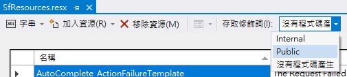
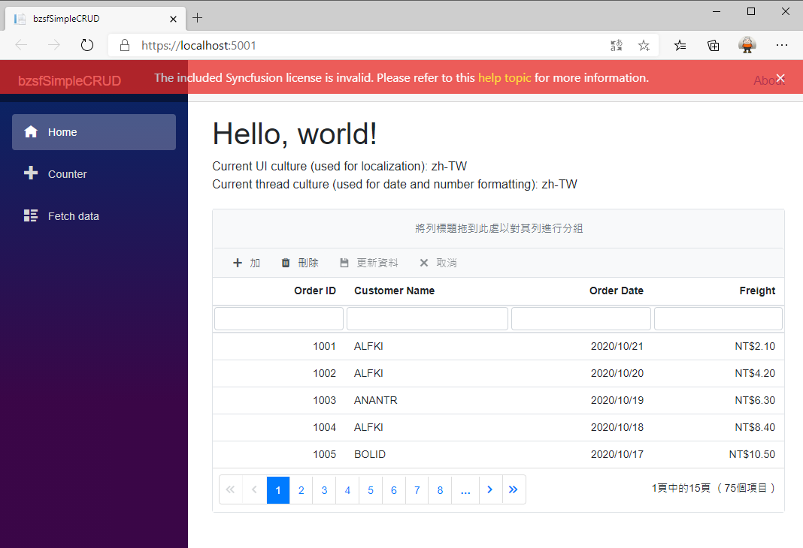

# 使用 Syncfusion DataGrid 做出一個具有中文語系的簡單 CRUD 應用

對於一個要開發出 Web 應用的 Blazor 專案來說，具有 CRUD 應用的功能是必備與必須學會的技術，在這篇文章中，將會說明如何透過 [Syncfusion for Blazor](https://www.syncfusion.com/blazor-components) 所提供的各項 UI 元件，來做到這樣的需求；當然，市面上也存在著其他家的付費元件，也包含了更多免費 Blazor UI 元件，大家可以依照自己的需要，選擇適當的資源與技術，一樣可以完成相同的工作。

這個說明專案的原始碼位於 [bzsfSimpleCRUD](https://github.com/vulcanlee/CSharp2020/tree/master/bzsfSimpleCRUD)

## 建立 Blazor Server-Side 的專案

* 打開 Visual Studio 2019
* 點選右下方的 [建立新的專案] 按鈕
* [建立新專案] 對話窗將會顯示在螢幕上
* 從[建立新專案] 對話窗的中間區域，找到 [Blazor 應用程式] 這個專案樣板選項，並且選擇這個項目
* 點選右下角的 [下一步] 按鈕
* 現在 [設定新的專案] 對話窗將會出現
* 請在這個對話窗內，輸入適當的 [專案名稱] 、 [位置] 、 [解決方案名稱]

  在這裡請輸入 [專案名稱] 為 `bzsfSimpleCRUD`

* 完成後，請點選 [建立] 按鈕
* 當出現 [建立新的 Blazor 應用程式] 對話窗的時候
* 請選擇最新版本的 .NET Core 與 [Blazor 伺服器應用程式]
* 完成後，請點選 [建立] 按鈕

稍微等會一段時間，Blazor 專案將會建立起來

## 進行 Syncfusion 元件的安裝

* 滑鼠右擊 Blazor 專案的 [相依性] 節點
* 選擇 [管理 NuGet 套件]
* 切換到 [瀏覽] 標籤頁次
* 搜尋 `Syncfusion.Blazor` 這個元件名稱
* 選擇搜尋到的 [Syncfusion.Blazor] 元件，並且安裝起來

## 進行 Syncfusion 元件的設定

* 打開專案根目錄下的 [Startup.cs] 這個檔案
* 找到 [ConfigureServices] 這個方法
* 在這個方法的最後面，加入底下程式碼，已完成 Blazor 元件會用到的服務註冊

```csharp
#region Syncfusion 元件的服務註冊
services.AddSyncfusionBlazor();
#endregion
```

* 在同一個檔案內，找到 [Configure] 這個方法
* 在這個方法的最前面，加入底下程式碼，宣告合法授權的金鑰 (License Key)

```csharp
#region 宣告所使用 Syncfusion for Blazor 元件的使用授權碼
Syncfusion.Licensing.SyncfusionLicenseProvider.RegisterLicense("YOUR LICENSE KEY");
#endregion
```

* 打開 [Pages] 資料夾內的 [_Host.cshtml] 檔案
* 在 `<head>` 標籤內，加入需要的 CSS 宣告，如底下內容
 
  >若沒有加入底下的宣告，將無法正常看到 Syncfusion 的元件樣貌

```XML
<link href="_content/Syncfusion.Blazor/styles/bootstrap4.css" rel="stylesheet" />
```

## 開始使用 Syncfusion 的 SfGrid 元件

* 打開 [Pages] 資料夾內的 [Index.razor] 檔案
* 將底下的程式碼替換掉原先的內容

```XML
@page "/"
@using System.Threading

<h1>Hello, world!</h1>

<div style="margin-bottom: 20px;">
    Current UI culture (used for localization): @Thread.CurrentThread.CurrentUICulture.Name
    <br />
    Current thread culture (used for date and number formatting): @Thread.CurrentThread.CurrentCulture.Name
</div>

<SfGrid DataSource="@Orders" AllowPaging="true" AllowSorting="true" AllowFiltering="true" AllowGrouping="true"
        Toolbar="@(new List<string>() { "Add", "Delete", "Update", "Cancel" })">
    <GridPageSettings PageSize="5"></GridPageSettings>
    <GridEditSettings AllowEditing="true" AllowDeleting="true" AllowAdding="true" Mode="@EditMode.Normal"></GridEditSettings>
    <GridColumns>
        <GridColumn Field=@nameof(Order.OrderID) HeaderText="Order ID" TextAlign="TextAlign.Right" Width="120"></GridColumn>
        <GridColumn Field=@nameof(Order.CustomerID) HeaderText="Customer Name" Width="150"></GridColumn>
        <GridColumn Field=@nameof(Order.OrderDate) HeaderText=" Order Date" Format="d" Type="ColumnType.Date" TextAlign="TextAlign.Right" Width="130"></GridColumn>
        <GridColumn Field=@nameof(Order.Freight) HeaderText="Freight" Format="C2" TextAlign="TextAlign.Right" Width="120"></GridColumn>
    </GridColumns>
</SfGrid>


@code {
    public List<Order> Orders { get; set; }

    protected override void OnInitialized()
    {
        Orders = Enumerable.Range(1, 75).Select(x => new Order()
        {
            OrderID = 1000 + x,
            CustomerID = (new string[] { "ALFKI", "ANANTR", "ANTON", "BLONP", "BOLID" })[new Random().Next(5)],
            Freight = 2.1 * x,
            OrderDate = DateTime.Now.AddDays(-x),
        }).ToList();
    }

    public class Order
    {
        public int? OrderID { get; set; }
        public string CustomerID { get; set; }
        public DateTime? OrderDate { get; set; }
        public double? Freight { get; set; }
    }
}
```

## 執行專案

* 請執行這個 Blazor 專案
* 將會看到如下圖的畫面


由於在這個專案中沒有輸入合法的授權碼，因此，會出現如上方紅底白字的訊息 : `The included Syncfusion license is invalid. Please refer to this help topic for more information.`，但是，不會影響到整體功能。

在這個範例中，將會使用 GridEditSettings 來設定各種紀錄可以允許的功能，並且透過 GridPageSettings 來宣告每頁可以看到的紀錄數量，當然，超過指定頁數的紀錄數量，將會自動有分頁元件出現，讓使用者可以操作並跳到特定頁數紀錄。

在 SfGrid 標籤內，使用了許多屬性用來宣告這個 DataGrid 元件可以擁有那些額外功能，例如在這裡宣告該 DataGrid 可以有自動分頁、排序、過濾、群組分類的功能，並且會顯示 新增、刪除、更新與取消的工具列按鈕。

該 DataGrid 要顯示出哪些欄位，將會在 GridColumns 這個標籤內宣告。

至於這個練習中要顯示在 DataGrid 元件中的紀錄，將會在該 Razor 元件的程式碼內來設計，這裡將使用 Blazor 生命週期的 OnInitialized 事件來負責產生相關集合資料，這些集合資料將會儲存在 Orders 這個集合物件內；而在 SfGrid 元件內，使用了 DataSource 屬性指定使用 Orders 這個集合物件做為顯示紀錄的來源。

## 設定 Syncfusion 元件使用中文語系

在上面的執行結果可以看到，預設 Syncfusion 元件所會用到的預設文字內，將會使用英文來顯示，由於 Syncfusion 元件具有多語系顯示能力，因此，在這裡將會說明如何設計讓這個專案的 Syncfusion 元件可以顯示中文內容。

* 滑鼠右擊專案節點，點選 [加入] > [新增資料夾] 項目
* 設定剛剛新增的資料夾名稱為 `Resources`
* 從這個網址 [blazor-locale](https://github.com/syncfusion/blazor-locale) 內的 src 目錄下，取得所需要的語系資源檔案
* 打開專案內的 [Resources] > [SfResources.resx] 檔案
* 在最上方找到 [存取修飾詞] 下拉選單控制項，選擇 `Public` 這個項目

  

* 滑鼠右擊專案節點，點選 [加入] > [類別] 項目
* 在 [新增項目] 對話窗的 [名稱] 欄位輸入 `SyncfusionLocalizer`
* 點選 [新增] 按鈕
* 使用底下程式碼替換到 [SyncfusionLocalizer.cs] 檔案內容

```csharp
public class SyncfusionLocalizer : ISyncfusionStringLocalizer
{
    // To get the locale key from mapped resources file
    public string GetText(string key)
    {
        return this.ResourceManager.GetString(key);
    }
 
    // To access the resource file and get the exact value for locale key
 
    public System.Resources.ResourceManager ResourceManager
    {
        get
        {
            // Replace the ApplicationNamespace with your application name.
            return bzsfSimpleCRUD.Resources.SfResources.ResourceManager;
        }
    }
}
```

* 打開專案根目錄下的 [Startup.cs] 這個檔案
* 找到 [ConfigureServices] 這個方法
* 在這個方法的最後面，加入底下程式碼，宣告 Syncfusion 元件要使用的資源檔案與多國語系要使用的內容。

```csharp
#region Localization
// Set the resx file folder path to access
services.AddLocalization(options => options.ResourcesPath = "Resources");
services.AddSyncfusionBlazor();
// Register the Syncfusion locale service to customize the  SyncfusionBlazor component locale culture
services.AddSingleton(typeof(ISyncfusionStringLocalizer), typeof(SyncfusionLocalizer));
services.Configure<RequestLocalizationOptions>(options =>
{
    // Define the list of cultures your app will support
    var supportedCultures = new List<CultureInfo>()
{
    new CultureInfo("en-US"),
    new CultureInfo("zh-TW")
};
    // Set the default culture
    options.DefaultRequestCulture = new RequestCulture("zh-TW");
    options.SupportedCultures = supportedCultures;
    options.SupportedUICultures = supportedCultures;
});
#endregion
```


* [Startup.cs] 檔案內，找到 [Configure] 這個方法
* 在這個方法的最前面，加入底下程式碼

```csharp
#region Localization
app.UseRequestLocalization(app.ApplicationServices.GetService<IOptions<RequestLocalizationOptions>>().Value);
#endregion
```

## 執行專案

* 請執行這個 Blazor 專案
* 將會看到如下圖的畫面



現在將可以看到中文文字說明內容了


