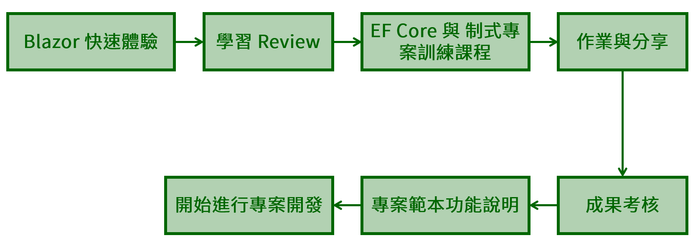
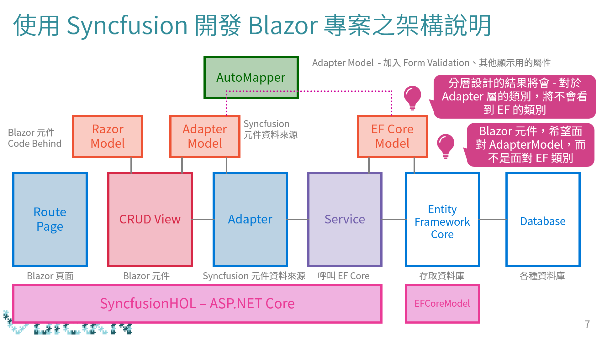

# Blazor實戰故事經驗分享 2 - 風雲再現 探究 Blazor 可以快速開發出來內部細節

在上一篇文章 [Blazor實戰故事經驗分享 1 - 風起雲湧 如何從無到有建立Blazor團隊與採用全端開發方式設計出給上市企業使用的Web系統](https://csharpkh.blogspot.com/2020/11/Blazor-Server-Side-Full-Stack-Case-Study-JavaScript-Story.html) 中，介紹了這個專案的啟動緣由與需要執行完成的工作和需要注意的事項，在這第二篇文章中，將會闡明究竟如何這個專案可以成功執行完成的關鍵因素與使用到的相關工具和技能。

對於採用 ASP.NET Core Blazor 這個全新的技術要來進行專案開發，對於許多人都是新的嘗試，畢竟這是新的技術，每個人都會有不同的考量因素，然而，在這裡將會根據當時實際環境與需求進行考量，評估要採用何種因應方法來讓團隊可以進行專案開發，這才是這個專案可以成功的主要關鍵因素。底下將來了解 陳少 的技術團隊，是採用甚麼方式來進行成功的 Blazor 專案開發。

>套句作者經常講的話，若是有興趣、沒信心，那就做個 POC，再決定接下來要如何進行。若只是坐著發呆、泡茶聊是非、發功觀落陰，還是把這些時間省下來，不要再去想太多了。

## 人員訓練

對於人員訓練這個過程，是這個 Blazor 專案導入過程中極為重要的過程，畢竟要在短短的三個月內，要能夠採用一個全新的 Blazor 開發框架技術來開發出一個專案，必須承認這是個滿嚴峻的挑戰，失敗機率相當的高，而且這些開發人員都是新招募進來的，他們之前技術背景也都不相同，要如何讓大家可以使用 Blazor 的技術來進行專案開發，這就需要一些訣竅；這裡是透過專門設計的教育訓練課程與教材來解決此一問題，讓所有開發人員先求有，再求好，也就是說，先把專案開發出來，再自行針對不同核心關鍵技術，自行後續的研究與了解。

團隊成員在接受教育訓練的時候，並不只是坐著聽講而已，而是會跟著不同設計好的練習題目，一起進行練習，隨時針對學習狀況進行調整進度與內容，另外，上完課程之後，原則上都會有課後作業要自行練習，並且繳交回來；一旦課程完成之後，也會需要針對學員上課吸收能力與是否真的有認真學會這些技術，進行檢視與分析。

>因為，天下沒有白吃的午餐，坐著聽課也許很容易，上課的講師一直講話，更是辛苦。

### .NET / C# 物件導向程式設計能力

當在招募人員的時候，第一要求能力就要有 .NET / C# 程式設計的經驗與能力，至少要有兩年以上的工作經驗，至於是在甚麼框架底下開發專案，這都不是很重要；對於比較進階與延伸應用的 C# 開發技能，我與陳少會根據當時成員的情況，適度地進行這方面的教育訓練，例如：介面、委派、Lambda、事件、泛型等等，不過，只要時間允許，也會針對 .NET CLR 相關特性來進行相關的訓練課程。

### HTML / CSS 開發經驗

對於這方面的需求，並沒有這麼的嚴格，原則上，至少要有這方面的基礎認識與了解，而團隊原則上不會針對這方面安排額外的教育訓練課程，因為，這些學習文章、書籍、影片，在網路上已經很多了。

### Blazor Server-Side or WebAssembly

相信第一次接觸到 Blazor 這樣的開發框架的人，若對於這樣的技術產生興趣的話，必定對於要使用哪種 Blazor 開發方式感到迷惑。

首先，若你對於自己的開發方式，不管是前後端分離，或者全端開發方式感到滿意與沒有甚麼遺憾的話，個人建議無須繼續探討是否要使用 Blazor 這樣的方式；若你看到一些現有開發方式的問題與遇到瓶頸，個人覺得 Blazor 是個滿值得選擇的一種開發方式。

對於這個團隊選擇 Blazor 的首要考量因素，那就是無需使用 JavaScript ，僅需要會 .NET / C# 就可以進行 Web 專案開發，當然，這與之前的 Web Forms & Silverlight 是決然不同的運作方式，這兩個開發技術上存在的問題與瓶頸，在 Blazor 上已經獲得大部分的解決，至於 Blazor 是否會像這兩個技術有著相同的下場，那就是微軟已經放棄了這兩種開發方式，不再提供任何技術支援與新的版本，個人覺得未來的事情很難說，畢竟，除了傳統的 HTTP Request / Response 的動態網頁開發方式，與現今相當豐富的前端開發框架而言，Blazor是個絕佳的選擇，畢竟僅需要會 .NET / C# 就可以開發 Web App 是件相當誘人因素，JavaScript在這樣的開發方式下，就變成幾乎不再需要這樣能力的考量了。

對於 陳少 的開發團隊，講求的是能夠快速開發出 Web 專案產品，對於開發速度、執行效能與品質上，也有著相當的要求，對於招募能力上，已具備 .NET / C# 能力的開發者為主要選擇，最為重要的是，一旦開發人員進入團隊之後，要能夠在最短的時間投入到產品研發、開發，更是佔有極重要的考量，所以，當然會優先選擇 Blazor 這樣的開發框架技術。

對於現階段的開發產品而言，經過分析，不論採用 Blazor Server-Side 或者 WebAssembay 的方式，都是可行的選擇，不過，若採用 Blazor Server-Side 方案的話，更可以大幅減少開發時間與學習門檻，讓每個開發人員都是個全端開發人員 (而後，會培養這些人員，都能夠朝向超全端開發能力邁進)，如此，不論是在投資成本、人員調度、技術分享上，都具有相當優異的表現。因此，經過討論，在未來一年之內，相關開發的產品，都會使用 Blazor Server-Side 的方式來進行開發，然而，在使用 Blazor Server-Side 開發技術所做出來的產品，也在開發架構上，預留了隨時可以轉換成為使用 WebAssembly 的空間，這樣的設計讓技術轉換上變得更加有彈性。

### Blazor 快速上手

好了，決定了要使用哪種 Blazor 的開發方式，現在就要如何讓現有人員，快速的開始使用 Blazor 來進行產品開發，記住，不是要花費大量的時間來學習甚麼是 Blazor 與相當細節的 Blazor 運作技術。

這裡採用的方式如下

首先，會先請開發人員先行觀看 Youtube 影片 [Blazor 快速體驗 之 線上操作教學影片](https://www.youtube.com/watch?v=SfXJf7Q3dg4&list=PLUHhEA6x1LH-MTqXJTNElSPkYFTMFHvsi) ，自行根據影片來進行開發過程的體驗，其目的是要能夠讓程式設計在最短的時間內，快速的了解 Blazor 開發框架的開發方式，並且能夠了解到在這個開發方式下，會有哪些特色或者技術需要學習，當然，有心的程式設計師也會自行搭配微軟官方的 [Blazor 介紹](https://docs.microsoft.com/zh-tw/aspnet/core/blazor/?view=aspnetcore-3.1&WT.mc_id=DT-MVP-5002220) 網站內容，做進一步的研究，當然在學習之後，會根據看完該影片與練習之後進行評估與討論，看看學習上遇到甚麼問題，適度的解惑，如此便可以進入下一個訓練課程。

## EF Core 與制式專案開發訓練課程

在這個課程則是透過直接的教學，配合不同的練習題目，實際現場進行操作，了解到各種 Entity Framework Core 這個工具的使用方式，以及有甚麼要注意的地方和限制，而後在同樣的課程內，進入到下一個階段內容

### Blazor + Syncfusion 的核心設計準則

在這裡將會讓程式設計師實際體驗真正複雜的 Blazor 開發環境，在下面示意圖中，規劃了 Blazor 與 Syncfusion 元件的整合應用架構，透過分層的設計，讓整個專案密切的整合起來。

在這裡除了能夠瞭解到一個實際在 Blazor 下整合 Entity Framework Core + AutoMapper + Syncfusion 元件 + 不用使用 Code Behind 的方式來進行開發的方式，當然，在這裡將會首先了解到如何理解與使用這樣的開發架構，當然，在課堂上也會讓學員實際自行開發練習，並且會有課後作業，讓把課堂是學習的內容，能夠獨立開發出來。

原則上，會留些時間讓學員可以理解、體會、領悟這個架構的精神與各分層是如何串接起來的方式，當然，最有效的方式，那就是會有課後成果考核與評分，確認學員真的學會這樣的設計技能。

在這裡提到的分層架構將會充分發揮 Blazor 開發框架的特色，使用 Razor 元件 的方式來設計，不論是 CSS 或者 HTML 標記，或者某個頁面的部分內容，經過這樣的元件化設計，將會大幅簡化整個系統開發的複雜度。另外，對於 Blazor Serer-Side 開發方式所提供的優異除錯除錯能力，表達衷心的感恩，因為這樣的機制解省了許多開發上的時間。

### 相依性注入、非同步程式設計、多執行緒程式設計、物件導向設計原則

關於這些技術，都已經完成了相關訓練教材，預計至少需要花費9天以上的時間來進行教育訓練，不過，因為，時間緊迫，在這個專案進行過程中，僅會針對部分的 相依性注入、非同步程式設計 的內容作教育，因為，許多的觀念與技能將會有助於團隊成員設計出更有效率、更好維護、不容易出錯的程式碼，不過，對於整個團隊成員會於日後將這些技能補足到他們身上，原則上，有些課程將會需要進行本身能力進行評估，確認他們已經具備了這樣的能力或者資質，才能夠接受這些教育訓練，提升自我能力，否則，需要他們自行研究與提升本身實力。

### 身分驗證與授權

這部份對於 Web 開發專案上具有相當的重要性，這包含了如何使用 Blazor + ASP.NET Core 來設計出具有 Cookie 與 JWT 方式的身分驗證與授權機制，整個 Blazor 專案將會受到這樣的機制保護下，避免沒有授權的使用者能夠存取到不屬於他們可以使用的資源。而這樣的課程將會使用到約 4 個小時的時間來上課，這個課程已經於 10 月上課完畢，而且在課後之後，團隊成員已經將這樣的機制時實作在要交付給客戶的產品中。

這個專案也包含了許多 Web API，要能夠讓 Windows Forms 應用程式可以存取這個 Blazor 開發出來的系統內資源，這些資源將會受到 JWT 的保護；當然，對於完整的 JWT Token 的取得、更新、與強制撤銷上，在標準的設計專案上，都已經有所提供，團隊成員可以從無到有的自行開發出這些機制，也可以直接套用已經開發好的機制，套用到現有產品上。

在這裡也會使用到 ASP.NET Core 之 Web API 功能，設計出具有 RESTfule 能力的 Web API 功能，對於 Dto 的相關物件規劃，也會實際時做出來。這些功能都會完全在 Blazor 專案內可以做出來。

### Xamarin.Forms

最後一部分也是最為精采的，就是要訓練團隊成員具備超全端開發設計能力，這包含了 Web 專案的開發 + 跨平台行動裝置地的開發能力；對於 Xamarin.Forms 的開發技術，在今年10月之前，已經進行了快要 1/2 的內容，預計年底之前，這些跨平台行動開發能力將會全數上完相關課程，因為，整個團隊將會至少擁有3名具有超全端程式設計能力的程式設計師。

## 執行結果分析

如同這系列文章一開始所提到的，這個採用 Blazor 開發框架技術，在三個月內是如期開發出來並且交付給客戶，實際運作也是十分的優異與滿足當初規劃的需求，這樣的成果將會取決於底下的因素

* 公司領導人的支持與信任、妥善的團隊分工規劃與決策

  由於該公司的總經理充分的授權與信任，可以讓這個新成立的團隊使用各種可行性方案來完成這個專案開發，團隊領導人的充分規劃與落實執行、追蹤與分析，遇到問題就找出 Root Cause，並且嘗試解決問題，大家可以在平行的方式下開發，這樣所展現的成果也是與所有團隊成員一起共享的。

* 優異與具有未來發展能力的 Blazor 開發環境

  雖然 Blazor 是在去年年底才發表的新 Web 開發方式，不過，整體架構採用了 MVU 方式的設計著實方便了不少，也簡化了許多設計工作；對於 Blazor 更多的內部運作細節與核心技術，也會在日後逐步透過教育訓練(Blazor的訓練教材已經完成了約 300頁以上的簡報)與技術分享的方式，與團隊成員一起來精通這個開發方式；另外，在年底的 ASP.NET 5 的發表，這裡也已經準備好隨時可以順利切換到這個新的技術框架內，明年也會進行規畫可以在同樣的開發模式下，在最少的痛苦情形下，華麗變身成為 WebAssembly 開發方式(當然，只要該專案的需求確實需要擁有這樣的條件，確信轉移上是不會遇到太多的障礙的)。對於 ASP.NET Core 這個優異平台已經提供了許多功能，實際在進行開發過程中不再需重新發明輪子，也節省了許多開發時間，而所做出產品當然也有高效能的表現。

* 完整與完善的教育訓練培訓機制

  一開始要進行這樣的開發模式的時候，就已經開始籌畫開發人員所需要的技術教育訓練內容，在適時提供相關技術的新知與開發方法，透過在課堂上實際練習各項實作內容，讓大家在下課之後，就可以把上課所學習的內容，實際應用在工作上；另外，相關的教育訓練、技術討論與分享，都有使用微軟 Teams 進行錄影下來，課後學員可以藉由上課錄影內容，來進行複習課堂上的各項技術與技能，這點也是一個相當不錯的效果。

* 即時與充分的技術支援

  再好的技術平台或者工具，總會遇到各項問題與困難，在團隊中需要有精通這些技術的人員，適時地提供相關解決方案、協助進行除厝或者討論出更好的因應做法，透過這樣的分工做法，著實提升整體專案的開發效能與品質。最重要的整個團隊都是樂於彼此分享自己的開發成果與經驗，讓大家一起成長。

最後想要表達的是， Blazor 是真的可以開發出在現實應用上的開發框架技術，陳少 這個團隊就是一個活生生的例子，若你曾經也嘗試要使用 Blazor 來開發專案並且遇到瓶頸，這可能需要靜下來分析究竟問題在哪裡？還是一開始本身你的公司或者團隊就不需要、不適合採用 Blazor 技術，甚至想要在 Blazor 開發環境中，加入許多你自己也不確定的因素，總之，找出問題，嘗試解決，最後下出決定：要改善還是要放棄這個開發平台。我們可以，相信你也可以做到的。

## 相關文章

[Blazor實戰故事經驗分享 1 - 風起雲湧 如何從無到有建立Blazor團隊與採用全端開發方式設計出給上市企業使用的Web系統](https://csharpkh.blogspot.com/2020/11/Blazor-Server-Side-Full-Stack-Case-Study-JavaScript-Story.html)

[Blazor實戰故事經驗分享 2 - 風雲再現 探究 Blazor 可以快速開發出來內部細節](https://csharpkh.blogspot.com/2020/11/Blazor-Server-Side-Layer-Data-Case-Study-Story.html)

