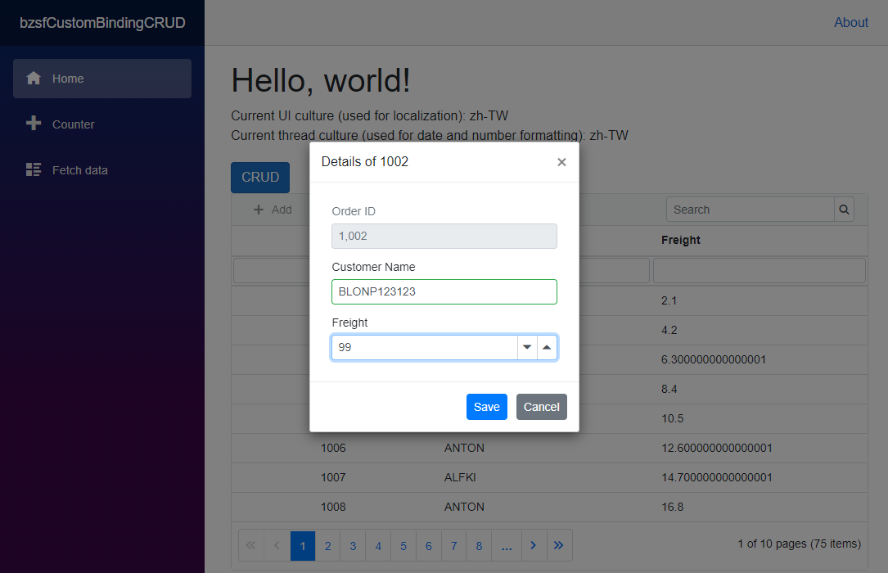
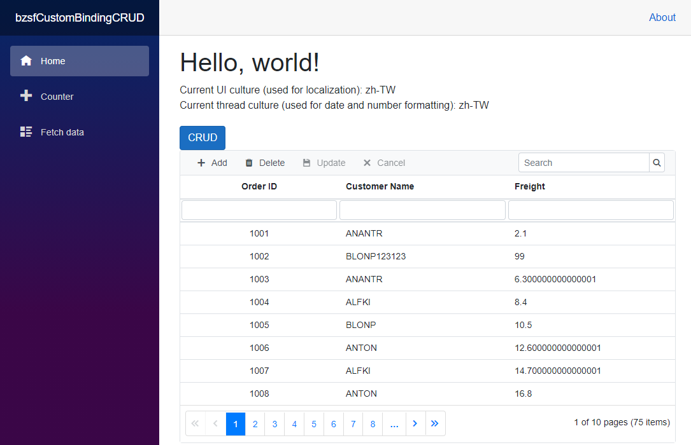
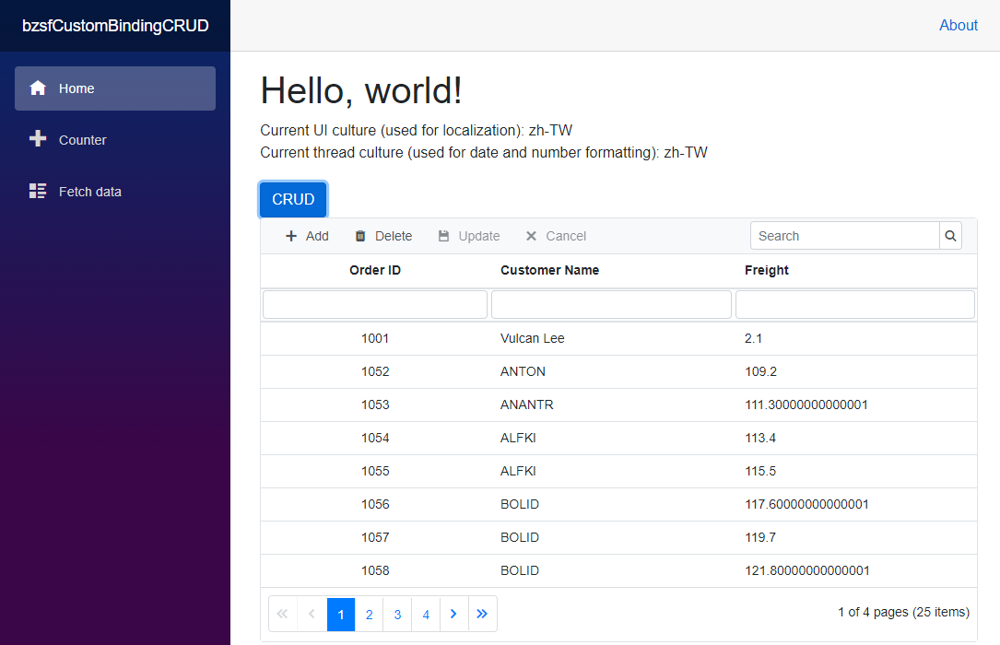

# 使用 Syncfusion 轉接器做出一個 CRUD 應用

在上一篇文章提到了 [使用 Syncfusion DataGrid 做出一個具有中文語系的簡單 CRUD 應用](https://csharpkh.blogspot.com/2020/10/Blazor-ISyncfusionStringLocalizer-SfGrid-DataSource-ResourceManager-Culture.html)，這裡會將 .NET 記憶體物件內容，顯示在螢幕上，不過，Syncfusion 的 DataGrid 還提供了一個相當好用的機制，那就是 SfDataManager Adaptor ，透過這樣的機制，可以隨時在 Adapter 中切換要顯示的資料來源，而不會影響到頁面 UI 的設計，是個具有鬆散偶和設計的架構。

這個說明專案的原始碼位於 [bzsfCustomBindingCRUD](https://github.com/vulcanlee/CSharp2020/tree/master/bzsfCustomBindingCRUD)

## 建立 Blazor Server-Side 的專案

* 打開 Visual Studio 2019
* 點選右下方的 [建立新的專案] 按鈕
* [建立新專案] 對話窗將會顯示在螢幕上
* 從[建立新專案] 對話窗的中間區域，找到 [Blazor 應用程式] 這個專案樣板選項，並且選擇這個項目
* 點選右下角的 [下一步] 按鈕
* 現在 [設定新的專案] 對話窗將會出現
* 請在這個對話窗內，輸入適當的 [專案名稱] 、 [位置] 、 [解決方案名稱]

  在這裡請輸入 [專案名稱] 為 `bzsfCustomBindingCRUD`

* 完成後，請點選 [建立] 按鈕
* 當出現 [建立新的 Blazor 應用程式] 對話窗的時候
* 請選擇最新版本的 .NET Core 與 [Blazor 伺服器應用程式]
* 完成後，請點選 [建立] 按鈕

稍微等會一段時間，Blazor 專案將會建立起來

## 進行 Syncfusion 元件的安裝

* 滑鼠右擊 Blazor 專案的 [相依性] 節點
* 選擇 [管理 NuGet 套件]
* 切換到 [瀏覽] 標籤頁次
* 搜尋 `Syncfusion.Blazor` 這個元件名稱
* 選擇搜尋到的 [Syncfusion.Blazor] 元件，並且安裝起來

## 進行 Syncfusion 元件的設定

* 打開專案根目錄下的 [Startup.cs] 這個檔案
* 找到 [ConfigureServices] 這個方法
* 在這個方法的最後面，加入底下程式碼，已完成 Blazor 元件會用到的服務註冊

```csharp
#region Syncfusion 元件的服務註冊
services.AddSyncfusionBlazor();
#endregion
```

* 在同一個檔案內，找到 [Configure] 這個方法
* 在這個方法的最前面，加入底下程式碼，宣告合法授權的金鑰 (License Key)

```csharp
#region 宣告所使用 Syncfusion for Blazor 元件的使用授權碼
Syncfusion.Licensing.SyncfusionLicenseProvider.RegisterLicense("YOUR LICENSE KEY");
#endregion
```

* 打開 [Pages] 資料夾內的 [_Host.cshtml] 檔案
* 在 `<head>` 標籤內，加入需要的 CSS 宣告，如底下內容
 
  >若沒有加入底下的宣告，將無法正常看到 Syncfusion 的元件樣貌

```XML
<link href="_content/Syncfusion.Blazor/styles/bootstrap4.css" rel="stylesheet" />
```

## 建立 SfDataManager 會用到的類別

* 滑鼠右擊專案的 [Data] 資料夾
* 點選 [加入] > [類別] 選項
* 在 [新增項目] 對話窗的 [名稱] 欄位輸入 `Order`
* 點選 [新增] 按鈕
* 使用底下程式碼替換到 [Order.cs] 檔案內容

```csharp
public class Order
{
    public int OrderID { get; set; }
    public string CustomerID { get; set; }
    public double Freight { get; set; }
}
```

* 滑鼠右擊專案的 [Data] 資料夾
* 點選 [加入] > [類別] 選項
* 在 [新增項目] 對話窗的 [名稱] 欄位輸入 `OrderService`
* 點選 [新增] 按鈕
* 使用底下程式碼替換到 [OrderService.cs] 檔案內容

```csharp
public class OrderService
{
    List<Order> Items { get; set; } = new List<Order>();
    public OrderService()
    {
        Items = Enumerable.Range(1, 75).Select(x => new Order()
        {
            OrderID = 1000 + x,
            CustomerID = (new string[] { "ALFKI", "ANANTR", "ANTON", "BLONP", "BOLID" })[new Random().Next(5)],
            Freight = 2.1 * x,
        }).ToList();
    }
 
    public IEnumerable<Order> GetItems()
    {
        return Items;
    }
    public Task<Order> GetAsync(int orderID)
    {
        var item = Items.FirstOrDefault(x => x.OrderID == orderID);
        return Task.FromResult(item);
    }
    public Task AddAsync(Order order)
    {
        Items.Add(order);
        return Task.CompletedTask;
    }
    public Task UpdateAsync(Order order)
    {
        var item = Items.FirstOrDefault(x => x.OrderID == order.OrderID);
        if (item != null)
        {
            item.Freight = order.Freight;
            item.CustomerID = order.CustomerID;
        }
        return Task.CompletedTask;
    }
    public Task RemoveAsync(Order order)
    {
        var item = Items.FirstOrDefault(x => x.OrderID == order.OrderID);
        if (item != null)
        {
            Items.Remove(item);
        }
        return Task.CompletedTask;
    }
    public void RemoveSomeRecordAsync()
    {
        Items.RemoveRange(1, 50);
        Items[0].CustomerID = "Vulcan Lee";
    }
}
```

在上面的程式碼中，設計了一個 OrderService 類別，在 OrderService 建構函式內將會隨機產生出 75 筆的 Order 類別的紀錄，這些紀錄將會要顯示在網頁上面。

該 OrderService 類別提供一個 [GetItems] 方法將會取得該服務內所有的集合物件，另外，將會有相關 查詢、更新、新增與刪除 的方法定義在這個類別內，這些 CRUD 的方法分別是 GetAsync, UpdateAsync, AddAsync, DeleteAsync，使用者可以點選 DataGrid 元件上的任何一筆紀錄，便可以進行刪除動作，也可以點選新增按鈕，進行新增一筆紀錄的能力。這些方法將會於使用者對 DataGrid 紀錄做一度的時候來呼叫。

對於這個 [RemoveSomeRecordAsync()] 沒有參數的方法，則是會讓網頁上的 [CRUD] 按鈕被點選之後，可以呼叫這個方法，以便刪除 50 筆紀錄，接著將第一筆紀錄，更新為 Vulcan Lee

* 滑鼠右擊專案的 [Shared] 資料夾
* 點選 [加入] > [類別] 選項
* 在 [新增項目] 對話窗的 [Razor元件] 欄位輸入 `OrderServiceAdapter`
* 點選 [新增] 按鈕
* 使用底下程式碼替換到 [OrderServiceAdapter.razor] 檔案內容

```XML
@using Syncfusion.Blazor;
@using Syncfusion.Blazor.Data;
@using Newtonsoft.Json
@using bzsfCustomBindingCRUD.Data

@inherits DataAdaptor<OrderService>

<CascadingValue Value="@this">
    @ChildContent
</CascadingValue>

@code {
    [Parameter]
    [JsonIgnore]
    public RenderFragment ChildContent { get; set; }

    // Performs data Read operation
    public override async Task<object> ReadAsync(DataManagerRequest dataManagerRequest, string key = null)
    {
        IEnumerable<Order> DataSource = (IEnumerable<Order>)Service.GetItems();
        if (dataManagerRequest.Search != null && dataManagerRequest.Search.Count > 0)
        {
            // Searching
            DataSource = DataOperations.PerformSearching(DataSource, dataManagerRequest.Search);
        }
        if (dataManagerRequest.Sorted != null && dataManagerRequest.Sorted.Count > 0)
        {
            // Sorting
            DataSource = DataOperations.PerformSorting(DataSource, dataManagerRequest.Sorted);
        }
        if (dataManagerRequest.Where != null && dataManagerRequest.Where.Count > 0)
        {
            // Filtering
            DataSource = DataOperations.PerformFiltering(DataSource, dataManagerRequest.Where, dataManagerRequest.Where[0].Operator);
        }
        int count = DataSource.Cast<Order>().Count();
        if (dataManagerRequest.Skip != 0)
        {
            //Paging
            DataSource = DataOperations.PerformSkip(DataSource, dataManagerRequest.Skip);
        }
        if (dataManagerRequest.Take != 0)
        {
            DataSource = DataOperations.PerformTake(DataSource, dataManagerRequest.Take);
        }
        var item = dataManagerRequest.RequiresCounts ? new DataResult() { Result = DataSource, Count = count } : (object)DataSource;
        await Task.Yield();
        return item;
    }

    public override async Task<object> InsertAsync(DataManager dataManager, object data, string key)
    {
        await Service.AddAsync(data as Order);
        return data;
    }

    public override async Task<object> UpdateAsync(DataManager dataManager, object data, string keyfield, string key)
    {
        await Service.UpdateAsync(data as Order);
        return data;
    }

    public override async Task<object> RemoveAsync(DataManager dataManager, object data, string keyField, string key)
    {
        var item = await Service.GetAsync(Convert.ToInt32(data));
        await Service.RemoveAsync(item);
        return data;
    }
}
```

在這個 OrderServiceAdapter.razor 轉接器元件，將會於 Syncfusion DataGrid 元件的 SfDataManager 屬性內，如此，當 DataGrid 要取得相關紀錄，或者要進行 CRUD 的紀錄異動的時候，就會呼叫該 OrderServiceAdapter.razor 內所提供的方法。

這個類別實際上繼承於 DataAdaptor 類別，該類別提供許多方法多載，只需要覆寫相關方法，讓這些方法呼叫特定服務的方法，就可以達成資料異動與存取的目的。

更多這方面的資訊，可以參考 [Custom Binding in Blazor DataManager component](https://blazor.syncfusion.com/documentation/data/custom-binding/#custom-binding)

## 註冊 OrderService 服務

* 打開專案根目錄下的 [Startup.cs] 這個檔案
* 找到 [ConfigureServices] 這個方法
* 在這個方法的最後面，加入底下程式碼，已完成服務註冊

```csharp
services.AddSingleton<OrderService>();
```

## 開始使用 Syncfusion 的 SfGrid 元件與客製轉換器

* 打開 [Pages] 資料夾內的 [Index.razor] 檔案
* 將底下的程式碼替換掉原先的內容

```XML
@page "/"
@using System.Threading
@using Syncfusion.Blazor
@using Syncfusion.Blazor.Data
@using Syncfusion.Blazor.Grids
@using bzsfCustomBindingCRUD.Data
@inject OrderService OrderService


<h1>Hello, world!</h1>

<div style="margin-bottom: 20px;">
    Current UI culture (used for localization): @Thread.CurrentThread.CurrentUICulture.Name
    <br />
    Current thread culture (used for date and number formatting): @Thread.CurrentThread.CurrentCulture.Name
</div>

<button class="btn btn-primary" @onclick="OnClick">CRUD</button>
@*<SfDataManager AdaptorInstance="@typeof(CustomAdaptor)" Adaptor="Adaptors.CustomAdaptor"></SfDataManager>*@
<SfGrid @ref="Grid" TValue="Order" ID="Grid"
        AllowSorting="true" AllowFiltering="true" AllowPaging="true"
        Toolbar="@(new List<string>() { "Add", "Delete", "Update", "Cancel","Search" })">
    <SfDataManager Adaptor="Adaptors.CustomAdaptor">
        <OrderServiceAdapter></OrderServiceAdapter>
    </SfDataManager>
    <GridPageSettings PageSize="8"></GridPageSettings>
    <GridEditSettings AllowEditing="true" AllowDeleting="true" AllowAdding="true" Mode="@EditMode.Dialog"></GridEditSettings>
    <GridSearchSettings Fields=@InitSearch Operator=Syncfusion.Blazor.Operator.Contains IgnoreCase="true"></GridSearchSettings>
    <GridColumns>
        <GridColumn Field=@nameof(Order.OrderID) HeaderText="Order ID" IsPrimaryKey="true" TextAlign="@TextAlign.Center" Width="140"></GridColumn>
        <GridColumn Field=@nameof(Order.CustomerID) HeaderText="Customer Name" Width="150"></GridColumn>
        <GridColumn Field=@nameof(Order.Freight) HeaderText="Freight" Width="150"></GridColumn>
    </GridColumns>
</SfGrid>

@code{
    SfGrid<Order> Grid;
    string[] InitSearch = (new string[] { "CustomerID" });
    protected override void OnInitialized()
    {
    }

    void OnClick()
    {
        OrderService.RemoveSomeRecordAsync();
        Grid.Refresh();
    }
}
```

## 執行專案

* 請執行這個 Blazor 專案
* 將會看到如下圖的畫面


在這裡將會使用滑鼠雙擊第二筆( Order ID 為 1002 這筆紀錄)紀錄，就會看到如下圖的畫面，該畫面是由 Syncfusion DataGrid 自動生成的，可以讓使用者在這裡修改該紀錄的相關欄位，在此會修改這筆紀錄成為如下的內容值



一旦點選確定按鈕之後，就會從 DataGrid 紀錄瀏覽畫面上看到剛剛修改過的內容，如下圖所示，同樣的，想要新增一筆紀錄，只需要點選 Add 按鈕，便可以新增一筆紀錄。



在這個練習頁面中，設計一個 CRUD 按鈕，當按下這個按鈕之後，便會呼叫 [OrderService.RemoveSomeRecordAsync()] 這個方法，此時，將會刪除前 50 筆紀錄並且修正第一筆紀錄的 Customer Name 為 Vulcan Lee




