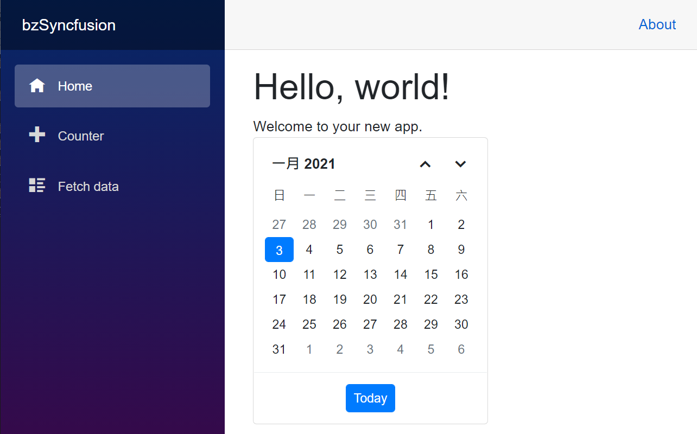

# 如何使用 Syncfusion 在 Blazor 專案上

由於工作上的需要以看到最新的網頁開發框架 Blazor ，便決定開始使用 Blazor Server Side 來進行網頁專案的開發，會選擇 Server Side 方式而不是採用 WASM 的方式，當初決定的理由相當的簡單，那就是要簡化整個網站開發的流程，透過 Blazor Server Side 開發架構，可以享受到許多的好處，例如可以線上直接設定中斷點來進行除錯、不需要設計 Web API 就可以存取後端的資料庫等等。

一旦決定了使用 Blazor 開發框架來進行專案開發，接下來要解決的問題就是如何設計各種ui介面，在網路上存在的許多免費的 Blazor UI 套件，每種使用方式以提供的功能都不盡相同，根據自身的需求來判斷，似乎沒有一套免費的ui套件可以滿足專案上的需要，因此就直接轉向了付費的 Blazor UI 套件來進行評估，當然，市面上也存在的許多付費的 Blazor 元件產品，在這裡選擇了 Syncfusion 這家的 Blazor 元件來進行開發。 

那麼要如何使用 Syncfusion 元件來進行 Blazor 專案開發，就是這篇文章所要探討的內容，在這裡，將會說明如何在 Blazor 專案內顯示一個日期選舉萬年曆這樣的 UI 功能。

這個說明專案的原始碼位於 [bzSidebar](https://github.com/vulcanlee/CSharp2020/tree/master/bzSyncfusion)

## 建立 Blazor Server-Side 的專案

* 打開 Visual Studio 2019
* 點選右下方的 [建立新的專案] 按鈕
* [建立新專案] 對話窗將會顯示在螢幕上
* 從[建立新專案] 對話窗的中間區域，找到 [Blazor 應用程式] 這個專案樣板選項，並且選擇這個項目
* 點選右下角的 [下一步] 按鈕
* 現在 [設定新的專案] 對話窗將會出現
* 請在這個對話窗內，輸入適當的 [專案名稱] 、 [位置] 、 [解決方案名稱]

  在這裡請輸入 [專案名稱] 為 `bzSyncfusion`

* 完成後，請點選 [建立] 按鈕
* 當出現 [建立新的 Blazor 應用程式] 對話窗的時候
* 請選擇最新版本的 .NET Core 與 [Blazor 伺服器應用程式]
* 完成後，請點選 [建立] 按鈕

稍微等會一段時間，Blazor 專案將會建立起來

## 進行 Syncfusion 元件的安裝

* 滑鼠右擊 Blazor 專案的 [相依性] 節點
* 選擇 [管理 NuGet 套件]
* 切換到 [瀏覽] 標籤頁次
* 搜尋 `Syncfusion.Blazor` 這個元件名稱
* 選擇搜尋到的 [Syncfusion.Blazor] 元件，並且安裝起來

## 進行 Syncfusion 元件的設定

* 打開專案根目錄下的 [Startup.cs] 這個檔案
* 找到 [ConfigureServices] 這個方法
* 在這個方法的最後面，加入底下程式碼，已完成 Blazor 元件會用到的服務註冊

```csharp
#region Syncfusion 元件的服務註冊
services.AddSyncfusionBlazor();
#endregion
```

* 在同一個檔案內，找到 [Configure] 這個方法
* 在這個方法的最前面，加入底下程式碼，宣告合法授權的金鑰 (License Key)

```csharp
#region 宣告所使用 Syncfusion for Blazor 元件的使用授權碼
Syncfusion.Licensing.SyncfusionLicenseProvider.RegisterLicense("YOUR LICENSE KEY");
#endregion
```

* 打開 [Pages] 資料夾內的 [_Host.cshtml] 檔案
* 在 `<head>` 標籤內，加入需要的 CSS 宣告，如底下內容
 
  >若沒有加入底下的宣告，將無法正常看到 Syncfusion 的元件樣貌

```XML
<link href="_content/Syncfusion.Blazor/styles/bootstrap4.css" rel="stylesheet" />
```

## 使用 SfCalendar 元件

* 在專案的 [Pages] 資料夾
* 打開 [Index.razor] 檔案
* 使用底下程式碼替換到 [Index.razor] 檔案內容

```XML
@page "/"
@using Syncfusion.Blazor
@using Syncfusion.Blazor.Calendars

<h1>Hello, world!</h1>

Welcome to your new app.

<SfCalendar TValue="DateTime" Value="workDate"></SfCalendar>

@code
{
    DateTime workDate = DateTime.Now;
}
```

從這裡看到使用 Syncfusion 元件相當的容易，只需要加入該元件所使用的命名空間在 Razor 元元件前面，接著就加入該元件的HTML標籤，例如在這裡使用的是 <SfCalendar TValue="DateTime" Value="workDate"></SfCalendar>

現在可以直接執行這支程式，就會看到如下圖的執行結果。



