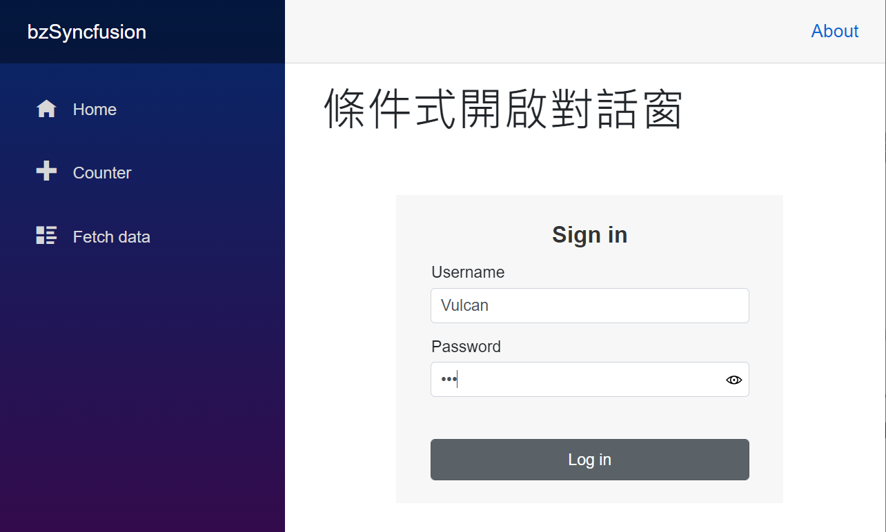

# 使用 Syncfusion 的各種對話窗的用法，包含巢狀對話窗


這個說明專案的原始碼位於 [bzSyncfusionDialog](https://github.com/vulcanlee/CSharp2020/tree/master/bzSyncfusionDialog)

## 建立 Blazor Server-Side 的專案

* 打開 Visual Studio 2019
* 點選右下方的 [建立新的專案] 按鈕
* [建立新專案] 對話窗將會顯示在螢幕上
* 從[建立新專案] 對話窗的中間區域，找到 [Blazor 應用程式] 這個專案樣板選項，並且選擇這個項目
* 點選右下角的 [下一步] 按鈕
* 現在 [設定新的專案] 對話窗將會出現
* 請在這個對話窗內，輸入適當的 [專案名稱] 、 [位置] 、 [解決方案名稱]

  在這裡請輸入 [專案名稱] 為 `bzSyncfusion`

* 完成後，請點選 [建立] 按鈕
* 當出現 [建立新的 Blazor 應用程式] 對話窗的時候
* 請選擇最新版本的 .NET Core 與 [Blazor 伺服器應用程式]
* 完成後，請點選 [建立] 按鈕

稍微等會一段時間，Blazor 專案將會建立起來

## 進行 Syncfusion 元件的安裝

* 滑鼠右擊 Blazor 專案的 [相依性] 節點
* 選擇 [管理 NuGet 套件]
* 切換到 [瀏覽] 標籤頁次
* 搜尋 `Syncfusion.Blazor` 這個元件名稱
* 選擇搜尋到的 [Syncfusion.Blazor] 元件，並且安裝起來

## 進行 Syncfusion 元件的設定

* 打開專案根目錄下的 [Startup.cs] 這個檔案
* 找到 [ConfigureServices] 這個方法
* 在這個方法的最後面，加入底下程式碼，已完成 Blazor 元件會用到的服務註冊

```csharp
#region Syncfusion 元件的服務註冊
services.AddSyncfusionBlazor();
#endregion
```

* 在同一個檔案內，找到 [Configure] 這個方法
* 在這個方法的最前面，加入底下程式碼，宣告合法授權的金鑰 (License Key)

```csharp
#region 宣告所使用 Syncfusion for Blazor 元件的使用授權碼
Syncfusion.Licensing.SyncfusionLicenseProvider.RegisterLicense("YOUR LICENSE KEY");
#endregion
```

* 打開 [Pages] 資料夾內的 [_Host.cshtml] 檔案
* 在 `<head>` 標籤內，加入需要的 CSS 宣告，如底下內容
 
  >若沒有加入底下的宣告，將無法正常看到 Syncfusion 的元件樣貌

```XML
<link href="_content/Syncfusion.Blazor/styles/bootstrap4.css" rel="stylesheet" />
```

## 修改 Index.razor

* 在專案的 [Pages] 資料夾
* 打開 [Index.razor] 檔案
* 使用底下程式碼替換到 [Index.razor] 檔案內容

```XML
@page "/"
@using Syncfusion.Blazor
@using Syncfusion.Blazor.Popups
@using Syncfusion.Blazor.Buttons
@inject NavigationManager NavigationManager

<h1>Hello, Dialog!</h1>

<div class="m-1">
    <SfButton CssClass="e-primary" @onclick="@OnClicked">Open Modal Dialog</SfButton>
</div>
<div class="m-1">
    <SfButton CssClass="e-primary" @onclick="@OnNestClicked">Open Nest Dialog</SfButton>
</div>
<div class="m-1">
    <SfButton CssClass="e-primary" @onclick="@OnScrollingClicked">Open Scrolling Dialog</SfButton>
</div>
<div class="m-1">
    <SfButton CssClass="e-primary" @onclick="@OnConditionClicked">Open Condition Dialog</SfButton>
</div>

<SfDialog @bind-Visible="@IsVisible" Width="250px" IsModal="true">
    <DialogEvents OnOverlayClick="OnOverlayclick">
    </DialogEvents>
    <DialogTemplates>
        <Content> This is a modal dialog</Content>
    </DialogTemplates>
</SfDialog>

@code {
    private bool IsVisible { get; set; } = false;
    private void OnClicked()
    {
        this.IsVisible = true;
    }
    private void OnOverlayclick(object arg)
    {
        this.IsVisible = false;
    }
    private void OnNestClicked()
    {
        NavigationManager.NavigateTo("/NestDialog");
    }
    private void OnScrollingClicked()
    {
        NavigationManager.NavigateTo("/Scroll");
    }
    private void OnConditionClicked()
    {
        NavigationManager.NavigateTo("/Condition");
    }
}
```

## 增加 Condition.razor

* 滑鼠右擊專案的 [Pages] 資料夾
* 從彈出功能表中選擇 [加入] > [Razor 元件]
* 在 [新增項目] 對話窗內的 [名稱] 欄位輸入 [Condition.razor] 
* 點選 [新增] 按鈕來新增這個 Razor 元件
* 使用底下程式碼替換到 [Condition.razor] 檔案內容

```xml
@page "/Condition"
@using Syncfusion.Blazor
@using Syncfusion.Blazor.Popups
@using Syncfusion.Blazor.Buttons

<h1>條件式開啟對話窗</h1>

<div class="login-form">
    <div class='wrap'>
        <div id="heading">Sign in</div>
        <div id="input-container">
            <div class="e-float-input e-input-group">
                <input id="textvalue" type="text" @bind-value="@Textvalue" required />
                <span class="e-float-line"></span>
                <label class="e-float-text">Username</label>
            </div>
            <div class="e-float-input e-input-group">
                <input id="textvalue2" type="password" @bind-value="@Textvalue2" required />
                <span class="e-float-line"></span>
                <label class="e-float-text">Password</label>
            </div>
        </div>
        <div class="button-contain">
            <SfButton @onclick="@OnClicked">Log in</SfButton>
        </div>
    </div>
</div>
<SfDialog IsModal="true" Width="280px" @bind-Visible="@Visibility">
    <DialogEvents OnOpen="Validation"></DialogEvents>
    <DialogTemplates>
        <Header> Success</Header>
        <Content> Congratulations! Login Success</Content>
    </DialogTemplates>
    <DialogButtons>
        <DialogButton OnClick="@OnClick">
            <DialogButtonModel Content="Dismiss" IsPrimary="true"></DialogButtonModel>
        </DialogButton>
    </DialogButtons>
</SfDialog>

<style>
    .wrap {
        box-sizing: border-box;
        margin: 0 auto;
        padding: 20px 30px;
        width: 340px;
        background: #f7f7f7;
    }

    #input-container .e-float-input { /* csslint allow: adjoining-classes */
        margin: 17px 0;
    }

    .wrap #input-container .e-control e-btn { /* csslint allow: adjoining-classes */
        margin: 3% 26%;
    }

    .button-contain {
        padding: 20px 0 0;
        width: 100%;
    }

        .button-contain .e-btn { /* csslint allow: adjoining-classes */
            width: 100%;
            height: 36px;
        }

    #heading {
        color: #333;
        font-weight: bold;
        margin: 0 0 15px;
        text-align: center;
        font-size: 20px;
    }

    .login-form {
        width: 340px;
        margin: 50px auto;
    }

    .e-dialog .e-footer-content {
        text-align: center;
    }
</style>

@code {
    public bool Visibility { get; set; } = false;
    private string Textvalue { get; set; } = "";
    private string Textvalue2 { get; set; } = "";

    private void OnClick()
    {
        this.Visibility = false;
    }

    private void OnClicked()
    {
        this.Visibility = true;
    }

    private void Validation(BeforeOpenEventArgs args)
    {
        if (this.Textvalue == "" && this.Textvalue2 == "")
        {
            this.Visibility = false;
            args.Cancel = true;
            Console.WriteLine("clicked");
        }
        else if (this.Textvalue == "")
        {
            this.Visibility = false;
            args.Cancel = true;
            Console.WriteLine("Enter the username");
        }
        else if (this.Textvalue2 == "")
        {
            this.Visibility = false;
            args.Cancel = true;
            Console.WriteLine("Enter the password");
        }
        else if (this.Textvalue.Length < 4)
        {
            this.Visibility = false;
            args.Cancel = true;
            Console.WriteLine("Username must be minimum 4 characters");
        }
        else
        {
            args.Cancel = false;
            this.Textvalue = "";
            this.Textvalue2 = "";
        }
    }
}
```

## 增加 NestDialog.razor

* 滑鼠右擊專案的 [Pages] 資料夾
* 從彈出功能表中選擇 [加入] > [Razor 元件]
* 在 [新增項目] 對話窗內的 [名稱] 欄位輸入 [NestDialog.razor] 
* 點選 [新增] 按鈕來新增這個 Razor 元件
* 使用底下程式碼替換到 [NestDialog.razor] 檔案內容

```xml
@page "/NestDialog"
@using Syncfusion.Blazor
@using Syncfusion.Blazor.Popups
@using Syncfusion.Blazor.Buttons

<h1>巢狀對話窗</h1>

<SfButton @onclick="@OnClicked">開啟第一層對話窗</SfButton>
<SfDialog ID="dialog" @bind-Visible="@isVisibleParent" IsModal="true"
          ShowCloseIcon="true" Width="400px" Height="300px">
    <DialogEvents OnOverlayClick="OnOuterOverlayclick">
    </DialogEvents>
    <DialogTemplates>
        <Header>第一層對話窗</Header>
        <Content><SfButton @onclick="@OnBtnClicked">開啟第二層對話窗</SfButton></Content>
    </DialogTemplates>
    <DialogPositionData X="center" Y="center"></DialogPositionData>
</SfDialog>
<SfDialog ID="innerDialog" @bind-Visible="@isVisibleChild" IsModal="true"
          ShowCloseIcon="true" Width="500px" Height="350px">
    <DialogEvents OnOverlayClick="OnInnerOverlayclick">
    </DialogEvents>
    <DialogTemplates>
        <Header>第二層對話窗</Header>
        <Content>這裡是 第二層對話窗</Content>
    </DialogTemplates>
    <DialogPositionData X="center" Y="center"></DialogPositionData>
</SfDialog>

@code {
    private bool isVisibleParent { get; set; } = false;
    private bool isVisibleChild { get; set; } = false;
    private void OnClicked()
    {
        this.isVisibleParent = true;
    }
    private void OnBtnClicked()
    {
        this.isVisibleChild = true;
    }
    private void OnOuterOverlayclick(object arg)
    {
        this.isVisibleParent = false;
    }
    private void OnInnerOverlayclick(object arg)
    {
        this.isVisibleChild = false;
    }
}
```

## 增加 Scroll.razor

* 滑鼠右擊專案的 [Pages] 資料夾
* 從彈出功能表中選擇 [加入] > [Razor 元件]
* 在 [新增項目] 對話窗內的 [名稱] 欄位輸入 [Scroll.razor] 
* 點選 [新增] 按鈕來新增這個 Razor 元件
* 使用底下程式碼替換到 [Scroll.razor] 檔案內容

```xml
@page "/Scroll"
@using Syncfusion.Blazor
@using Syncfusion.Blazor.Popups
@using Syncfusion.Blazor.Buttons

<h1>捲動對話窗</h1>

<div>
    <b>JavaScript:</b><br />
    JavaScript is a high-level, dynamic, untyped, and interpreted programming language. It has been standardized in the ECMAScript
    language specification. Alongside HTML and CSS, it is one of the three essential technologies of World Wide Web
    content production; the majority of websites employ it and it is supported by all modern Web browsers without
    plug-ins. JavaScript is prototype-based with first-class functions, making it a multi-paradigm language, supporting
    object - oriented , imperative, and functional programming styles.
    <br /><br /><br />
    <b>MVC:</b><br />
    Model–view–controller (MVC) is a software architecture pattern which separates the representation of information from the user's interaction with it. The model consists of application data, business rules, logic, and functions. A view can be any output representation of data, such as a chart or a diagram. Multiple views of the same data are possible, such as a bar chart for management and a tabular view for accountants. The controller mediates input, converting it to commands for the model or view.The central ideas behind MVC are code reusability and in addition to dividing the application into three kinds of components, the MVC design defines the interactions between them.
    A controller can send commands to its associated view to change the view's presentation of the model (e.g., by scrolling through a document). It can also send commands to the model to update the model's state (e.g., editing a document).
    A model notifies its associated views and controllers when there has been a change in its state. This notification allows the views to produce updated output, and the controllers to change the available set of commands. A passive implementation of MVC omits these notifications, because the application does not require them or the software platform does not support them.
    A view requests from the model the information that it needs to generate an output representation to the user.
</div>
<SfDialog CssClass="@DialogClass" Width="250px">
    <DialogTemplates>
        <Header>Dialog</Header>
        <Content>
            <div>
                <b>JavaScript:</b><br />
                JavaScript is a high-level, dynamic, untyped, and interpreted programming language. It has been standardized in the ECMAScript
                language specification. Alongside HTML and CSS, it is one of the three essential technologies of World Wide Web
                content production; the majority of websites employ it and it is supported by all modern Web browsers without
                plug-ins. JavaScript is prototype-based with first-class functions, making it a multi-paradigm language, supporting
                object - oriented , imperative, and functional programming styles.
                <br /><br /><br />
                <b>MVC:</b><br />
                Model–view–controller (MVC) is a software architecture pattern which separates the representation of information from the user's interaction with it. The model consists of application data, business rules, logic, and functions. A view can be any output representation of data, such as a chart or a diagram. Multiple views of the same data are possible, such as a bar chart for management and a tabular view for accountants. The controller mediates input, converting it to commands for the model or view.The central ideas behind MVC are code reusability and in addition to dividing the application into three kinds of components, the MVC design defines the interactions between them.
                A controller can send commands to its associated view to change the view's presentation of the model (e.g., by scrolling through a document). It can also send commands to the model to update the model's state (e.g., editing a document).
                A model notifies its associated views and controllers when there has been a change in its state. This notification allows the views to produce updated output, and the controllers to change the available set of commands. A passive implementation of MVC omits these notifications, because the application does not require them or the software platform does not support them.
                A view requests from the model the information that it needs to generate an output representation to the user.
            </div>

            <SfButton @onclick='@OnClicked'>Prevent Dialog Scroll</SfButton>
        </Content>
    </DialogTemplates>
</SfDialog>

<style>
    body {
        overflow-y: scroll;
    }

    .e-fixed {
        position: fixed;
    }
</style>

@code {
    public string DialogClass { get; set; }

    private void OnClicked()
    {
        this.DialogClass = "e-fixed";
        this.StateHasChanged();
    }
}
```

現在可以直接執行這支程式，就會看到如下圖的執行結果。

當應用程式啟動之後，在首頁網頁上 Index.razor 將會看到四個按鈕


Open Modal Dialog

Open Nest Dialog

Open Scrolling Dialog

Open Condition Dialog

在點選了 Open Modal Dialog 這個按鈕之後，將會觸發 OnClicked 事件委派方法，塞斯在該方法內會把變數 IsVisible 設定為 True，而因為該變數有透過資料綁定到 SfDialog 元件上的 @bind-Visible ，因此這個對話窗將會顯示在螢幕上，如下圖所示。

這是一個最簡單的對話窗使用操作方式，透過HTML標籤的宣告，讓這個對話窗元件預設不要顯示在螢幕上，透過資料綁定的用法，可以隨時讓對話窗顯示或者關閉。


在點選了 Open Nest Dialog 這個按鈕之後，將會觸發 OnNestClicked 事件委派方法，在該方法內將會使用敘述 NavigationManager.NavigateTo("/NestDialog"); 切換到  這個 NestDialog 頁面


在這個 NestDialog.razor 頁面，使用兩個 SfDialog 標籤元素，定義了兩個 Syncfusion 對話窗，所以當按下第一個按鈕，將會顯示 SfDialog ID="dialog" 的對話窗，該對話窗內有一個按鈕，該按鈕的名稱為 開啟第二層對話窗 ，這時若按下這個按鈕，將會使得第2個對話窗， SfDialog ID="innerDialog"，因為按鈕的委派方法那有將 isVisibleChild 變數設定為 true，所以第二個對話窗就會顯示在螢幕上，如此將會形成一個巢狀對話窗效果。

底下為巢狀對話窗執行結果的畫面截圖


在點選了 Open Scrolling Dialog 這個按鈕之後，將會觸發 OnScrollingClicked 事件委派方法，在該方法內將會使用敘述 NavigationManager.NavigateTo("/Scroll"); 切換到  這個 Scroll 頁面

在這個 Scroll.razor 頁面，在對話窗顯示之後，因為要顯示內容超過1個螢幕的高度，因此可以透過捲動的方式來查看到超過螢幕高度的對話窗內容，不過在對話窗的最後面有一個按鈕，當按下這個按鈕之後， 會將這個 DialogClass 字串變數的內容設定為 "e-fixed"，而改變數是透過了資料綁定的方式綁定在對話窗的 CssClass 屬性上，SfDialog CssClass="@DialogClass"，所以加會造成這個對話窗是無法被捲動的。


在點選了 Open Condition Dialog 這個按鈕之後，將會觸發 OnConditionClicked 事件委派方法，在該方法內將會使用敘述 NavigationManager.NavigateTo("/Condition"); 切換到  這個 Condition 頁面

在這個 Scroll.razor 頁面，會顯示一個使用者登入畫面，其中在這裡可以輸入使用者的帳號以及密碼，若此時按下登入按鈕，將會觸發 OnClick 事件委派方法，在該事件委派方法那會將 Visibility 布林變數設定為 true， 此時在該頁面所宣告的對話窗就會顯示在螢幕上，不過這裡使用到一個 DialogEvents 對話框事件 OnOpen ，也就是當這個對話裝備顯示的時候會觸發 Validation 事件委派方法，在該事件委派方法內會進行相關的商業邏輯檢查，若有不符合商業邏輯規範的，會在 Console 視窗中顯示這些錯誤訊息。

Enter the password

Enter the username

Username must be minimum 4 characters




