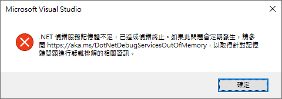
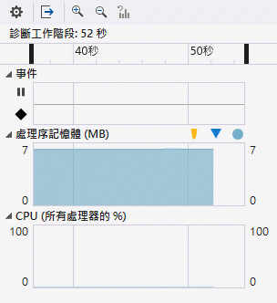

# Memory Overflow 造成的原因

在前面的文章 [Stack Overflow 造成的原因](https://csharpkh.blogspot.com/2020/09/Thread-Stack-Memory-Overflow-Local-Variable-Parameter.html) ，討論到造成 Stack Overflow 的現象，在這裡，將會來研究另外一種 記憶體 Overflow 問題，通常當這個問題發生的時候，會看到 [記憶體不足] 這樣的訊息出現，而且，此時，這個處理程序就異常終止，並且會看到如下的畫面。



會發生這樣的現象，那是因為這個處理程序耗用了過多的 Heap 堆積內的記憶體空間，導致當其他程式碼需要產生執行個體的時候，因為沒有足夠的記憶體，而造成整個處理成緒崩潰。

現在，來了解發生這樣問題的真正原因。當在 .NET 系統底下，需要建立一個 參考 Reference 型別的物件，通常會使用 new 這個運算子，後面緊接著某個型別的建構式，此時， .NET CLR 將會從 Heap 堆積記憶體空間，配置一塊記憶體來作為儲存該執行個體內容之用；而當這個物件不被其他變數參考到的時候，便會被 GC 垃圾回收機制回收，接著是放掉這個物件所參考到的記憶體空間。

若系統不斷的要求超過位址空間所允許的記憶體，便會發生了記憶體不足的問題，除了不斷的要求建立一個新的物件，但是持續有變數參考到這個物件，便會造成記憶體不足的問題，這還會發生到 GC Generation 2 的時候，因為架構上的設計，導致記憶體空間破碎，雖然剩餘的記憶體空間還足夠，但無法真正的找到一塊連緒且符合要求的記憶體空間，這樣也會造成記憶體不足的問題。

在上面的說明中，可以看到對於 .NET 系統中，將會有兩種類型的記憶體儲存空間，一個是 Heap，這裡將會存放各種參考型別物件值，而且這裡可用的空間非常大，另外一種是 Stack，這裡的空間會使用當前執行緒所配置的空間來使用，而在 .NET 中，一個執行緒在建立的時候，預設將會擁有 1MB 的記憶體空間，任何在方法呼叫過程中，對於參數與區域變數，將會使用這裡的空間。

因此，底下的範例，將會設計兩個類別 [MyLargeClass] 與 [MySmallClass] ，這兩個類別都是參考型別，因此，當建立執行個體的時候，會從 Heap 中要求一塊記憶體空間來用；前者類別當產生物件的時候，將會佔據至少 86KB 的記憶體空間，因為該類別類宣告了一個長度為 86KB 的 byte 陣列，後者類別將會從 Heap 中要求至少 20KB 的記憶體空間。

所以，在 Main 方法內，將會建立一個超大迴圈，不斷地建立這兩個型別的物件，並且把取得的記憶體空間，儲存到 List<MyLargeClass> 或者 List<MySmallClass> 集合型別內，也因為這樣，這些產生的物件並不會因為 GC 記憶體回收機制的運作，而把這些記憶體歸還給系統，經過不斷的執行，終於造成了記憶體不足的問題，也就會出現體底下的異常畫面。


在下圖，將可以看到這個測試程式碼執行時候，耗用記憶體空間的過程。



```csharp
public class MyLargeClass
{
    // 這將會讓產生的執行個體會占用 > 85000 bytes 的記憶體大小
    public byte[] bytes = new byte[1024 * 86];
}
 
public class MySmallClass
{
    // 這將會讓產生的執行個體會占用 < 85000 bytes 的記憶體大小
    public byte[] bytes = new byte[1024 * 20];
}
class Program
{
    static void Main(string[] args)
    {
 
        Console.WriteLine("Press any key for continuing...");
        Console.ReadKey();
        //這裡將會模擬產生大量的大物件執行個體，耗用大量的堆積記憶體
        List<MyLargeClass> listLargeObject = new List<MyLargeClass>();
        for (int i = 0; i < 1000 * 1000; i++)
        {
            listLargeObject.Add(new MyLargeClass());
        }
 
        //這裡將會模擬產生大量的物件執行個體，耗用大量的堆積記憶體
        List<MySmallClass> listSmallObject = new List<MySmallClass>();
        for (int i = 0; i < 1000 * 1000; i++)
        {
            listSmallObject.Add(new MySmallClass());
        }
    }
}
```


