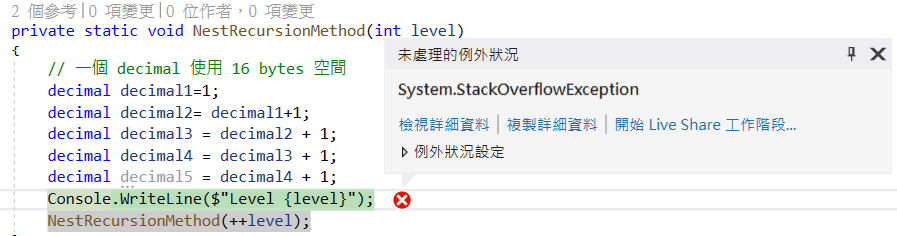
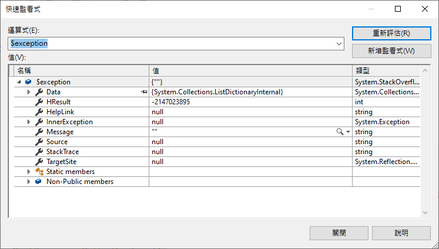

# Stack Overflow 造成的原因

在進行程式設計的時候，經常會聽到 記憶體不足 這樣的問題，其中，對於記憶體不足這樣的現象，會發生在兩種情況下，在這裡將會展示出如何過度使用 執行緒推疊 Stack Overflow。

當在設計類別中的方法時候，對於該方法所使用的參數或者區域變數，若這兩種物件的型別為 數值型別 Value Type，則該物件將會從堆疊結構中取得一個空間來作為儲存、存放的地方，然而，若是一個 參考型別 Reference Type ，則會從堆疊結構中取得一個該參考型別的位置儲存空間，並且要求 堆積 Heap 取得一塊空間，用來儲存該參考物件的相關執行個體內容。

在上面的說明中，可以看到對於 .NET 系統中，將會有兩種類型的記憶體儲存空間，一個是 Heap，這裡將會存放各種參考型別物件值，而且這裡可用的空間非常大，另外一種是 Stack，這裡的空間會使用當前執行緒所配置的空間來使用，而在 .NET 中，一個執行緒在建立的時候，預設將會擁有 1MB 的記憶體空間，任何在方法呼叫過程中，對於參數與區域變數，將會使用這裡的空間。

因此，底下的範例，將會設計一個方法 [NestRecursionMethod] ，這個方法將會自我遞迴呼叫，在這個方法內，將宣告五個 decimal 數值型別的區域變數，每個 decimal 物件，將會耗用 16 bytes的記憶體空間，所以，五個 decimal 物件，將會耗用 16*5 = 80 bytes 記憶體空間；當然在呼叫方法的過程中，還會有其他的資料會儲存在 Thread Stack 這個資料結構空間內。

在這個程式中，因為會反覆呼叫 [NestRecursionMethod] 方法，進而造成 Stack 記憶體空間不斷減少，一旦該 Stack 內沒有足夠的記憶體空間，將會造成 Stack 空間不足，也就是會拋出 Stack Overflow 的例外異常。

這裡是最後執行後的螢幕輸出結果

```
.
.
.
Level 3818
Level 3819
Level 3820
Level 3821
Level 3822
Level 3823
Level 3824
Level 3825
Level 3826
Stack overflow.
```

而在 Visual Studio 2019 內，將會看到這樣的例外異常提示畫面





這裡將會是該例外異常的詳細資訊

```
System.StackOverflowException
  HResult=0x800703E9
  Source=<無法評估例外狀況來源>
  StackTrace: 
<無法評估例外狀況堆疊追蹤>
```

```csharp
class Program
{
    static void Main(string[] args)
    {
        int level = 1;
        Console.WriteLine("Hello World!");
        NestRecursionMethod(level);
    }
 
    private static void NestRecursionMethod(int level)
    {
        // 一個 decimal 使用 16 bytes 空間
        decimal decimal1=1;
        decimal decimal2= decimal1+1;
        decimal decimal3 = decimal2 + 1;
        decimal decimal4 = decimal3 + 1;
        decimal decimal5 = decimal4 + 1;
        Console.WriteLine($"Level {level}");
        NestRecursionMethod(++level);
    }
}
```


