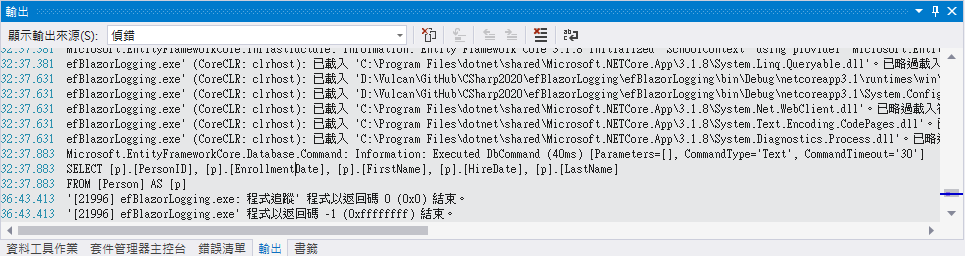
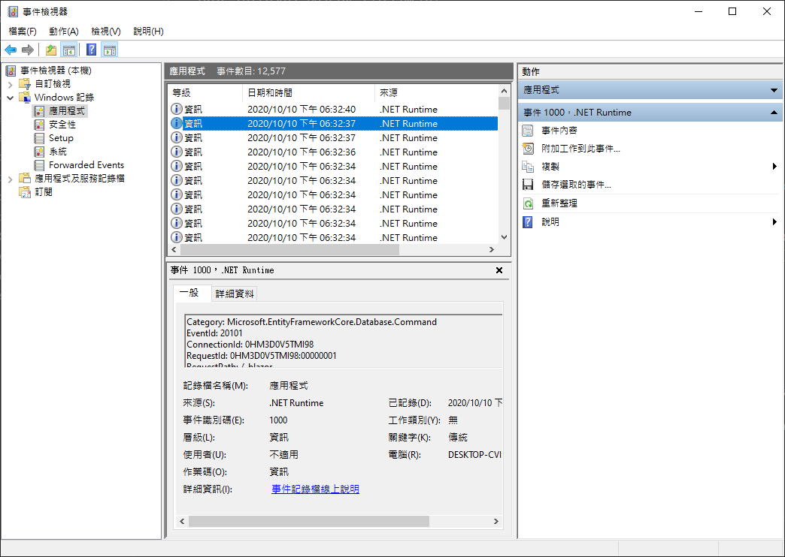
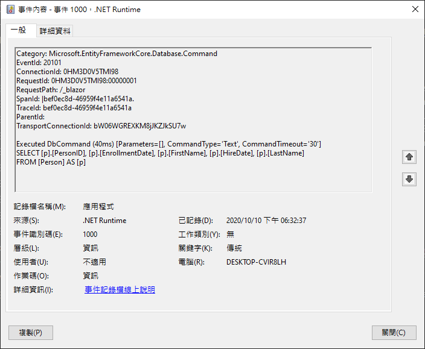

# 在 ASP.NET Core 專案內，建立其他日誌輸出設備

根據 上一篇 EF Core 討論文章 [在 ASP.NET Core Blazor 專案內，觀察送出的 SQL 敘述](https://csharpkh.blogspot.com/2020/10/Entity-Framework-Core-Blazor-ILoggerFactory-appsettings-Logging-LogLevel.html) ，了解到如何透過 [appsettings.Development.json] 來指定與過濾那些等級的日誌要記錄下來。。

在這篇文章中，來了解如何在 ASP.NET Core 的專案內，可以指定多個日誌 Log 輸出對象的作法。

關於更多這方面的應用，可以參考 [.NET Core 與 ASP.NET Core 中的記錄](https://docs.microsoft.com/zh-tw/aspnet/core/fundamentals/logging/?view=aspnetcore-3.1&WT.mc_id=DT-MVP-5002220) 這份文件內容。

這裡的練習專案原始碼，將會延續 [在 ASP.NET Core Blazor 專案內，觀察送出的 SQL 敘述](https://csharpkh.blogspot.com/2020/10/Entity-Framework-Core-Blazor-ILoggerFactory-appsettings-Logging-LogLevel.html) 文件中使用的專案原始碼。

請打開這個 `efBlazorLogging` 專案

在專案根目錄下找到並打開 [Program.cs] 這個檔案

將這個檔案的內容，修改成為如下的程式碼

```csharp
using System;
using System.Collections.Generic;
using System.IO;
using System.Linq;
using System.Threading.Tasks;
using Microsoft.AspNetCore;
using Microsoft.AspNetCore.Hosting;
using Microsoft.Extensions.Configuration;
using Microsoft.Extensions.Hosting;
using Microsoft.Extensions.Logging;

namespace efBlazorLogging
{
    public class Program
    {
        public static void Main(string[] args)
        {
            CreateHostBuilder(args).Build().Run();
        }

        public static IHostBuilder CreateHostBuilder(string[] args) =>
            Host.CreateDefaultBuilder(args)
            .ConfigureLogging((context, logging) =>
            {
                // Console
                logging.AddConsole();
                // Debug
                logging.AddDebug();
                // Event Source
                logging.AddEventSourceLogger();
                // Event Log
                logging.AddEventLog();
            })
            .ConfigureWebHostDefaults(webBuilder =>
                {
                    webBuilder.UseStartup<Startup>();
                });
    }
}
```

在 [CreateHostBuilder] 方法內，呼叫了 [ConfigureLogging] 方法，在這裏面指定了 Console, Debug, Event Source, Event Log 這四個對象做為要輸出日誌的目的。

另外，請打開 [appsettings.Development.json] 檔案
* 在這個檔案內，加入一個屬性 : `EventLog` 節點，如底下清單所示

```json
{
  "DetailedErrors": true,
  "Logging": {
    "LogLevel": {
      "Default": "Information",
      "Microsoft": "Warning",
      //"Microsoft.EntityFrameworkCore": "Trace",
      "Microsoft.EntityFrameworkCore": "Information",
      "Microsoft.Hosting.Lifetime": "Information"
    },
    "EventLog": {
      "LogLevel": {
        "Default": "Information",
        "Microsoft.Hosting.Lifetime": "Information",
        "Microsoft.EntityFrameworkCore": "Information"
      }
    }
  }
}
```

* 執行一次這個專案，並且點選讀取資料庫的按鈕
* 此時，從 Console 視窗內將會看到底下內容

```
info: Microsoft.Hosting.Lifetime[0]
      Now listening on: https://localhost:5001
info: Microsoft.Hosting.Lifetime[0]
      Now listening on: http://localhost:5000
info: Microsoft.Hosting.Lifetime[0]
      Application started. Press Ctrl+C to shut down.
info: Microsoft.Hosting.Lifetime[0]
      Hosting environment: Development
info: Microsoft.Hosting.Lifetime[0]
      Content root path: D:\Vulcan\GitHub\CSharp2020\efBlazorLogging\efBlazorLogging
info: efBlazorLogging.Pages.Index[0]
      開始讀取資料庫
info: Microsoft.EntityFrameworkCore.Infrastructure[10403]
      Entity Framework Core 3.1.8 initialized 'SchoolContext' using provider 'Microsoft.EntityFrameworkCore.SqlServer' with options: None
info: Microsoft.EntityFrameworkCore.Database.Command[20101]
      Executed DbCommand (56ms) [Parameters=[], CommandType='Text', CommandTimeout='30']
      SELECT [p].[PersonID], [p].[EnrollmentDate], [p].[FirstName], [p].[HireDate], [p].[LastName]
      FROM [Person] AS [p]
```

另外，在 Visual Studio 的輸出視窗內，將會看到底下的內容




```
...
Microsoft.EntityFrameworkCore.Database.Command: Information: Executed DbCommand (40ms) [Parameters=[], CommandType='Text', CommandTimeout='30']
SELECT [p].[PersonID], [p].[EnrollmentDate], [p].[FirstName], [p].[HireDate], [p].[LastName]
FROM [Person] AS [p]
'[21996] efBlazorLogging.exe: 程式追蹤' 程式以返回碼 0 (0x0) 結束。
'[21996] efBlazorLogging.exe' 程式以返回碼 -1 (0xffffffff) 結束。
```

打開電腦中的事件檢視器軟體，點選 [Windows紀錄] > [應用程式] 節點，將會看到許多 `.NET Runtime` 的事件，如下圖所示



請找到有 `Category: Microsoft.EntityFrameworkCore.Database.Command` 內容的事件項目，點兩下打開這個節點，將會看到如下內容



```
記錄檔名稱:         Application
來源:            .NET Runtime
日期:            2020/10/10 下午 06:32:37
事件識別碼:         1000
工作類別:          無
層級:            資訊
關鍵字:           傳統
使用者:           不適用
電腦:            DESKTOP-CVIR8LH
描述:
Category: Microsoft.EntityFrameworkCore.Database.Command
EventId: 20101
ConnectionId: 0HM3D0V5TMI98
RequestId: 0HM3D0V5TMI98:00000001
RequestPath: /_blazor
SpanId: |bef0ec8d-46959f4e11a6541a.
TraceId: bef0ec8d-46959f4e11a6541a
ParentId: 
TransportConnectionId: bW06WGREXKM8jJKZJkSU7w

Executed DbCommand (40ms) [Parameters=[], CommandType='Text', CommandTimeout='30']
SELECT [p].[PersonID], [p].[EnrollmentDate], [p].[FirstName], [p].[HireDate], [p].[LastName]
FROM [Person] AS [p]

事件 Xml:
<Event xmlns="http://schemas.microsoft.com/win/2004/08/events/event">
  <System>
    <Provider Name=".NET Runtime" />
    <EventID Qualifiers="0">1000</EventID>
    <Version>0</Version>
    <Level>4</Level>
    <Task>0</Task>
    <Opcode>0</Opcode>
    <Keywords>0x80000000000000</Keywords>
    <TimeCreated SystemTime="2020-10-10T10:32:37.5318663Z" />
    <EventRecordID>21976</EventRecordID>
    <Correlation />
    <Execution ProcessID="0" ThreadID="0" />
    <Channel>Application</Channel>
    <Computer>DESKTOP-CVIR8LH</Computer>
    <Security />
  </System>
  <EventData>
    <Data>Category: Microsoft.EntityFrameworkCore.Database.Command
EventId: 20101
ConnectionId: 0HM3D0V5TMI98
RequestId: 0HM3D0V5TMI98:00000001
RequestPath: /_blazor
SpanId: |bef0ec8d-46959f4e11a6541a.
TraceId: bef0ec8d-46959f4e11a6541a
ParentId: 
TransportConnectionId: bW06WGREXKM8jJKZJkSU7w

Executed DbCommand (40ms) [Parameters=[], CommandType='Text', CommandTimeout='30']
SELECT [p].[PersonID], [p].[EnrollmentDate], [p].[FirstName], [p].[HireDate], [p].[LastName]
FROM [Person] AS [p]
</Data>
  </EventData>
</Event>
```


