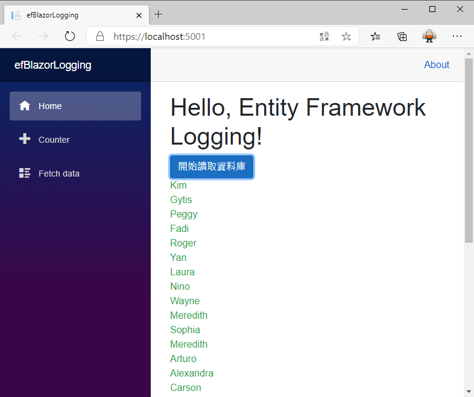

# 在 ASP.NET Core Blazor 專案內，觀察送出的 SQL 敘述

根據 上一篇 EF Core 討論文章 [使用 LoggerFactory 觀察 EF Core 送出的 SQL Statement](https://csharpkh.blogspot.com/2020/10/Entity-Framework-Core-LoggerFactory-DbContextOptionsBuilder-DbContext-UseSqlServer.html) ，了解到如何透過 [LoggerFactory] 這個工廠方法來建立可以產生日誌 Log 紀錄資訊的有用資料，藉以觀察 EF Core 產生了甚麼 SQL 敘述到 Server Server 內，而不用透過 SQL Server Profiler 來觀察。

在這篇文章中，來了解如何在 ASP.NET Core 的專案內，這裡將會使用 Blazor Server-Side 類型的專案作為講解與練習的範本，如何觀察 EF Core 產生了哪些 SQL 敘述到 SQL Server 內。

關於更多這方面的應用，可以參考 [.NET Core 與 ASP.NET Core 中的記錄](https://docs.microsoft.com/zh-tw/aspnet/core/fundamentals/logging/?view=aspnetcore-3.1&WT.mc_id=DT-MVP-5002220) 這份文件內容。

請按照底下的步驟來進行操作

## 建立練習專案

* 打開 Visual Studio 2019
* 點選 [建立新的專案] 按鈕
* 在 [建立新專案] 對話窗內，選擇 [Blazor 應用程式] 專案樣板
* 在 [設定新的專案] 對話窗內，於 [專案名稱] 欄位內輸入 `efBlazorLogging`
* 在 [建立新的 Blazor 應用程式] 對話窗內，選擇 [Blazor 伺服器應用程式] 這個選項

  > 在該對話窗右半部的其他選項，可以不用變更

* 點選 [建立] 按鈕，以便開始建立這個專案

## 加入 Entity Framework Core 要使用到的 NuGet 套件

* 滑鼠右擊專案內的 [相依性] 節點
* 選擇 [管理 NuGet 套件]
* 點選 [瀏覽] 標籤分頁頁次
* 在 [搜尋] 文字輸入盒內，輸入 [Microsoft.EntityFrameworkCore.SqlServer]
* 點選 [安裝] 按鈕以便安裝這個套件
* 在 [搜尋] 文字輸入盒內，輸入 [Microsoft.EntityFrameworkCore.Tools]
* 點選 [安裝] 按鈕以便安裝這個套件

## 使用反向工程來產生 Entity Framework 要用到的 Entity 模型相關類別

* 切換到 [套件管理器主控台] 視窗

  > 若沒有看到 [套件管理器主控台] 視窗，點選功能表 [工具] > [NuGet 套件管理員] > [套件管理器主控台]

* 在 [套件管理器主控台] 輸入底下內容

  > 因為都在同一個專案內，所以，這裡可以省略 `StartupProject` & `Project` 這兩個參數，因此，底下的指令會更為精簡

```
Scaffold-DbContext "Data Source=(localdb)\MSSQLLocalDB;Initial Catalog=School" Microsoft.EntityFrameworkCore.SqlServer -OutputDir Models -f
```

## 修改 Blazor 頁面可以透過 Entity Framework Core 讀取資料庫內的紀錄

* 在專案根目錄下，打開 [Startup.cs] 這個檔案
* 找到 [ConfigureServices] 方法，在該方法內加入 `services.AddDbContext<SchoolContext>();` 敘述

```csharp
public void ConfigureServices(IServiceCollection services)
{
    services.AddRazorPages();
    services.AddServerSideBlazor();
    services.AddSingleton<WeatherForecastService>();
    services.AddDbContext<SchoolContext>();
}
```

* 找到 [Pages] 資料夾，打開這個 [Index.razor] 檔案，完成底下的程式碼

```html
@page "/"
@using efBlazorLogging.Models
@using Microsoft.EntityFrameworkCore
@using Microsoft.Extensions.Logging
@inject ILogger<Index> logger
@inject SchoolContext context

<h1>Hello, Entity Framework Logging!</h1>

<div>
    <button class="btn btn-primary" @onclick="ReadAsync">開始讀取資料庫</button>
</div>

@if (people != null)
{
    <div>
        @foreach (var item in people)
        {
            <div class="text-success">@item.FirstName</div>
        }
    </div>
}

@code{
    List<Person> people = new List<Person>();

    async Task ReadAsync()
    {
        logger.LogInformation("開始讀取資料庫", null);
        people = await context.Person.ToListAsync();

        // SchoolContext 一定要由相依注入取得，才會自動擁有 Log 能力
        //using (var context = new SchoolContext())
        //{
        //    people = await context.Person.ToListAsync();
        //}
    }
}
```

這個頁面會呼叫 `context.Person.ToListAsync();` 非同步方法，取得所有 [Person] 資料表內的紀錄，並且儲存在 people 變數內；一旦這個集合類型的變數有資料，透過 Blazor 的資料綁定，便會將所有的人員記錄顯示在網頁上。

這裡使用了幾個技巧，首先宣告 `@inject ILogger<Index> logger` 要注入 ILogger 物件，因此，在這個頁面便可以將自動邏輯要顯示的 Log 內容，透過 logger 執行個體來輸出到日誌記錄內；例如，這裡使用了 `logger.LogInformation("開始讀取資料庫", null);` 這樣的敘述，將會在 Log 指定輸出的目的地顯示 `開始讀取資料庫` 文字

第二，這裡不能夠自己使用 new 運算子來產生 DbContext 物件，因為這樣將無法正常的取得 Entity Framework 內的輸出日誌內容；因此，這裡一樣需要宣告 `@inject SchoolContext context` 這樣的敘述，要求注入 SchoolContext 物件。

> 這裡可以這樣使用 ，這是因為前面有在 [Startup] 類別內，執行了 `services.AddDbContext<SchoolContext>();` 敘述

## 執行這個專案並且觀察執行結果

* 請執行這個專案
* 當網頁顯示的職後，請點選 [開始讀取資料庫] 按鈕
* 稍等一下，就會看到如下的網頁

  

* 底下是 Console 視窗中的輸出內容

```
info: Microsoft.Hosting.Lifetime[0]
      Now listening on: https://localhost:5001
info: Microsoft.Hosting.Lifetime[0]
      Now listening on: http://localhost:5000
info: Microsoft.Hosting.Lifetime[0]
      Application started. Press Ctrl+C to shut down.
info: Microsoft.Hosting.Lifetime[0]
      Hosting environment: Development
info: Microsoft.Hosting.Lifetime[0]
      Content root path: D:\Vulcan\GitHub\CSharp2020\efBlazorLogging\efBlazorLogging
info: efBlazorLogging.Pages.Index[0]
      開始讀取資料庫
```

現在發現到問題了，那就是自己指定 Log 輸出有成功顯示於 Console 內，而 Entity Framework Core 的相關產生 SQL 指定的內容，卻沒有顯示在 Console 內，因此，要來做些修正。

## 指定 Entity Framework Core 要顯示那些等級的 Log

* 請打開 [appsettings.Development.json] 檔案
* 在這個檔案內的 LogLevel 內，加入一個屬性 : `"Microsoft.EntityFrameworkCore": "Information"` ；完成後的全部內容，如底下清單所示

```json
{
  "DetailedErrors": true,
  "Logging": {
    "LogLevel": {
      "Default": "Information",
      "Microsoft": "Warning",
      "Microsoft.EntityFrameworkCore": "Information",
      "Microsoft.Hosting.Lifetime": "Information"
    }
  }
}
```

* 重新再執行一次這個專案，並且點選讀取資料庫的按鈕
* 此時，從 Console 視窗內將會看到底下內容

```
info: Microsoft.Hosting.Lifetime[0]
      Now listening on: https://localhost:5001
info: Microsoft.Hosting.Lifetime[0]
      Now listening on: http://localhost:5000
info: Microsoft.Hosting.Lifetime[0]
      Application started. Press Ctrl+C to shut down.
info: Microsoft.Hosting.Lifetime[0]
      Hosting environment: Development
info: Microsoft.Hosting.Lifetime[0]
      Content root path: D:\Vulcan\GitHub\CSharp2020\efBlazorLogging\efBlazorLogging
info: efBlazorLogging.Pages.Index[0]
      開始讀取資料庫
info: Microsoft.EntityFrameworkCore.Infrastructure[10403]
      Entity Framework Core 3.1.8 initialized 'SchoolContext' using provider 'Microsoft.EntityFrameworkCore.SqlServer' with options: None
info: Microsoft.EntityFrameworkCore.Database.Command[20101]
      Executed DbCommand (56ms) [Parameters=[], CommandType='Text', CommandTimeout='30']
      SELECT [p].[PersonID], [p].[EnrollmentDate], [p].[FirstName], [p].[HireDate], [p].[LastName]
      FROM [Person] AS [p]
```

現在終於可以看到 Entity Framework Core 所產生的 SQL 指令；這裡的做法可以參考 [設定記錄](https://docs.microsoft.com/zh-tw/aspnet/core/fundamentals/logging/?view=aspnetcore-3.1&WT.mc_id=DT-MVP-5002220) 文件說明，關於各種 LogLevel 可以使用的內容，可以參考 [LogLevel 列舉](https://docs.microsoft.com/zh-tw/dotnet/api/microsoft.extensions.logging.loglevel?view=dotnet-plat-ext-3.1&WT.mc_id=DT-MVP-5002220)

這裡根據文件上的內容，列出各種日誌等級的說明

欄位
|LogLevel|列舉值|說明|
|-|-|-|
|Trace|0|包含最詳細訊息的記錄。 這些訊息可能包含敏感性應用程式資料。 這些訊息預設會停用，且永遠不應在生產環境中啟用。|
|Debug|1|開發期間用於互動式調查的記錄。 這些記錄主要應包含適用於偵錯的資訊，且不具備任何長期值。|
|Information|2|追蹤應用程式一般流程的記錄。 這些記錄應具備長期值。|
|Warning|3|醒目提示應用程式流程中異常或未預期事件的記錄，這些異常或未預期事件不會造成應用程式執行停止。|
|Error|4|在目前執行流程因失敗而停止時進行醒目提示的記錄。 這些記錄應指出目前活動中的失敗，而非整個應用程式的失敗。|
|Critical|5|描述無法復原的應用程式或系統損毀，或需要立即注意重大失敗的記錄。
None|6|不會用來寫入記錄訊息。 指定記錄類別不應寫入任何訊息。|

## 現在來嘗試將 EF Core LogLevel 切換為 Trace

* 請打開 [appsettings.Development.json] 檔案
* 在將屬性 `"Microsoft.EntityFrameworkCore"` 的值修改成為 ` "Trace"` ；完成後的全部內容，如底下清單所示

```json
{
  "DetailedErrors": true,
  "Logging": {
    "LogLevel": {
      "Default": "Information",
      "Microsoft": "Warning",
      "Microsoft.EntityFrameworkCore": "Trace",
      "Microsoft.Hosting.Lifetime": "Information"
    }
  }
}
```

* 重新再執行一次這個專案，並且點選讀取資料庫的按鈕
* 此時，從 Console 視窗內將會看到底下內容

```
info: Microsoft.Hosting.Lifetime[0]
      Now listening on: https://localhost:5001
info: Microsoft.Hosting.Lifetime[0]
      Now listening on: http://localhost:5000
info: Microsoft.Hosting.Lifetime[0]
      Application started. Press Ctrl+C to shut down.
info: Microsoft.Hosting.Lifetime[0]
      Hosting environment: Development
info: Microsoft.Hosting.Lifetime[0]
      Content root path: D:\Vulcan\GitHub\CSharp2020\efBlazorLogging\efBlazorLogging
info: efBlazorLogging.Pages.Index[0]
      開始讀取資料庫
dbug: Microsoft.EntityFrameworkCore.Infrastructure[10409]
      An additional 'IServiceProvider' was created for internal use by Entity Framework. An existing service provider was not used due to the following configuration changes: configuration changed for 'Core:ConfigureWarnings', configuration added for 'SqlServer:UseRowNumberForPaging'.
dbug: Microsoft.EntityFrameworkCore.Model[10601]
      The index {'CourseId'} was not created on entity type 'CourseInstructor' as the properties are already covered by the index {'CourseId', 'PersonId'}.
info: Microsoft.EntityFrameworkCore.Infrastructure[10403]
      Entity Framework Core 3.1.8 initialized 'SchoolContext' using provider 'Microsoft.EntityFrameworkCore.SqlServer' with options: None
dbug: Microsoft.EntityFrameworkCore.Query[10107]
      queryContext => new QueryingEnumerable<Person>(
          (RelationalQueryContext)queryContext,
          RelationalCommandCache,
          null,
          null,
          Func<QueryContext, DbDataReader, ResultContext, int[], ResultCoordinator, Person>,
          efBlazorLogging.Models.SchoolContext,
          null
      )
dbug: Microsoft.EntityFrameworkCore.Database.Command[20103]
      Creating DbCommand for 'ExecuteReader'.
dbug: Microsoft.EntityFrameworkCore.Database.Command[20104]
      Created DbCommand for 'ExecuteReader' (30ms).
dbug: Microsoft.EntityFrameworkCore.Database.Connection[20000]
      Opening connection to database 'School' on server '(localdb)\MSSQLLocalDB'.
dbug: Microsoft.EntityFrameworkCore.Database.Connection[20001]
      Opened connection to database 'School' on server '(localdb)\MSSQLLocalDB'.
dbug: Microsoft.EntityFrameworkCore.Database.Command[20100]
      Executing DbCommand [Parameters=[], CommandType='Text', CommandTimeout='30']
      SELECT [p].[PersonID], [p].[EnrollmentDate], [p].[FirstName], [p].[HireDate], [p].[LastName]
      FROM [Person] AS [p]
info: Microsoft.EntityFrameworkCore.Database.Command[20101]
      Executed DbCommand (51ms) [Parameters=[], CommandType='Text', CommandTimeout='30']
      SELECT [p].[PersonID], [p].[EnrollmentDate], [p].[FirstName], [p].[HireDate], [p].[LastName]
      FROM [Person] AS [p]
dbug: Microsoft.EntityFrameworkCore.ChangeTracking[10806]
      Context 'SchoolContext' started tracking 'Person' entity. Consider using 'DbContextOptionsBuilder.EnableSensitiveDataLogging' to see key values.
dbug: Microsoft.EntityFrameworkCore.ChangeTracking[10806]
      Context 'SchoolContext' started tracking 'Person' entity. Consider using 'DbContextOptionsBuilder.EnableSensitiveDataLogging' to see key values.
dbug: Microsoft.EntityFrameworkCore.ChangeTracking[10806]
      Context 'SchoolContext' started tracking 'Person' entity. Consider using 'DbContextOptionsBuilder.EnableSensitiveDataLogging' to see key values.
dbug: Microsoft.EntityFrameworkCore.ChangeTracking[10806]
      Context 'SchoolContext' started tracking 'Person' entity. Consider using 'DbContextOptionsBuilder.EnableSensitiveDataLogging' to see key values.
dbug: Microsoft.EntityFrameworkCore.ChangeTracking[10806]
      Context 'SchoolContext' started tracking 'Person' entity. Consider using 'DbContextOptionsBuilder.EnableSensitiveDataLogging' to see key values.
dbug: Microsoft.EntityFrameworkCore.ChangeTracking[10806]
      Context 'SchoolContext' started tracking 'Person' entity. Consider using 'DbContextOptionsBuilder.EnableSensitiveDataLogging' to see key values.
dbug: Microsoft.EntityFrameworkCore.ChangeTracking[10806]
      Context 'SchoolContext' started tracking 'Person' entity. Consider using 'DbContextOptionsBuilder.EnableSensitiveDataLogging' to see key values.
dbug: Microsoft.EntityFrameworkCore.ChangeTracking[10806]
      Context 'SchoolContext' started tracking 'Person' entity. Consider using 'DbContextOptionsBuilder.EnableSensitiveDataLogging' to see key values.
dbug: Microsoft.EntityFrameworkCore.ChangeTracking[10806]
      Context 'SchoolContext' started tracking 'Person' entity. Consider using 'DbContextOptionsBuilder.EnableSensitiveDataLogging' to see key values.
dbug: Microsoft.EntityFrameworkCore.ChangeTracking[10806]
      Context 'SchoolContext' started tracking 'Person' entity. Consider using 'DbContextOptionsBuilder.EnableSensitiveDataLogging' to see key values.
dbug: Microsoft.EntityFrameworkCore.ChangeTracking[10806]
      Context 'SchoolContext' started tracking 'Person' entity. Consider using 'DbContextOptionsBuilder.EnableSensitiveDataLogging' to see key values.
dbug: Microsoft.EntityFrameworkCore.ChangeTracking[10806]
      Context 'SchoolContext' started tracking 'Person' entity. Consider using 'DbContextOptionsBuilder.EnableSensitiveDataLogging' to see key values.
dbug: Microsoft.EntityFrameworkCore.ChangeTracking[10806]
      Context 'SchoolContext' started tracking 'Person' entity. Consider using 'DbContextOptionsBuilder.EnableSensitiveDataLogging' to see key values.
dbug: Microsoft.EntityFrameworkCore.ChangeTracking[10806]
      Context 'SchoolContext' started tracking 'Person' entity. Consider using 'DbContextOptionsBuilder.EnableSensitiveDataLogging' to see key values.
dbug: Microsoft.EntityFrameworkCore.ChangeTracking[10806]
      Context 'SchoolContext' started tracking 'Person' entity. Consider using 'DbContextOptionsBuilder.EnableSensitiveDataLogging' to see key values.
dbug: Microsoft.EntityFrameworkCore.ChangeTracking[10806]
      Context 'SchoolContext' started tracking 'Person' entity. Consider using 'DbContextOptionsBuilder.EnableSensitiveDataLogging' to see key values.
dbug: Microsoft.EntityFrameworkCore.ChangeTracking[10806]
      Context 'SchoolContext' started tracking 'Person' entity. Consider using 'DbContextOptionsBuilder.EnableSensitiveDataLogging' to see key values.
dbug: Microsoft.EntityFrameworkCore.ChangeTracking[10806]
      Context 'SchoolContext' started tracking 'Person' entity. Consider using 'DbContextOptionsBuilder.EnableSensitiveDataLogging' to see key values.
dbug: Microsoft.EntityFrameworkCore.ChangeTracking[10806]
      Context 'SchoolContext' started tracking 'Person' entity. Consider using 'DbContextOptionsBuilder.EnableSensitiveDataLogging' to see key values.
dbug: Microsoft.EntityFrameworkCore.ChangeTracking[10806]
      Context 'SchoolContext' started tracking 'Person' entity. Consider using 'DbContextOptionsBuilder.EnableSensitiveDataLogging' to see key values.
dbug: Microsoft.EntityFrameworkCore.ChangeTracking[10806]
      Context 'SchoolContext' started tracking 'Person' entity. Consider using 'DbContextOptionsBuilder.EnableSensitiveDataLogging' to see key values.
dbug: Microsoft.EntityFrameworkCore.ChangeTracking[10806]
      Context 'SchoolContext' started tracking 'Person' entity. Consider using 'DbContextOptionsBuilder.EnableSensitiveDataLogging' to see key values.
dbug: Microsoft.EntityFrameworkCore.ChangeTracking[10806]
      Context 'SchoolContext' started tracking 'Person' entity. Consider using 'DbContextOptionsBuilder.EnableSensitiveDataLogging' to see key values.
dbug: Microsoft.EntityFrameworkCore.ChangeTracking[10806]
      Context 'SchoolContext' started tracking 'Person' entity. Consider using 'DbContextOptionsBuilder.EnableSensitiveDataLogging' to see key values.
dbug: Microsoft.EntityFrameworkCore.ChangeTracking[10806]
      Context 'SchoolContext' started tracking 'Person' entity. Consider using 'DbContextOptionsBuilder.EnableSensitiveDataLogging' to see key values.
dbug: Microsoft.EntityFrameworkCore.ChangeTracking[10806]
      Context 'SchoolContext' started tracking 'Person' entity. Consider using 'DbContextOptionsBuilder.EnableSensitiveDataLogging' to see key values.
dbug: Microsoft.EntityFrameworkCore.ChangeTracking[10806]
      Context 'SchoolContext' started tracking 'Person' entity. Consider using 'DbContextOptionsBuilder.EnableSensitiveDataLogging' to see key values.
dbug: Microsoft.EntityFrameworkCore.ChangeTracking[10806]
      Context 'SchoolContext' started tracking 'Person' entity. Consider using 'DbContextOptionsBuilder.EnableSensitiveDataLogging' to see key values.
dbug: Microsoft.EntityFrameworkCore.ChangeTracking[10806]
      Context 'SchoolContext' started tracking 'Person' entity. Consider using 'DbContextOptionsBuilder.EnableSensitiveDataLogging' to see key values.
dbug: Microsoft.EntityFrameworkCore.ChangeTracking[10806]
      Context 'SchoolContext' started tracking 'Person' entity. Consider using 'DbContextOptionsBuilder.EnableSensitiveDataLogging' to see key values.
dbug: Microsoft.EntityFrameworkCore.ChangeTracking[10806]
      Context 'SchoolContext' started tracking 'Person' entity. Consider using 'DbContextOptionsBuilder.EnableSensitiveDataLogging' to see key values.
dbug: Microsoft.EntityFrameworkCore.ChangeTracking[10806]
      Context 'SchoolContext' started tracking 'Person' entity. Consider using 'DbContextOptionsBuilder.EnableSensitiveDataLogging' to see key values.
dbug: Microsoft.EntityFrameworkCore.ChangeTracking[10806]
      Context 'SchoolContext' started tracking 'Person' entity. Consider using 'DbContextOptionsBuilder.EnableSensitiveDataLogging' to see key values.
dbug: Microsoft.EntityFrameworkCore.ChangeTracking[10806]
      Context 'SchoolContext' started tracking 'Person' entity. Consider using 'DbContextOptionsBuilder.EnableSensitiveDataLogging' to see key values.
dbug: Microsoft.EntityFrameworkCore.Database.Command[20300]
      A data reader was disposed.
dbug: Microsoft.EntityFrameworkCore.Database.Connection[20002]
      Closing connection to database 'School' on server '(localdb)\MSSQLLocalDB'.
dbug: Microsoft.EntityFrameworkCore.Database.Connection[20003]
      Closed connection to database 'School' on server '(localdb)\MSSQLLocalDB'.
```


