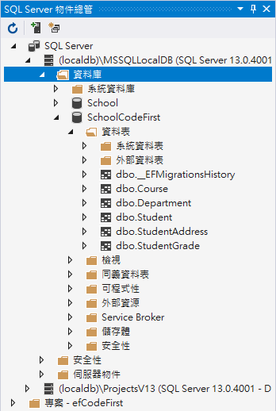

# Code First 建立 Entity Framework Core 應用專案

在前一個文章 [Console 專案與 EF Core 讀取已經存在的資料庫](https://csharpkh.blogspot.com/2020/09/Entity-Framework-Core-Read-Query-Table-Record-DbContext.html) ，說明了如何 DbContext 類別，來讀取後端資料庫內的紀錄；在這裡將要練習另外一種 Entity Framework Core 的架構，稱作 Code First，也就是說，開發過程中，會先來使用 C# 類別定義出各種對應到後端資料庫內資料表的 Entity 類別，接著，透過這些 Entity 類別，產生出後端的資料，或者，直接進行存取。

請按照底下的步驟來進行操作

## 建立練習專案

* 打開 Visual Studio 2019
* 點選 [建立新的專案] 按鈕
* 在 [建立新專案] 對話窗內，選擇 [主控台應用程式 (.NET Core)] 專案樣板
* 在 [設定新的專案] 對話窗內，於 [專案名稱] 欄位內輸入 `efCodeFirst`
* 點選 [建立] 按鈕，以便開始建立這個專案

## 加入 Entity Framework Core 要使用到的 NuGet 套件

* 滑鼠右擊專案內的 [相依性] 節點
* 選擇 [管理 NuGet 套件]
* 點選 [瀏覽] 標籤分頁頁次
* 在 [搜尋] 文字輸入盒內，輸入 [Microsoft.EntityFrameworkCore.SqlServer]
* 點選 [安裝] 按鈕以便安裝這個套件
* 在 [搜尋] 文字輸入盒內，輸入 [Microsoft.EntityFrameworkCore.Tools]
* 點選 [安裝] 按鈕以便安裝這個套件

## 建立 Entity Framework 要用到的 Entity 模型相關類別

* 在專案下，建立 [Models] 目錄

* 在 [Models] 目錄下，建立 [Department] 類別，其程式碼如下

  這裡宣告這個 Department Entity 內，有兩個欄位，分別是 Id 與 Name；另外，他與 Course 這個 Entity 具有一對多的關聯，也就是說，一個 Department 會有多個 Course 紀錄

```csharp
public class Department
{
    public Department()
    {
        Courses = new HashSet<Course>();
    }
    public int Id { get; set; }
    public string Name { get; set; }
    public virtual ICollection<Course> Courses { get; set; }
}
```

* 在 [Models] 目錄下，建立 [Course] 類別，其程式碼如下

  這裡宣告這個 Course Entity 內，有兩個欄位，分別是 Id 與 Name，並且也宣告一個 Foreign Key 外鍵 DepartmentId 與一個導航屬性 Department，這裡表示了 Course 這個 Entity 將會對應到一個 Department Entity上；另外，他與 StudentGrade 這個 Entity 具有一對多的關聯，也就是說，一個 Course 會有多個 StudentGrade 紀錄。因為通常在學校內，一個課程內，將會有多個學生的考試成績紀錄。

```csharp
public class Course
{
    public Course()
    {
        StudentGrades = new HashSet<StudentGrade>();
    }
    public int Id { get; set; }
    public string Name { get; set; }
    public int DepartmentId { get; set; }
    public virtual Department Department { get; set; }
    public virtual ICollection<StudentGrade> StudentGrades { get; set; }
}
```

* 在 [Models] 目錄下，建立 [Student] 類別，其程式碼如下

  這裡宣告這個 Student Entity 內，有兩個欄位，分別是 Id 與 Name，並且也宣告一個導航屬性 Department，這裡表示了 Address 這個 Entity 將會對應到一個 StudentAddress Entity上；另外，他與 StudentGrades 這個 Entity 具有一對多的關聯，也就是說，一個 Student 會有多個 StudentGrade 紀錄。因為通常在學校內，一個學生內，將會有多個課程的考試成績紀錄。

  > 從這裡將會推論，學生 Student 與 課程 Course 這兩個類別，將會呈現了多對多的關係，而StudentGrade這個 Entity，則是扮演著這兩個 Entity 之間的一對多的關係。

```csharp
public class Student
{
    public Student()
    {
        StudentGrades = new HashSet<StudentGrade>();
    }
    public int Id { get; set; }
    public string Name { get; set; }
 
    public virtual StudentAddress Address { get; set; }
    public virtual ICollection<StudentGrade> StudentGrades { get; set; }
}
```

* 在 [Models] 目錄下，建立 [StudentAddress] 類別，其程式碼如下

  這裡宣告這個 StudentAddress Entity 內，有五個欄位，分別是 Id 、 Address 、 City 、 State 、 Country，並且也宣告一個 Foreign Key 外鍵 StudentId 與一個導航屬性 Student ，這裡表示了 StudentAddress 這個 Entity 將會與 Student Entity 呈現了一對一的關係。

```csharp
public class StudentAddress
{
    public int Id { get; set; }
    public string Address { get; set; }
    public string City { get; set; }
    public string State { get; set; }
    public string Country { get; set; }
 
    public int StudentId { get; set; }
    public virtual Student Student { get; set; }
}
```

## 建立資料庫架構的 DbContent 類別

* 在 [Models] 目錄下，建立 [DataContext] 類別，其程式碼如下

  這裡建立一個 DataContext 類別，該類別繼承了 DbContext 這個類別；在這個 DataContext 內，使用 DbSet<T> 類別，宣告了三個屬性，說明了這個資料庫內共有三個資料表，有兩個欄位，分別是 Id 與 Name；另外，他與 Course 這個 Entity 具有一對多的關聯，也就是說，一個 Department 會有多個 Course 紀錄

```csharp
public class DataContext : DbContext
{
    public virtual DbSet<Student> Student { get; set; }
    public virtual DbSet<StudentGrade> StudentGrade { get; set; }
    public virtual DbSet<StudentAddress> StudentAddress { get; set; }
    public virtual DbSet<Course> Course { get; set; }
    public virtual DbSet<Department> Department { get; set; }

    public DataContext()
    {
    }

    public DataContext(DbContextOptions<DataContext> options)
        : base(options)
    {
    }

    protected override void OnConfiguring(DbContextOptionsBuilder optionsBuilder)
    {
        if (!optionsBuilder.IsConfigured)
        {
            optionsBuilder.UseSqlServer("Data Source=(localdb)\\MSSQLLocalDB;Initial Catalog=SchoolCodeFirst");
        }
    }

    protected override void OnModelCreating(ModelBuilder modelBuilder)
    {
    }

}
```


現在 Entity Model 相關資料已經建立完成

## 建立資料庫

這裡將會有兩種方式，一種是透過命令列下達指令，另外一種是在程式碼中呼叫 API，首先，先確認該電腦上的 [(localdb)\MSSQLLocalDB]  內，沒有 SchoolCodeFirst 這個資料庫


### 使用 PowerShell 來建立資料庫

* 切換到 [套件管理器主控台] 視窗

  > 若沒有看到 [套件管理器主控台] 視窗，點選功能表 [工具] > [NuGet 套件管理員] > [套件管理器主控台]

* 在 [套件管理器主控台] 輸入底下內容

```
Add-Migration InitialCreate
Update-Database
```

* 若看到底下的訊息顯示出來之後，就表示該資料庫已經建立在 [(localdb)\MSSQLLocalDB] 



```
每個封裝均由其擁有者提供授權給您。NuGet 對於協力廠商封裝不負任何責任，也不提供相關的任何授權。某些封裝可能包含須由其他授權控管的相依項目。請遵循封裝來源 (摘要) URL 決定有無任何相依項目。

套件管理員主控台主機版本 5.7.0.6726

輸入 'get-help NuGet' 可查看所有可用的 NuGet 命令。

PM> Add-Migration InitialCreate
Build started...
Build succeeded.
To undo this action, use Remove-Migration.
PM> Update-Database
Build started...
Build succeeded.
Applying migration '20200926142800_InitialCreate'.
Done.
PM> 
```


### 使用 SQL Server Management Studio (SSMS) 產生 ERD

* 安裝好 SQL Server Management Studio (SSMS) 之後，請打開這個應用程式

* 首先會看到 [連線至伺服器] 對話窗
* 請在 [伺服器名稱] 內，輸入 `(localdb)\.`
* 最後，點選 [連線] 按鈕
* 成功連線之後，將會顯示 [物件總管] 視窗
* 請展開 [物件總管] 視窗內的 [(localdb\.)] > [資料庫] > [School] 節點
* 滑鼠右擊 [資料庫圖表] 節點，從彈出功能表選取 [新增資料庫圖表] 選項
* 第一次將會出現 [此資料庫沒有使用資料庫圖表所需的一或多個支援物件。您要建立它們嗎?] 訊息
* 點選 [是] 按鈕
* 此時將會出現 [加入資料表] 對話窗
* 請將全部資料表都選取起來

  > 想要全部選取，可以先點選第一個資料表 (Course)，接著按下 [Shift] 按鍵，點選最後一個資料表(StudentGrade)

* 最後，點選 [加入] 按鈕
* 若這些資料表沒有正常排列顯示，請在空白處，使用滑鼠右擊，選擇 [排列資料表]，這樣就會看到這個資料庫所以資料表之間的關聯 ERD，哪些是 一對一關係、一對多關係、多對一關係、多對多關係

  

* 透過這裡產生的 ERD，來確認這裡使用 Code First 方式，所建立起來的資料庫架構，是否違當初所設計的內容。

### 使用 API 來建立資料庫

* 打開專案內的 [Program.cs] 這個檔案
* 輸入底下程式碼

```csharp
class Program
{
    static void Main(string[] args)
    {
        var context = new DataContext();
        context.Database.EnsureDeleted();
        context.Database.EnsureCreated();
    }
}
```

首先將會看到建立起一個 DataContext 類別的 context 物件，透過這個物件便可以操作資料庫行為；接下來呼叫了 `context.Database.EnsureDeleted();` API，若此時資料庫系統中有這裡定義的資料庫，會將該資料庫先刪除，接著呼叫 `context.Database.EnsureCreated();` API，這裡將會開始建立這個資料庫。

  
  


