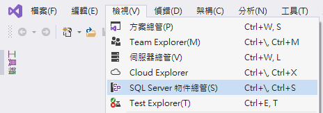
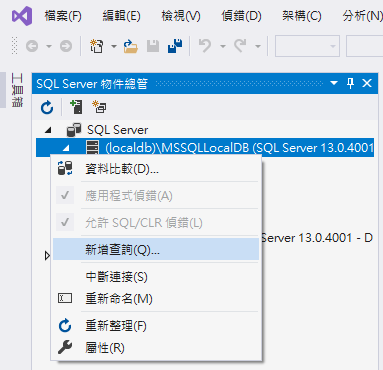
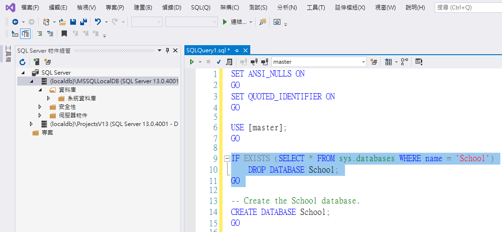
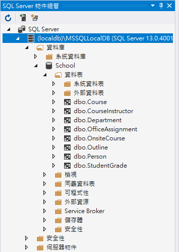

# Entity Framework Core - 建立練習使用的 Contoso University 資料庫

今年將會撰寫許多關於 [Entity Framework Core](https://docs.microsoft.com/zh-tw/ef/core/?WT.mc_id=DT-MVP-5002220) 的設計與使用說明文章，不過，當想要實際進行演練這些 Entity Framework Core 的用法，還是需要有個範例資料庫，並且該資料庫內最好已經具備了許多測試資料；在這裡，將會準備 [Contoso University 資料庫](https://raw.githubusercontent.com/vulcanlee/Blazor-HOL/master/Database/SchemaAndData.sql) 這個範例資料庫，因此，接下來就來說明如何安裝這個練習用的資料庫到讀者的開發電腦上。

## 使用 VS2019 匯入資料庫

* 開啟 [Visual Studio 2019]
* 選擇對話窗右下方的 [不使用程式碼繼續(W)] 連結
* 點選 Visual Studio 2019 功能表的 [檢視] > [SQL Server 物件總管] 選項

  

* 在 [SQL Server 物件總管] 視窗內，展開 [SQL Server] 節點，便會 [(localdb)\MSSQLLocalDB] 這個資料庫服務
* 滑鼠右擊剛剛看到的 localdb 節點，選擇 [新增查詢] 功能表選項

  
* 此時，將會顯示一個 [SQLQuery1.sql] 視窗
* 請使用瀏覽器打開這個連結 [Contoso University 資料庫](https://raw.githubusercontent.com/vulcanlee/Blazor-HOL/master/Database/SchemaAndData.sql)，接這些內容複製到系統的剪貼簿內
* 切換到 [SQLQuery1.sql] 視窗內，把這些內容貼到該視窗內

  

* 點選該視窗標籤下方的綠色三角形，執行這些 SQL 敘述

  這個 [Contoso University 資料庫](https://raw.githubusercontent.com/vulcanlee/Blazor-HOL/master/Database/SchemaAndData.sql) SQL 敘述，將會先把原先的 School 資料庫刪除掉 (可以從上圖的第 9~11 行看到這些 SQL 敘述) ，接著，將會建立 School 資料庫建立起來，並且建立相關資料表與產生測試資料紀錄到資料庫內。

  > 若執行完成之後，可以滑鼠右擊 [SQL Server 物件總管] 內的 localdb 節點，選擇 [重新整理]

## 確認練習用的資料庫已經建立完成

* 請在 [SQL Server 物件總管] 視窗內的 [(localdb)\MSSQLLocalDB] > [資料庫] 節點內，找到 [School] 資料庫節點
* 展開這個 [School] 節點，便可以看到最新產生的練習用資料庫了

  

