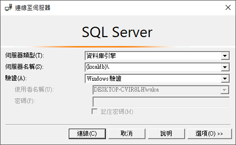
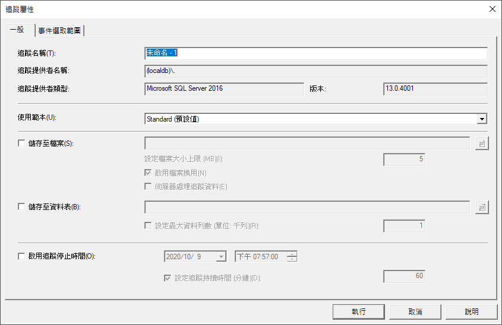
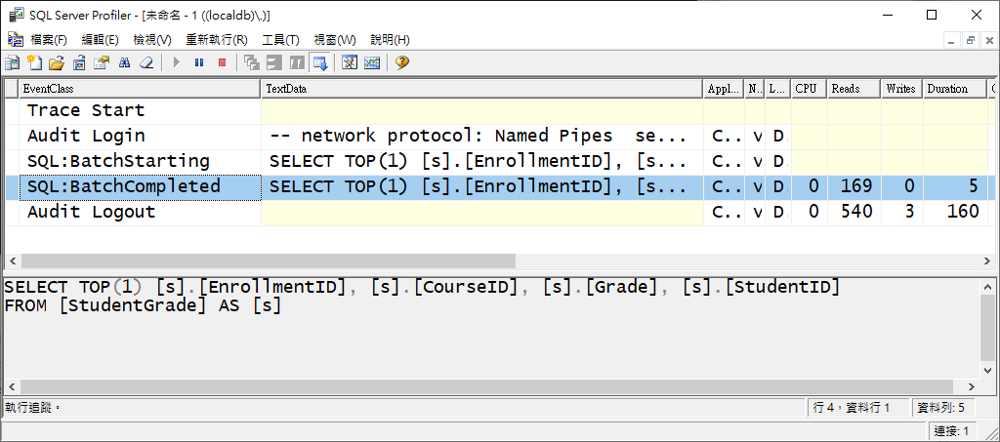

# 使用 DbContextOptionsBuilder 來指定連線字串與觀察 EF Core 產生的 SQL 指令

接續 上一篇 EF Core 討論文章 [DbContext 在多執行緒環境下的運作情況](https://csharpkh.blogspot.com/2020/10/Entity-Framework-Core-dbcontext-multi-thread-safty-InvalidOperationException-OnConfiguring.html) 
，有些時候，當要使用 DbContext 來建立一個可以存取資料庫的 EF Core 的物件，想要能夠自行指定連線字串，可以在該繼承 DbContext 的類別建構函式內，傳入要使用的連線字串，並且於 OnConfiguring 方法內，使用該傳入的連線字串做為要連線到資料庫的依據；不過，這裡使用另外一個方式，那就是使用 [DbContextOptionsBuilder](https://docs.microsoft.com/en-us/dotnet/api/microsoft.entityframeworkcore.dbcontextoptionsbuilder?view=efcore-3.1&WT.mc_id=DT-MVP-5002220) 型別，產生一個這個物件，以便指定要使用的連線字串。

請按照底下的步驟來進行操作

## 建立練習專案

* 打開 Visual Studio 2019
* 點選 [建立新的專案] 按鈕
* 在 [建立新專案] 對話窗內，選擇 [主控台應用程式 (.NET Core)] 專案樣板
* 在 [設定新的專案] 對話窗內，於 [專案名稱] 欄位內輸入 `efDbContextOptionsBuilder`
* 點選 [建立] 按鈕，以便開始建立這個專案

## 加入 Entity Framework Core 要使用到的 NuGet 套件

* 滑鼠右擊專案內的 [相依性] 節點
* 選擇 [管理 NuGet 套件]
* 點選 [瀏覽] 標籤分頁頁次
* 在 [搜尋] 文字輸入盒內，輸入 [Microsoft.EntityFrameworkCore.SqlServer]
* 點選 [安裝] 按鈕以便安裝這個套件
* 在 [搜尋] 文字輸入盒內，輸入 [Microsoft.EntityFrameworkCore.Tools]
* 點選 [安裝] 按鈕以便安裝這個套件

## 使用反向工程來產生 Entity Framework 要用到的 Entity 模型相關類別

* 切換到 [套件管理器主控台] 視窗

  > 若沒有看到 [套件管理器主控台] 視窗，點選功能表 [工具] > [NuGet 套件管理員] > [套件管理器主控台]

* 在 [套件管理器主控台] 輸入底下內容

  > 因為都在同一個專案內，所以，這裡可以省略 `StartupProject` & `Project` 這兩個參數，因此，底下的指令會更為精簡

```
Scaffold-DbContext "Data Source=(localdb)\MSSQLLocalDB;Initial Catalog=School" Microsoft.EntityFrameworkCore.SqlServer -OutputDir Models -f
```

現在 Entity Model 相關資料已經建立完成

請觀察 [SchoolContext.cs] 檔案，這裡的 SchoolContext 類別繼承了 DbContext 類別，不過，這裡有兩個建構式，一個是預設建構函式，也就是沒有任何參數的建構式，另外一個建構式可以接收 [DbContextOptions<T>] 這個型別的物件；另外，在 [OnConfiguring] 覆寫方法內，將會檢查傳入的 [DbContextOptionsBuilder] 物件的 [IsConfigured] 屬性是否為 真，用來確認是否已經指定了連線字串，若沒有指定的話，將會在這裡使用預設的本機 localDB 資料庫之連線字串。

```csharp
    public partial class SchoolContext : DbContext
    {
        public SchoolContext()
        {
        }
 
        public SchoolContext(DbContextOptions<SchoolContext> options)
            : base(options)
        {
        }
 
        protected override void OnConfiguring(DbContextOptionsBuilder optionsBuilder)
        {
            if (!optionsBuilder.IsConfigured)
            {
#warning To protect potentially sensitive information in your connection string, you should move it out of source code. See http://go.microsoft.com/fwlink/?LinkId=723263 for guidance on storing connection strings.
                optionsBuilder.UseSqlServer("Data Source=(localdb)\\MSSQLLocalDB;Initial Catalog=School");
            }
        }
 
        protected override void OnModelCreating(ModelBuilder modelBuilder)
        {
             . . .
            OnModelCreatingPartial(modelBuilder);
        }
 
        partial void OnModelCreatingPartial(ModelBuilder modelBuilder);
    }
```

因此，透過上面的解說，將會進行相關的程式開發與設計

請打開這個 [Program.cs] 檔案，完成底下的程式碼

```csharp
static void Main(string[] args)
{
    string connectionString = @"Data Source=(localdb)\MSSQLLocalDB;Initial Catalog=School";
    DbContextOptions<SchoolContext> options = new DbContextOptionsBuilder<SchoolContext>()
        .UseSqlServer(connectionString)
        .Options;
    using (var context = new SchoolContext(options))
    {
        Console.WriteLine($"取得 StudentGrade 第一筆紀錄");
        var aStudentGrade = context.StudentGrade.FirstOrDefault();
        Console.WriteLine($"{aStudentGrade.StudentId} 學生的 {aStudentGrade.CourseId} 課程的成績為 {aStudentGrade.Grade}");
    }
}
```

從上面的程式碼中，可以看到首先建立了一個 connectionString 字串物件，該字串即是準備要用到的連線字串，緊接著建立一個 [DbContextOptions<SchoolContext>] 泛型型別物件，在該物件建立之後，便呼叫 [UseSqlServer] 方法，只是此次要 EF Core 使用指定的連線字串，連線到 SQL Server 服務上，最後，透過 [Options] 屬性，取得此次設定的相關內容。

如此，便可以建立 [SchoolContext] DbContext 物件，不過，需要在該建構函式內傳入剛剛產生的 [DbContextOptions<SchoolContext>] 物件，如此，一切準備工作都就緒了，便可以透過 [context] 變數來取得後端 SQL Server 內資料表的紀錄。

執行結果如下

```
取得 StudentGrade 第一筆紀錄
2 學生的 2021 課程的成績為 4.00
```

最後，要來觀察究竟 EF Core 產生了甚麼 SQL 指定到後端 SQL Server 內，此時，便可以透過 [SSMS](https://docs.microsoft.com/zh-tw/sql/ssms/download-sql-server-management-studio-ssms?view=sql-server-ver15&WT.mc_id=DT-MVP-5002220) (SQL Server Management Studio) 這個工具來觀察，請打開此連結 [SSMS](https://docs.microsoft.com/zh-tw/sql/ssms/download-sql-server-management-studio-ssms?view=sql-server-ver15&WT.mc_id=DT-MVP-5002220) ，下載與安裝這個工具。

安裝好之後，請找到 [SQL Server Profilee 18](https://docs.microsoft.com/zh-tw/sql/tools/sql-server-profiler/sql-server-profiler?view=sql-server-ver15&WT.mc_id=DT-MVP-5002220) 這個應用程式，並且打開與執行。

點選功能表 [檔案] > [新增追蹤] 選項

當 [連線至伺服器] 對話窗出現之後，請在 [伺服器名稱] 欄位內，輸入 `(localdb)\.` 內容



點選 [連線] 按鈕，連線到 [SQL Server Express LocalDB](https://docs.microsoft.com/zh-tw/sql/database-engine/configure-windows/sql-server-express-localdb?view=sql-server-ver15&WT.mc_id=DT-MVP-5002220) 上

當出現 [連線屬性] 對話窗，點選 [執行按鈕]



現在可以重新執行剛剛建立的 [efDbContextOptionsBuilder] 專案；一旦執行完成之後，便可以看到底下的內容



從上面的 SQL Server Profiler 畫面中，可以看到此次將送出底下的 SQL指令到 SQL Server 內，而這個 SQL 指令是因為程式中執行了 `context.StudentGrade.FirstOrDefault();` 敘述， EF Core 根據這個 C# 敘述所產生出來的 SQL 指令。

```
SELECT TOP(1) [s].[EnrollmentID], [s].[CourseID], [s].[Grade], [s].[StudentID]
FROM [StudentGrade] AS [s]
```


