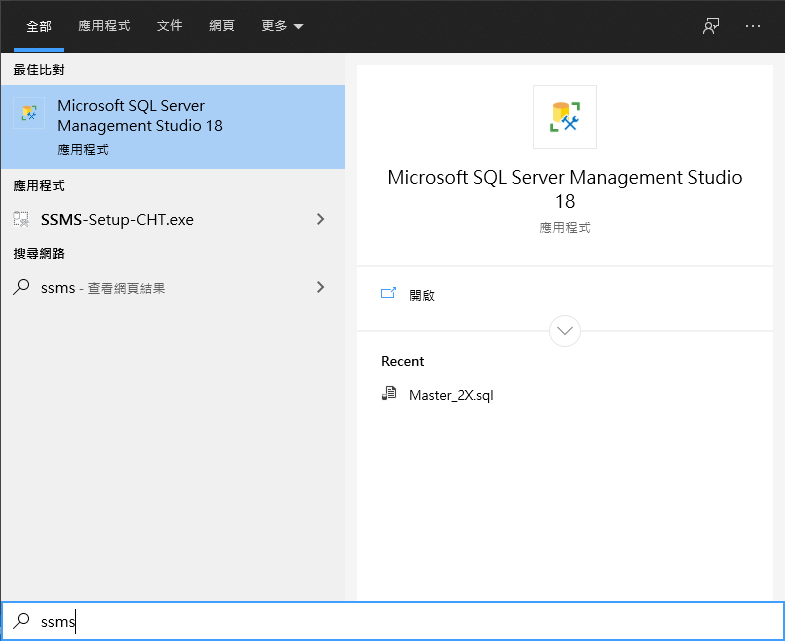
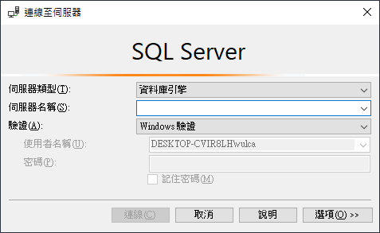
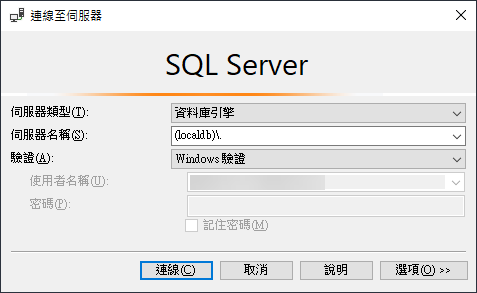
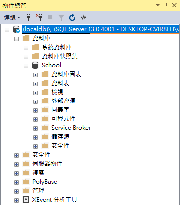
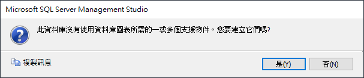
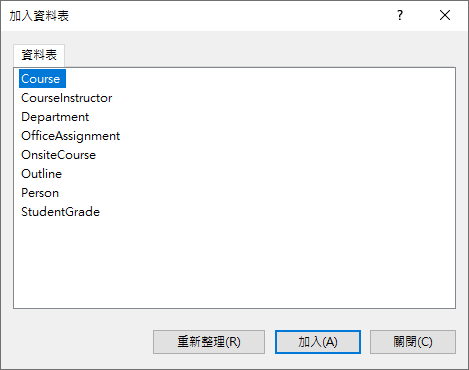
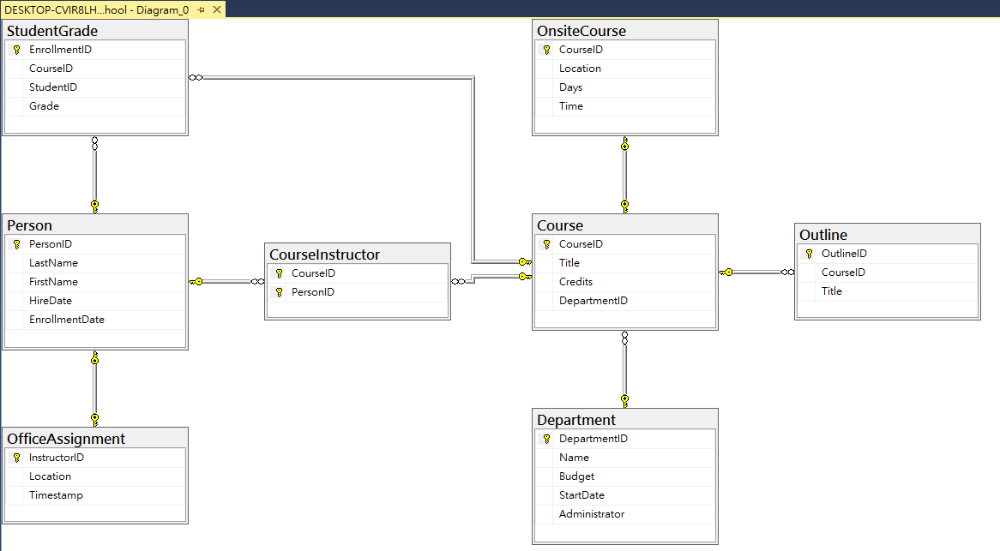

# 建立與查看Contoso 大學資料庫的 ERD Entity-Relationship Diagram

在上一篇文章 [Entity Framework Core - 建立練習使用的 Contoso University 資料庫](https://csharpkh.blogspot.com/2020/09/Entity-Framework-Core-Contoso-University-Database.html) 中，已經說明如何在開發電腦環境中，建立一個測試用的資料庫，並且該資料庫內也產生了許多測試紀錄。可是，在這個資料庫內，這些資料表 Table 之間的關聯為何? 也就是在進行關聯式資料庫設計時候，經常會用到的 設計時候，ERD Entity-Relationship Diagram 是呈現甚麼內容？ 在這篇文章中，將會說明如何得到這方面的資訊。

## 安裝 SQL Server Management Studio (SSMS)

* 首先，打開 [下載 SQL Server Management Studio (SSMS)](https://docs.microsoft.com/zh-tw/sql/ssms/download-sql-server-management-studio-ssms?WT.mc_id=DT-MVP-5002220)網頁
* 下載並且安裝 [SQL Server Management Studio (SSMS)] 這套工具

## 使用 SQL Server Management Studio (SSMS) 產生 ERD

* 安裝好 SQL Server Management Studio (SSMS) 之後，請打開這個應用程式

  

* 首先會看到 [連線至伺服器] 對話窗

  

* 請在 [伺服器名稱] 內，輸入 `(localdb)\.`

  

* 最後，點選 [連線] 按鈕
* 成功連線之後，將會顯示 [物件總管] 視窗
* 請展開 [物件總管] 視窗內的 [(localdb\.)] > [資料庫] > [School] 節點

  

* 滑鼠右擊 [資料庫圖表] 節點，從彈出功能表選取 [新增資料庫圖表] 選項
* 第一次將會出現 [此資料庫沒有使用資料庫圖表所需的一或多個支援物件。您要建立它們嗎?] 訊息
* 點選 [是] 按鈕

  

* 此時將會出現 [加入資料表] 對話窗
* 請將全部資料表都選取起來

  > 想要全部選取，可以先點選第一個資料表 (Course)，接著按下 [Shift] 按鍵，點選最後一個資料表(StudentGrade)

  

* 最後，點選 [加入] 按鈕
* 若這些資料表沒有正常排列顯示，請在空白處，使用滑鼠右擊，選擇 [排列資料表]，這樣就會看到這個資料庫所以資料表之間的關聯 ERD，哪些是 一對一關係、一對多關係、多對一關係、多對多關係

  

