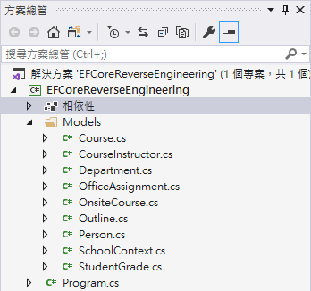

# Entity Framework Core  - 反向工程 建立 Entity Model建立 Entity Model

在 [Entity Framework Core - 建立練習使用的 Contoso University 資料庫](https://csharpkh.blogspot.com/2020/09/Entity-Framework-Core-Contoso-University-Database.html) 內，已經說明了如何建立起 Contoso 大學的資料庫架構與相關測試資料，現在，將會需要建立起 .NET C# 使用的 Entity Model，這裡提到的 Entity ，就是 Entity Framework 內的 Entity 這個名詞。想要在 C# 內建立一個類別，可以透過這個類別來存取 資料庫 內的紀錄，需要讓這個類別繼承 DbContext 類別，並且宣告 DbSet<T> 屬性 ，[實體類型](https://docs.microsoft.com/zh-tw/ef/core/modeling/entity-types?tabs=data-annotations&WT.mc_id=DT-MVP-5002220)，這裡的泛型型別 T ，將會對應到資料庫內的 Table 表格。

現在開始來練習這個開發過程，這樣的技術稱之為 [Entity Framework Core  - 反向工程](https://docs.microsoft.com/zh-tw/ef/core/managing-schemas/scaffolding?tabs=dotnet-core-cli&WT.mc_id=DT-MVP-5002220)，在此將會使用 Console 專案來做為示範。

## 建立練習專案

* 打開 Visual Studio 2019
* 點選 [建立新的專案] 按鈕
* 在 [建立新專案] 對話窗內，選擇 [主控台應用程式 (.NET Core)] 專案樣板
* 在 [設定新的專案] 對話窗內，於 [專案名稱] 欄位內輸入 `EFCoreReverseEngineering`
* 點選 [建立] 按鈕，以便開始建立這個專案

## 加入 Entity Framework Core 要使用到的 NuGet 套件

* 滑鼠右擊專案內的 [相依性] 節點
* 選擇 [管理 NuGet 套件]
* 點選 [瀏覽] 標籤分頁頁次
* 在 [搜尋] 文字輸入盒內，輸入 [Microsoft.EntityFrameworkCore.SqlServer]
* 點選 [安裝] 按鈕以便安裝這個套件
* 在 [搜尋] 文字輸入盒內，輸入 [Microsoft.EntityFrameworkCore.Tools]
* 點選 [安裝] 按鈕以便安裝這個套件

## 使用反向工程來產生 Entity Framework 要用到的 Entity 模型相關類別

* 切換到 [套件管理器主控台] 視窗

  > 若沒有看到 [套件管理器主控台] 視窗，點選功能表 [工具] > [NuGet 套件管理員] > [套件管理器主控台]

* 在 [套件管理器主控台] 輸入底下內容

```
Scaffold-DbContext "Data Source=(localdb)\MSSQLLocalDB;Initial Catalog=School" Microsoft.EntityFrameworkCore.SqlServer -StartupProject EFCoreReverseEngineering -Project EFCoreReverseEngineering -OutputDir Models -f
```

現在 Entity Model 相關資料已經建立完成，底下是輸入 [Scaffold-DbContext] 指令的相關執行內容

```
每個封裝均由其擁有者提供授權給您。NuGet 對於協力廠商封裝不負任何責任，也不提供相關的任何授權。某些封裝可能包含須由其他授權控管的相依項目。請遵循封裝來源 (摘要) URL 決定有無任何相依項目。

套件管理員主控台主機版本 5.7.0.6726

輸入 'get-help NuGet' 可查看所有可用的 NuGet 命令。

PM> Scaffold-DbContext "Data Source=(localdb)\MSSQLLocalDB;Initial Catalog=School" Microsoft.EntityFrameworkCore.SqlServer -StartupProject EFCoreReverseEngineering -Project EFCoreReverseEngineering -OutputDir Models -f
Build started...
Build succeeded.
PM>
```

請查看 Visual Studio 內的方案總管視窗內，將會看到自動建立了一個方案資料夾，稱之為 [Models]，在這個資料夾內存在著許多檔案。



現在來打開 [Department.cs] 這個檔案，從名稱可以看的出來，這裡指的就是 SQL Server 資料庫上的 Department 資料表 Table。

```csharp
using System;
using System.Collections.Generic;

namespace EFCoreReverseEngineering.Models
{
    public partial class Department
    {
        public Department()
        {
            Course = new HashSet<Course>();
        }

        public int DepartmentId { get; set; }
        public string Name { get; set; }
        public decimal Budget { get; set; }
        public DateTime StartDate { get; set; }
        public int? Administrator { get; set; }

        public virtual ICollection<Course> Course { get; set; }
    }
}
```

另外，查看 SQL Server 上的 Department 資料表的結構定義，其宣告如下：

```SQL
CREATE TABLE [dbo].[Department] (
    [DepartmentID]  INT           NOT NULL,
    [Name]          NVARCHAR (50) NOT NULL,
    [Budget]        MONEY         NOT NULL,
    [StartDate]     DATETIME      NOT NULL,
    [Administrator] INT           NULL,
    CONSTRAINT [PK_Department] PRIMARY KEY CLUSTERED ([DepartmentID] ASC)
);
```

透過 Department 資料表的綱要宣告，可以來理解透過反向工程所產生的 Entity Model 為什麼是這樣宣告的。

因此，在資料庫上的每個資料表，都會在 [Models] 資料夾內，產生一個類別檔案，另外，也會針對這個資料庫，產生一個 [SchoolContext.cs] 檔案，其內容如下。

這裡建立了一個 [SchoolContext] 類別，這個類別將會指向 SQL Server 上的 [School] 資料庫，也就是說，想要對這個資料庫進行任何操作：新增、讀取、修改、刪除，都可以透過這個 [SchoolContext] 類別來做到，因此，對於使用 Entity Framework Core 的開發者，只需要會使用 C# 程式碼，就可以進行資料庫的紀錄存取操作了。

```csharp
using System;
using Microsoft.EntityFrameworkCore;
using Microsoft.EntityFrameworkCore.Metadata;

namespace EFCoreReverseEngineering.Models
{
    public partial class SchoolContext : DbContext
    {
        public SchoolContext()
        {
        }

        public SchoolContext(DbContextOptions<SchoolContext> options)
            : base(options)
        {
        }

        public virtual DbSet<Course> Course { get; set; }
        public virtual DbSet<CourseInstructor> CourseInstructor { get; set; }
        public virtual DbSet<Department> Department { get; set; }
        public virtual DbSet<OfficeAssignment> OfficeAssignment { get; set; }
        public virtual DbSet<OnsiteCourse> OnsiteCourse { get; set; }
        public virtual DbSet<Outline> Outline { get; set; }
        public virtual DbSet<Person> Person { get; set; }
        public virtual DbSet<StudentGrade> StudentGrade { get; set; }

        protected override void OnConfiguring(DbContextOptionsBuilder optionsBuilder)
        {
            if (!optionsBuilder.IsConfigured)
            {
#warning To protect potentially sensitive information in your connection string, you should move it out of source code. See http://go.microsoft.com/fwlink/?LinkId=723263 for guidance on storing connection strings.
                optionsBuilder.UseSqlServer("Data Source=(localdb)\\MSSQLLocalDB;Initial Catalog=School");
            }
        }

        protected override void OnModelCreating(ModelBuilder modelBuilder)
        {
            modelBuilder.Entity<Course>(entity =>
            {
                entity.Property(e => e.CourseId)
                    .HasColumnName("CourseID")
                    .ValueGeneratedNever();

                entity.Property(e => e.DepartmentId).HasColumnName("DepartmentID");

                entity.Property(e => e.Title)
                    .IsRequired()
                    .HasMaxLength(100);

                entity.HasOne(d => d.Department)
                    .WithMany(p => p.Course)
                    .HasForeignKey(d => d.DepartmentId)
                    .OnDelete(DeleteBehavior.ClientSetNull)
                    .HasConstraintName("FK_Course_Department");
            });

            modelBuilder.Entity<CourseInstructor>(entity =>
            {
                entity.HasKey(e => new { e.CourseId, e.PersonId });

                entity.Property(e => e.CourseId).HasColumnName("CourseID");

                entity.Property(e => e.PersonId).HasColumnName("PersonID");

                entity.HasOne(d => d.Course)
                    .WithMany(p => p.CourseInstructor)
                    .HasForeignKey(d => d.CourseId)
                    .OnDelete(DeleteBehavior.ClientSetNull)
                    .HasConstraintName("FK_CourseInstructor_Course");

                entity.HasOne(d => d.Person)
                    .WithMany(p => p.CourseInstructor)
                    .HasForeignKey(d => d.PersonId)
                    .OnDelete(DeleteBehavior.ClientSetNull)
                    .HasConstraintName("FK_CourseInstructor_Person");
            });

            modelBuilder.Entity<Department>(entity =>
            {
                entity.Property(e => e.DepartmentId)
                    .HasColumnName("DepartmentID")
                    .ValueGeneratedNever();

                entity.Property(e => e.Budget).HasColumnType("money");

                entity.Property(e => e.Name)
                    .IsRequired()
                    .HasMaxLength(50);

                entity.Property(e => e.StartDate).HasColumnType("datetime");
            });

            modelBuilder.Entity<OfficeAssignment>(entity =>
            {
                entity.HasKey(e => e.InstructorId);

                entity.Property(e => e.InstructorId)
                    .HasColumnName("InstructorID")
                    .ValueGeneratedNever();

                entity.Property(e => e.Location)
                    .IsRequired()
                    .HasMaxLength(50);

                entity.Property(e => e.Timestamp)
                    .IsRequired()
                    .IsRowVersion()
                    .IsConcurrencyToken();

                entity.HasOne(d => d.Instructor)
                    .WithOne(p => p.OfficeAssignment)
                    .HasForeignKey<OfficeAssignment>(d => d.InstructorId)
                    .OnDelete(DeleteBehavior.ClientSetNull)
                    .HasConstraintName("FK_OfficeAssignment_Person");
            });

            modelBuilder.Entity<OnsiteCourse>(entity =>
            {
                entity.HasKey(e => e.CourseId);

                entity.Property(e => e.CourseId)
                    .HasColumnName("CourseID")
                    .ValueGeneratedNever();

                entity.Property(e => e.Days)
                    .IsRequired()
                    .HasMaxLength(50);

                entity.Property(e => e.Location)
                    .IsRequired()
                    .HasMaxLength(50);

                entity.Property(e => e.Time).HasColumnType("smalldatetime");

                entity.HasOne(d => d.Course)
                    .WithOne(p => p.OnsiteCourse)
                    .HasForeignKey<OnsiteCourse>(d => d.CourseId)
                    .OnDelete(DeleteBehavior.ClientSetNull)
                    .HasConstraintName("FK_OnsiteCourse_Course");
            });

            modelBuilder.Entity<Outline>(entity =>
            {
                entity.Property(e => e.OutlineId).HasColumnName("OutlineID");

                entity.Property(e => e.CourseId).HasColumnName("CourseID");

                entity.Property(e => e.Title)
                    .IsRequired()
                    .HasMaxLength(100);

                entity.HasOne(d => d.Course)
                    .WithMany(p => p.Outline)
                    .HasForeignKey(d => d.CourseId)
                    .OnDelete(DeleteBehavior.ClientSetNull)
                    .HasConstraintName("FK_Outline_Course");
            });

            modelBuilder.Entity<Person>(entity =>
            {
                entity.Property(e => e.PersonId).HasColumnName("PersonID");

                entity.Property(e => e.EnrollmentDate).HasColumnType("datetime");

                entity.Property(e => e.FirstName)
                    .IsRequired()
                    .HasMaxLength(50);

                entity.Property(e => e.HireDate).HasColumnType("datetime");

                entity.Property(e => e.LastName)
                    .IsRequired()
                    .HasMaxLength(50);
            });

            modelBuilder.Entity<StudentGrade>(entity =>
            {
                entity.HasKey(e => e.EnrollmentId);

                entity.Property(e => e.EnrollmentId).HasColumnName("EnrollmentID");

                entity.Property(e => e.CourseId).HasColumnName("CourseID");

                entity.Property(e => e.Grade).HasColumnType("decimal(3, 2)");

                entity.Property(e => e.StudentId).HasColumnName("StudentID");

                entity.HasOne(d => d.Course)
                    .WithMany(p => p.StudentGrade)
                    .HasForeignKey(d => d.CourseId)
                    .OnDelete(DeleteBehavior.ClientSetNull)
                    .HasConstraintName("FK_StudentGrade_Course");

                entity.HasOne(d => d.Student)
                    .WithMany(p => p.StudentGrade)
                    .HasForeignKey(d => d.StudentId)
                    .OnDelete(DeleteBehavior.ClientSetNull)
                    .HasConstraintName("FK_StudentGrade_Student");
            });

            OnModelCreatingPartial(modelBuilder);
        }

        partial void OnModelCreatingPartial(ModelBuilder modelBuilder);
    }
}
```
