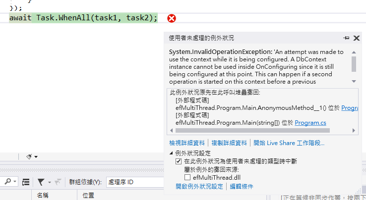

# DbContext 在多執行緒環境下的運作情況

在上篇文章中 [Console 專案與 EF Core 讀取已經存在的資料庫](https://csharpkh.blogspot.com/2020/09/Entity-Framework-Core-Read-Query-Table-Record-DbContext.html) ，可以知道如何在 Console 類型的專案內，加入 [EF Core 套件](https://docs.microsoft.com/zh-tw/ef/core/get-started/install?WT.mc_id=DT-MVP-5002220)，便可以透過 EF Core 框架所提供的功能，存取後端資料庫內的資料。在這篇文章中，將來探討論外一個問題，那就是需要在多執行緒的多工環境下，若使用同一個 [DbContext](https://docs.microsoft.com/en-us/ef/core/miscellaneous/configuring-dbcontext#avoiding-dbcontext-threading-issues?WT.mc_id=DT-MVP-5002220) 會發生甚麼問題。

請按照底下的步驟來進行操作

## 建立練習專案

* 打開 Visual Studio 2019
* 點選 [建立新的專案] 按鈕
* 在 [建立新專案] 對話窗內，選擇 [主控台應用程式 (.NET Core)] 專案樣板
* 在 [設定新的專案] 對話窗內，於 [專案名稱] 欄位內輸入 `efMultiThread`
* 點選 [建立] 按鈕，以便開始建立這個專案

## 加入 Entity Framework Core 要使用到的 NuGet 套件

* 滑鼠右擊專案內的 [相依性] 節點
* 選擇 [管理 NuGet 套件]
* 點選 [瀏覽] 標籤分頁頁次
* 在 [搜尋] 文字輸入盒內，輸入 [Microsoft.EntityFrameworkCore.SqlServer]
* 點選 [安裝] 按鈕以便安裝這個套件
* 在 [搜尋] 文字輸入盒內，輸入 [Microsoft.EntityFrameworkCore.Tools]
* 點選 [安裝] 按鈕以便安裝這個套件

## 使用反向工程來產生 Entity Framework 要用到的 Entity 模型相關類別

* 切換到 [套件管理器主控台] 視窗

  > 若沒有看到 [套件管理器主控台] 視窗，點選功能表 [工具] > [NuGet 套件管理員] > [套件管理器主控台]

* 在 [套件管理器主控台] 輸入底下內容

  > 因為都在同一個專案內，所以，這裡可以省略 `StartupProject` & `Project` 這兩個參數，因此，底下的指令會更為精簡

```
Scaffold-DbContext "Data Source=(localdb)\MSSQLLocalDB;Initial Catalog=School" Microsoft.EntityFrameworkCore.SqlServer -OutputDir Models -f
```

現在 Entity Model 相關資料已經建立完成

請打開這個 [Program.cs] 檔案，完成底下的程式碼

```csharp
class Program
{
    static async Task Main(string[] args)
    {
        SchoolContext context = new SchoolContext();
 
        var task1 = Task.Run(async () =>
        {
            for (int i = 0; i < 100; i++)
            {
               var people= await context.Person
                .AsNoTracking()
                .OrderBy(x => x.LastName).ToListAsync();
                foreach (var item in people)
                {
                    Console.Write($"{item.LastName} ");
                }
            }
        });
        var task2 = Task.Run(async () =>
        {
            for (int i = 0; i < 100; i++)
            {
                var courses = await context.Course
                 .AsNoTracking()
                 .OrderBy(x => x.Title).ToListAsync();
                foreach (var item in courses)
                {
                    Console.Write($"{item.Title} ");
                }
            }
        });
        await Task.WhenAll(task1, task2);
    }
}
```

從上面的程式碼中，可以看到首先建立了一個 SchoolContext 型別的 context 物件，這個物件就代表了遠端的資料庫，而接下來將會透過 [Task.Run 方法](https://docs.microsoft.com/zh-tw/dotnet/api/system.threading.tasks.task.run?view=netcore-3.1&WT.mc_id=DT-MVP-5002220) 建立兩個[非同步工作](https://docs.microsoft.com/zh-tw/dotnet/csharp/programming-guide/concepts/async?WT.mc_id=DT-MVP-5002220) 物件，代表未來與承諾會完成這個非同步工作內指定的需求，在這兩個非同步工作內，分別會執行 100 次的迴圈，每次迴圈分別會對 Person & Course 資料表，讀取遠端資料庫內的所有紀錄回本機電腦內；基本上，看樣子的設計，似乎沒有甚麼衝突可以發生，因為，雖然有兩個非同步工作，這兩個非同步工作都是做查詢而已，而且是分別在不同資料表內做查詢，可是，當執行這個程式碼之後，便會發生底下的錯誤訊息：

```
System.InvalidOperationException: 'An attempt was made to use the context while it is being configured. A DbContext instance cannot be used inside OnConfiguring since it is still being configured at this point. This can happen if a second operation is started on this context before a previous operation completed. Any instance members are not guaranteed to be thread safe.'
```



通常，第一次看到這樣的錯誤訊息的時候，絕大多數的人都是很迷惘了，究竟發生了甚麼問題，可是仔細看這段訊息，會看到這樣的內容 `Any instance members are not guaranteed to be thread safe.` 這裡充分說明了 DbContext 的類別所產生單一物件，不能夠使用於多執行緒環境下，在微軟官方文件中，也有提到這樣的內容

```
Entity Framework Core does not support multiple parallel operations being run on the same DbContext instance. This includes both parallel execution of async queries and any explicit concurrent use from multiple threads. Therefore, always await async calls immediately, or use separate DbContext instances for operations that execute in parallel.

When EF Core detects an attempt to use a DbContext instance concurrently, you'll see an InvalidOperationException with a message like this:

A second operation started on this context before a previous operation completed. This is usually caused by different threads using the same instance of DbContext, however instance members are not guaranteed to be thread safe.

When concurrent access goes undetected, it can result in undefined behavior, application crashes and data corruption.
```

所以，這樣的用法就算僅作查詢或分別針對不同資料表做查詢，一樣會產生例外異常。

若想要修正這樣的問題，可以參考底下的作法，就可以避免掉執行緒不安全的問題。

```csharp
static async Task Main(string[] args)
{
 
    var task1 = Task.Run(async () =>
    {
        using (SchoolContext context = new SchoolContext())
        {
            for (int i = 0; i < 100; i++)
            {
                var people = await context.Person
                 .AsNoTracking()
                 .OrderBy(x => x.LastName).ToListAsync();
                foreach (var item in people)
                {
                    Console.Write($"{item.LastName} ");
                }
            }
        }
    });
    var task2 = Task.Run(async () =>
    {
        using (SchoolContext context = new SchoolContext())
        {
            for (int i = 0; i < 100; i++)
            {
                var courses = await context.Course
                 .AsNoTracking()
                 .OrderBy(x => x.Title).ToListAsync();
                foreach (var item in courses)
                {
                    Console.Write($"{item.Title} ");
                }
            }
        }
    });
    await Task.WhenAll(task1, task2);
}
```

