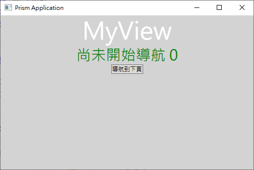
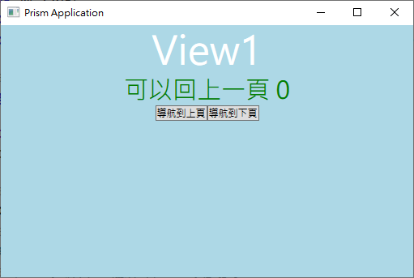
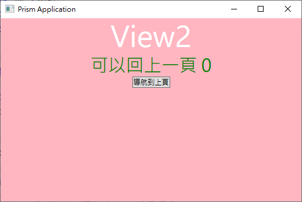

# WPF Prism 4 - 使用 Prism 開發框架來製作一個具有 WPF 導航檢視功能教學說明程式

在這篇文章，將會使用 Prism 來開發出具有導航檢視功能的 WPF 應用程式。

首先，當應用程式啟動之後，將會使用 RequestNavigate 方法，切換到 MyView 這個檢視畫面上，如同下圖。



當點選 [導航下頁] 按鈕之後，將會切換到 View1 這個檢視畫面上，如同下圖。



在 View1 檢視內，當點選 [導航下頁] 按鈕之後，將會切換到 View2 這個檢視畫面上，如同下圖；而當點選 [導航上頁] 按鈕之後，將會切換到 MyView 頁面。



這個說明專案的原始碼位於 [WPFPrismViewNavigation](https://github.com/vulcanlee/CSharp2020/tree/master/WPFPrismViewNavigation)

## 準備工作

* 首先，先要安裝 [Prism Template Pack] 到 Visual Studio 2019 內
* 打開 [Prism Template Pack](https://marketplace.visualstudio.com/items?itemName=BrianLagunas.PrismTemplatePack) 擴充功能網站
* 下載並且安裝這個擴充功能

## 建立 WPF for Prism 的專案

* 打開 Visual Studio 2019
* 點選右下方的 [建立新的專案] 按鈕
* [建立新專案] 對話窗將會顯示在螢幕上
* 從[建立新專案] 對話窗的中間區域，找到 [Prism Blank App (WPF)] 這個專案樣板選項，並且選擇這個項目
  
  > 若沒有看到這個選項，則表示你的 Visual Studio 2019 開發環境中，還沒有安裝 [Prism Template Pack](https://marketplace.visualstudio.com/items?itemName=BrianLagunas.PrismTemplatePack) 擴充功能

* 點選右下角的 [下一步] 按鈕
* 現在 [設定新的專案] 對話窗將會出現
* 請在這個對話窗內，輸入適當的 [專案名稱] 、 [位置] 、 [解決方案名稱]

  在這裡請輸入 [專案名稱] 為 `WPFPrismViewNavigation`

* 在最下方的 [架構] 部分，建議選取最新的 [.NET Framework 4.8]
* 完成後，請點選 [建立] 按鈕
* 當出現 [PRISM PROJECT WIZARD] 對話窗的時候
* 請在 [Select Container] 選擇容器這個欄位之下拉選單，選擇你要使用的 DI 相依性注入容器，我個人習慣使用 Unity 這個 Ioc 容器
* 之後，點選 [CREATE PROJECT] 這個按鈕

稍微等會一段時間，具有 Prism 開發框架的 WPF 專案將會建立起來

## 加入 WPF 套件

* 滑鼠右擊剛剛建立的專案節點
* 選擇 [管理 NuGet 套件]
* 找到 [Prism.Wpf] 這個套件，並且安裝起來

## 設定第一個要顯示的 View 檢視

* 

## 在剛剛建立的專案中，加入三個 View 與 ViewModel

* 滑鼠右擊剛剛建立的專案，選擇 [加入] > [新增資料夾]，建立 `Views` & `ViewModels` 這兩個資料夾
* 滑鼠右擊 [Views] 資料夾
* 選擇 [加入] > [新增項目]
* 此時，[新增項目] 對話窗將顯示出來
* 請在該對話窗的左方，展開節點到 [已安裝] > [Visual C#] > [Prism] > [WPF]
* 在中間區域選擇 [Prism UserControl (WPF)] 選項
* 在下方名稱欄位輸入 `MyView`
* 最後點選 [新增] 按鈕

此時，將會看到該專案的 [Views] 資料夾內新產生了一個 [MyView.xaml] 這個檔案，另外，在 [ViewModel] 資料夾內也產生了一個 [MyViewViewModel] 這個類別檔案。

打開 [MyView.xaml] 檔案，填入底下 XAML 標記宣告

```XML
<UserControl x:Class="WPFPrismViewNavigation.Views.MyView"
             xmlns="http://schemas.microsoft.com/winfx/2006/xaml/presentation"
             xmlns:x="http://schemas.microsoft.com/winfx/2006/xaml"
             xmlns:prism="http://prismlibrary.com/"             
             prism:ViewModelLocator.AutoWireViewModel="True">
    <Grid Background="LightGray">
        <StackPanel
            Orientation="Vertical">
            <TextBlock Text="MyView"
                   HorizontalAlignment="Center" VerticalAlignment="Center"
                   FontSize="48" Foreground="White"/>
            <TextBlock Text="{Binding Message}"
                       HorizontalAlignment="Center" VerticalAlignment="Center"
                       FontSize="30"
                       Foreground="Green"/>
            <Button 
                HorizontalAlignment="Center"
                Command="{Binding GoNextCommand}">導航到下頁</Button>
        </StackPanel>
    </Grid>
</UserControl>
```

在這個檢視內，將會宣告一個按鈕並且有個 Command 命令屬性

* 請要修正該檢視會搭配的 ViewModel 類別，請打開 [ViewModels] 資料夾下的 MyViewViewModel.cs 檔案
* 使用底下 C# 程式碼進行替換

```csharp
public class MyViewModel : BindableBase , INavigationAware
{
    private string message;
    private readonly IRegionManager regionManager;
 
    public string Message
    {
        get { return message; }
        set { SetProperty(ref message, value); }
    }
    public DelegateCommand GoNextCommand { get; set; }
    public int Counter { get; set; }
    public MyViewModel(IRegionManager regionManager)
    {
        this.regionManager = regionManager;
        GoNextCommand = new DelegateCommand(() =>
        {
            regionManager.RequestNavigate("ContentRegion", nameof(View1));
        });
    }
 
    public bool IsNavigationTarget(NavigationContext navigationContext)
    {
        return true;
    }
 
    public void OnNavigatedFrom(NavigationContext navigationContext)
    {
    }
 
    public async void OnNavigatedTo(NavigationContext navigationContext)
    {
        await Task.Yield();
        Message = navigationContext.NavigationService.Journal.CanGoBack == false ? "尚未開始導航 "+ Counter++ : "可以回上一頁";
        //regionManager.Regions["ContentRegion"].NavigationService.Journal.Clear();
    }
}
```

在此 ViewModel 類別內，將會設計這個按鈕的命令觸發委派方法，因此，當使用者點選這個按鈕的時候，將會使用 `regionManager.RequestNavigate("ContentRegion", nameof(View1));` 敘述，切換到 View1 檢視內。

另外，這個 ViewModel 也有實作出 `INavigationAware` 這個介面，因此，將會需要實作出三個方法，分別會於頁面切換過程中，會被觸發執行的。

接下來，繼續產生一個 View1 檢視

* 首先，滑鼠右擊 [Views] 資料夾
* 選擇 [加入] > [新增項目]
* 此時，[新增項目] 對話窗將顯示出來
* 請在該對話窗的左方，展開節點到 [已安裝] > [Visual C#] > [Prism] > [WPF]
* 在中間區域選擇 [Prism UserControl (WPF)] 選項
* 在下方名稱欄位輸入 `View1`
* 最後點選 [新增] 按鈕

此時，將會看到該專案的 [Views] 資料夾內新產生了一個 [View1.xaml] 這個檔案，另外，在 [ViewModel] 資料夾內也產生了一個 [View1ViewModel] 這個類別檔案。

打開 [View1.xaml] 檔案，填入底下 XAML 標記宣告

```XML
<UserControl x:Class="WPFPrismViewNavigation.Views.View1"
             xmlns="http://schemas.microsoft.com/winfx/2006/xaml/presentation"
             xmlns:x="http://schemas.microsoft.com/winfx/2006/xaml"
             xmlns:prism="http://prismlibrary.com/"             
             prism:ViewModelLocator.AutoWireViewModel="True">
    <Grid Background="LightBlue">
        <StackPanel
            Orientation="Vertical">
            <TextBlock Text="View1"
                   HorizontalAlignment="Center" VerticalAlignment="Center"
                   FontSize="48" Foreground="White"/>
            <TextBlock Text="{Binding Message}"
                       HorizontalAlignment="Center" VerticalAlignment="Center"
                       FontSize="30"
                       Foreground="Green"/>
            <StackPanel
                Orientation="Horizontal"
                HorizontalAlignment="Center">
                <Button 
                    HorizontalAlignment="Center"
                    Command="{Binding GoPrevCommand}">導航到上頁</Button>
                <Button 
                    HorizontalAlignment="Center"
                    Command="{Binding GoNextCommand}">導航到下頁</Button>
            </StackPanel>
        </StackPanel>
    </Grid>
</UserControl>
```

在這個檢視內，將會宣告一個按鈕並且有個 Command 命令屬性

* 請要修正該檢視會搭配的 ViewModel 類別，請打開 [ViewModels] 資料夾下的 View1ViewModel.cs 檔案
* 使用底下 C# 程式碼進行替換

```csharp
public class View1ViewModel : BindableBase, INavigationAware
{
    private string message;
    private readonly IRegionManager regionManager;
    private readonly IRegionNavigationService regionNavigationService;
 
    public string Message
    {
        get { return message; }
        set { SetProperty(ref message, value); }
    }
    public int Counter { get; set; }
    public DelegateCommand GoNextCommand { get; set; }
    public DelegateCommand GoPrevCommand { get; set; }
    public View1ViewModel(IRegionManager regionManager, IRegionNavigationService regionNavigationService)
    {
        this.regionManager = regionManager;
        this.regionNavigationService = regionNavigationService;
        GoNextCommand = new DelegateCommand(() =>
        {
            regionManager.RequestNavigate("ContentRegion", nameof(View2));
        });
        GoPrevCommand = new DelegateCommand(() =>
        {
            regionManager.Regions["ContentRegion"].NavigationService.Journal.GoBack();
        });
    }
 
    public bool IsNavigationTarget(NavigationContext navigationContext)
    {
        return true;
    }
 
    public void OnNavigatedFrom(NavigationContext navigationContext)
    {
    }
 
    public async void OnNavigatedTo(NavigationContext navigationContext)
    {
        await Task.Yield();
        Message = navigationContext.NavigationService.Journal.CanGoBack == false ? "尚未開始導航 ": "可以回上一頁 " + Counter++;
    }
}
```

在此 ViewModel 類別內，將會設計兩個按鈕的命令觸發委派方法，因此，當使用者點選 [GoNextCommand] 這個按鈕的時候，將會使用 `regionManager.RequestNavigate("ContentRegion", nameof(View2));` 敘述，切換到 View2 檢視內，當使用者點選 [GoPrevCommand] 這個按鈕的時候，將會使用 `regionManager.Regions["ContentRegion"].NavigationService.Journal.GoBack();` 敘述，回到上一頁檢視，也就是 MyView 檢視內。

另外，這個 ViewModel 也有實作出 `INavigationAware` 這個介面，因此，將會需要實作出三個方法，分別會於頁面切換過程中，會被觸發執行的。

最後，產生一個 View2 檢視

* 首先，滑鼠右擊 [Views] 資料夾
* 選擇 [加入] > [新增項目]
* 此時，[新增項目] 對話窗將顯示出來
* 請在該對話窗的左方，展開節點到 [已安裝] > [Visual C#] > [Prism] > [WPF]
* 在中間區域選擇 [Prism UserControl (WPF)] 選項
* 在下方名稱欄位輸入 `View2`
* 最後點選 [新增] 按鈕

此時，將會看到該專案的 [Views] 資料夾內新產生了一個 [View2.xaml] 這個檔案，另外，在 [ViewModel] 資料夾內也產生了一個 [View2ViewModel] 這個類別檔案。

打開 [View2.xaml] 檔案，填入底下 XAML 標記宣告

```XML
<UserControl x:Class="WPFPrismViewNavigation.Views.View2"
             xmlns="http://schemas.microsoft.com/winfx/2006/xaml/presentation"
             xmlns:x="http://schemas.microsoft.com/winfx/2006/xaml"
             xmlns:prism="http://prismlibrary.com/"             
             prism:ViewModelLocator.AutoWireViewModel="True">
    <Grid Background="LightPink">
        <StackPanel
            Orientation="Vertical">
            <TextBlock Text="View2"
                   HorizontalAlignment="Center" VerticalAlignment="Center"
                   FontSize="48" Foreground="White"/>
            <TextBlock Text="{Binding Message}"
                       HorizontalAlignment="Center" VerticalAlignment="Center"
                       FontSize="30"
                       Foreground="Green"/>
            <StackPanel
                Orientation="Horizontal"
                HorizontalAlignment="Center">
                <Button 
                    HorizontalAlignment="Center"
                    Command="{Binding GoPrevCommand}">導航到上頁</Button>
            </StackPanel>
        </StackPanel>
    </Grid>
</UserControl>
```

在這個檢視內，將會宣告一個按鈕並且有個 Command 命令屬性

* 請要修正該檢視會搭配的 ViewModel 類別，請打開 [ViewModels] 資料夾下的 View2ViewModel.cs 檔案
* 使用底下 C# 程式碼進行替換

```csharp
public class View2ViewModel : BindableBase, INavigationAware
{
    private string message;
    private readonly IRegionManager regionManager;
 
    public string Message
    {
        get { return message; }
        set { SetProperty(ref message, value); }
    }
    public int Counter { get; set; }
    public DelegateCommand GoPrevCommand { get; set; }
    public View2ViewModel(IRegionManager regionManager)
    {
        this.regionManager = regionManager;
        GoPrevCommand = new DelegateCommand(() =>
        {
            regionManager.Regions["ContentRegion"].NavigationService.Journal.GoBack();
        });
    }
 
    public bool IsNavigationTarget(NavigationContext navigationContext)
    {
        return true;
    }
 
    public void OnNavigatedFrom(NavigationContext navigationContext)
    {
    }
 
    public async void OnNavigatedTo(NavigationContext navigationContext)
    {
        await Task.Yield();
        Message = navigationContext.NavigationService.Journal.CanGoBack == false ? "尚未開始導航 " + this.GetHashCode() : "可以回上一頁 " + Counter++;
    }
}
```

在此 ViewModel 類別內，將會設計這個按鈕的命令觸發委派方法，因此，當使用者點選這個按鈕的時候，將會使用 `regionManager.Regions["ContentRegion"].NavigationService.Journal.GoBack();` 敘述，退回到 View1 檢視內。

另外，這個 ViewModel 也有實作出 `INavigationAware` 這個介面，因此，將會需要實作出三個方法，分別會於頁面切換過程中，會被觸發執行的。

## 修正主專案

* 在該專案根目錄下，找到 App.xaml 這個檔案節點
* 展開該節點，將會看到一個 [App.xaml.cs] 這個節點
* 滑鼠雙擊打開 [App.xaml.cs] 這個節點
* 建立一個覆寫 ConfigureModuleCatalog 方法
* 將該方法修改成為底下的程式碼

```csharp
public partial class App
{
    protected override Window CreateShell()
    {
        return Container.Resolve<MainWindow>();
    }
 
    protected override void RegisterTypes(IContainerRegistry containerRegistry)
    {
        containerRegistry.RegisterForNavigation<MyView>();
        containerRegistry.RegisterForNavigation<View1>();
        containerRegistry.RegisterForNavigation<View2>();
    }
 
    // 在這裡指定 Region 要顯示的 View ，也是可行的
    public override void Initialize()
    {
        base.Initialize();
        IContainerProvider container = Container;
        IRegionManager regionManager = container.Resolve<IRegionManager>();
        regionManager.RequestNavigate("ContentRegion", nameof(MyView));
    }
}

```

## 執行與測試

現在可以執行這個使用 Prism 開發的 WPF 專案，看看是不是如同第一篇文章規劃的一樣方式來進行運作。


