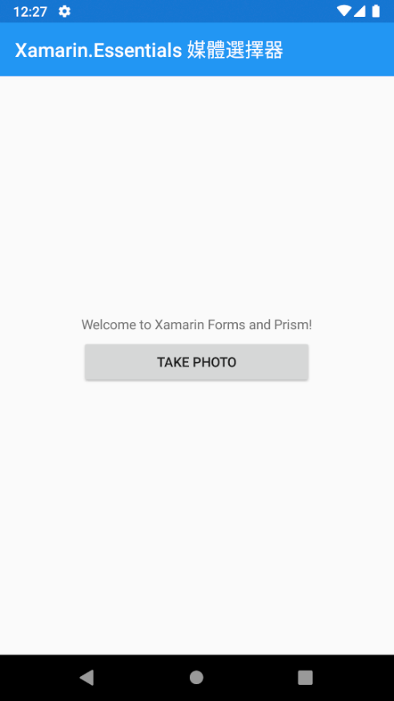
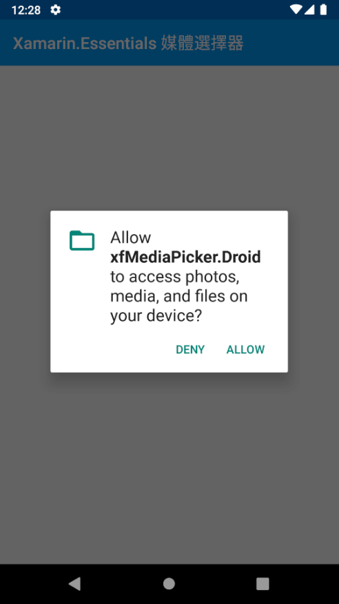
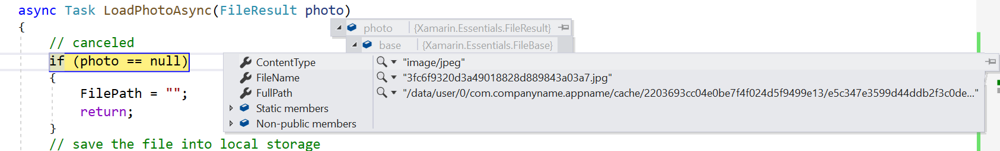
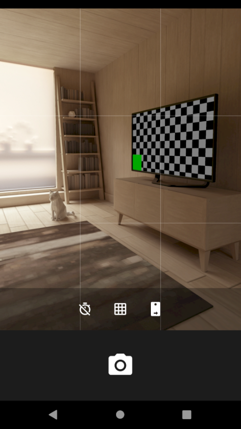
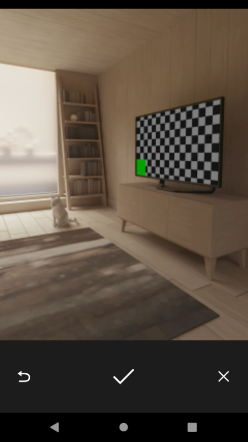
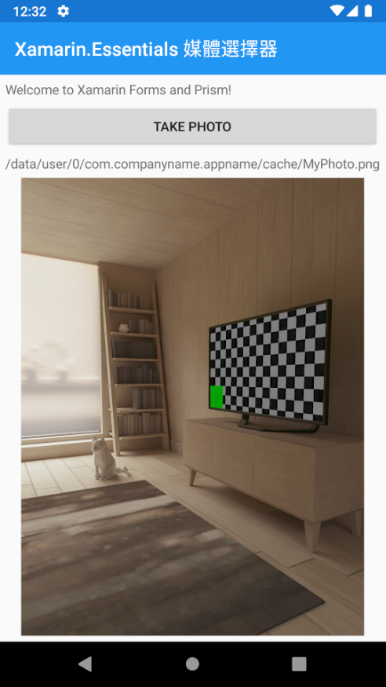

# Xamarin.Forms 使用 Xamarin.Essentials 媒體選擇器

在這篇文章將會逐步說明，如何使用 Xamarin.Essentials 套件提供的 媒體選擇器 功能，幫 Xamarin.Forms 可以製作出可以使用照相機鏡頭的拍照功能。

## 建立專案

* 開啟 Visual Studio 2019
* 在 [Visual Studio 2019] 對話窗中，選擇 [建立新的專案]
* 在 [建立新專案] 對話窗，選擇 [Prism Blank App (Xamarin.Forms)]
* 點選 [下一步] 按鈕
* 在 [設定新的專案] 對話窗， [專案名稱] 欄位輸入 xfMediaPicker
* 點選 [建立] 按鈕
* 在 [RPISM PROJECT WIZARD] 對話窗內，勾選 [ANDROID] & [iOS]
* 點選 [CREATE PROJECT] 按鈕

## 加入與更新套件

* 在 [方案總管] 視窗內，展開 Xamarin.Forms 專案節點，也就是 [xfMediaPicker]
* 滑鼠右擊 [相依性節點]，點選 [管理 NuGet 套件]
* 當 [NuGet: xfMediaPicker] 視窗出現後，點選 [瀏覽] 標籤頁次
* 在文字輸入盒內輸入 PropertyChanged.Fody ，搜尋出這個套件
* 點選 [PropertyChanged.Fody] 這個套件，安裝到 Xamarin.Forms 專案內
* 滑鼠右擊 [方案總管] 最上方的節點 [解決方案 xfMediaPicker]
* 點選 [管理方案的 NuGet 套件]
* 當 [NuGet: 解決方案] 視窗出現後，點選 [更新] 標籤頁次
* 點選 [選取所有封裝] ，接著點選 [更新按鈕]
* 將選取套件更新到最新版本

## 查看 Xamarin.Essentials 媒體選擇器 使用方式

打開 [Xamarin.Essentials 媒體選擇器](https://docs.microsoft.com/zh-tw/xamarin/essentials/media-picker?context=xamarin%2Fxamarin-forms&tabs=android?WT.mc_id=DT-MVP-5002220) 文件，可以看到這個 Xamarin.Essentials 媒體選擇器 使用說明

## Android 專案修正

* 找到 Android 專案 [xfMediaPicker.Android]
* 開啟 [Properties] 資料夾下的 AssemblyInfo.cs 檔案
* 在最後面加入底下宣告

```csharp

// Add some common permissions, these can be removed if not needed
[assembly: UsesPermission(Android.Manifest.Permission.Internet)]
[assembly: UsesPermission(Android.Manifest.Permission.WriteExternalStorage)]
// Needed for Picking photo/video
[assembly: UsesPermission(Android.Manifest.Permission.ReadExternalStorage)]

// Needed for Taking photo/video
[assembly: UsesPermission(Android.Manifest.Permission.WriteExternalStorage)]
[assembly: UsesPermission(Android.Manifest.Permission.Camera)]

// Add these properties if you would like to filter out devices that do not have cameras, or set to false to make them optional
[assembly: UsesFeature("android.hardware.camera", Required = true)]
[assembly: UsesFeature("android.hardware.camera.autofocus", Required = true)]
```

## iOS 專案修正

* 找到 Android 專案 [xfMediaPicker.iOS]
* 滑鼠右擊 [Info.plist] 檔案，選擇 [開啟方式]
* 在 [開啟方式 - Info.plist] 對話窗出現後，選擇 [XML (文字) 編輯器]
* 將底下內容輸入到 `</dict>` 文字前面

```XML
<key>NSCameraUsageDescription</key>
<string>This app needs access to the camera to take photos.</string>
<key>NSMicrophoneUsageDescription</key>
<string>This app needs access to microphone for taking videos.</string>
<key>NSPhotoLibraryAddUsageDescription</key>
<string>This app needs access to the photo gallery for picking photos and videos.</string>
<key>NSPhotoLibraryUsageDescription</key>
<string>This app needs access to photos gallery for picking photos and videos.</string>
```

## 修正首頁頁面

* 打開 MainPage.xaml 檔案
* 將這個檔案內容替換為底下內容

```xml
<?xml version="1.0" encoding="utf-8" ?>
<ContentPage xmlns="http://xamarin.com/schemas/2014/forms"
             xmlns:x="http://schemas.microsoft.com/winfx/2009/xaml"
             x:Class="xfMediaPicker.Views.MainPage"
             Title="Xamarin.Essentials 媒體選擇器">

    <StackLayout HorizontalOptions="CenterAndExpand" VerticalOptions="CenterAndExpand">
        <Label Text="Welcome to Xamarin Forms and Prism!" />
        <Button Text="Take Photo"
                Command="{Binding TakePhotoCommand}"/>
        <Label Text="{Binding FilePath}"/>
        <Image Source="{Binding Photo}"/>
    </StackLayout>

</ContentPage>
```

## 修正首頁 ViewModel

* 打開 MainPageViewModel.cs 檔案
* 將這個檔案內容替換為底下內容

```csharp
using Prism.Commands;
using System;

namespace xfMediaPicker.ViewModels
{
    using System.ComponentModel;
    using System.IO;
    using System.Threading.Tasks;
    using Prism.Navigation;
    using Xamarin.Essentials;
    using Xamarin.Forms;

    public class MainPageViewModel : INotifyPropertyChanged, INavigationAware
    {
        public event PropertyChangedEventHandler PropertyChanged;

        private readonly INavigationService navigationService;
        public string FilePath { get; set; }
        public ImageSource Photo { get; set; }
        public DelegateCommand TakePhotoCommand { get; set; }
        public MainPageViewModel(INavigationService navigationService)
        {
            this.navigationService = navigationService;
            TakePhotoCommand = new DelegateCommand(async () =>
            {
                try
                {
                    FileResult photo = await MediaPicker.CapturePhotoAsync();
                    await LoadPhotoAsync(photo);
                }
                catch (Exception ex)
                {
                    Console.WriteLine($"CapturePhotoAsync THREW: {ex.Message}");
                }
            });
        }

        async Task LoadPhotoAsync(FileResult photo)
        {
            // canceled
            if (photo == null)
            {
                FilePath = "";
                return;
            }
            // save the file into local storage
            var newFile = Path.Combine(FileSystem.CacheDirectory, "MyPhoto.png");
            using (var stream = await photo.OpenReadAsync())
            using (var newStream = File.OpenWrite(newFile))
                await stream.CopyToAsync(newStream);

            File.Delete(photo.FullPath);
            FilePath = newFile;

            FileResult showFile = new FileResult(FilePath);
            Photo = ImageSource.FromStream( () =>
            {
                Stream stream = showFile.OpenReadAsync().Result;
                return stream;
            });
        }
        public void OnNavigatedFrom(INavigationParameters parameters)
        {
        }

        public void OnNavigatedTo(INavigationParameters parameters)
        {
        }

    }
}
```

## 開始執行這個專案

* 選擇在 Android 模擬器下來執行這個專案
* 當應用程式啟動之後，就會看到底下畫面



* 點選 [TAKE PHOTO] 按鈕
* 將會出現對話窗，詢問是否允許這個應用程式可以允許拍照或者錄影功能
* 點選 [ALLOW] 按鈕


* 現在將會出現底下對話窗，詢問這個應用程式是否可以允許存取圖片、媒體、檔案詢問這個應用程式是否可以允許存取圖片、媒體、檔案
* 點選 [ALLOW] 按鈕



* 現在，先回到 Visual Studio 內，打開 [MainPageViewModel.cs] 
* 找到 `if (photo == null)` 這行
* 標示這行為中斷點



* 現在將會看到模擬器出現了模擬的照相功能
* 請點選最下方的 [照相機] 圖示，表示要拍照



* 當出現下圖，點選底下的 [打勾] 按鈕



* 現在程式停在剛剛設定中斷點上
* 現在可以查看 LoadPhotoAsync 方法的參數 photo 的屬性值內容
* 可以看到這次拍照的照片檔案存在在哪裡


* 在我這台電腦上，所拍照的照片將會為這個檔案

/data/user/0/com.companyname.appname/cache/2203693cc04e0be7f4f024d5f9499e13/e5c347e3599d44ddb2f3c0ded01ab830/3fc6f9320d3a49018828d889843a03a7.jpg

* 繼續執行這個專案，將會看到底下畫面


