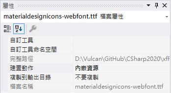
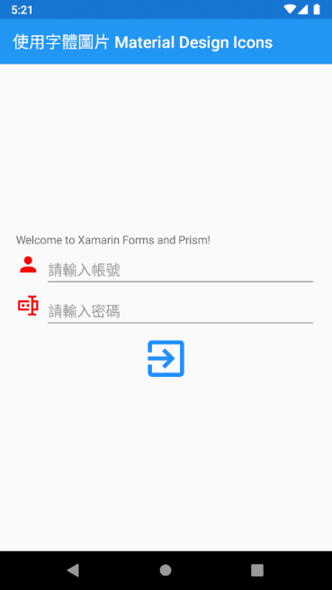

# 使用字體圖片 Material Design Icons 的練習

在以往想要做到加入其他字體到 Xamarin.Forms 專案來使用，需要在原生專案內進行相關設定，或者使用第三方的套件來簡化使用過程，在 Xamarin.Forms 4.5.0.530 或更高版本，若想要使用內嵌字型功能，就不再這麼麻煩了，絕大部分的開發工作都可以在 Xamarin.Forms 專案內來做到，只有對於 iOS 平台下，也不再需要做 [info.plist](https://docs.microsoft.com/zh-tw/xamarin/ios/app-fundamentals/property-lists?WT.mc_id=DT-MVP-5002220) 的設定[修改工作](https://devblogs.microsoft.com/xamarin/embedded-fonts-xamarin-forms/?WT.mc_id=DT-MVP-5002220)，在這篇文章中將會說明這個功能的使用方式。

請按照底下的步驟來進行操作

## 建立練習專案

* 打開 Visual Studio 2019
* 點選 [建立新的專案] 按鈕
* 在 [建立新專案] 對話窗內，選擇 [Prism Blank App (Xamarin.Forms)] 專案樣板
* 在 [設定新的專案] 對話窗內，於 [專案名稱] 欄位內輸入 `xfFontIcon`
* 在 [PRISM PROJECT WIZARD] 對話窗內，勾選 [ANDROD] 與 [iOS]
* 點選 [CREATE PROJECT] 按鈕
* 點選 [建立] 按鈕，以便開始建立這個專案

## 取得與設定 Material Design Icons

* 使用瀏覽器打開 [materialdesignicons-webfont.ttf](https://github.com/Templarian/MaterialDesign-Webfont/blob/master/fonts/materialdesignicons-webfont.ttf) 網頁
* 點選 [下載] 連結，取得 [materialdesignicons-webfont.ttf] 這個檔案
* 滑鼠右擊 [xfFontIcon] 專案，點選 [加入] > [新增資料夾] 選項
* 將剛剛建立的資料夾名稱命名為 `Resources`
* 滑鼠右擊 [xfFontIcon] 專案內的 [Resources] 資料夾，點選 [加入] > [新增資料夾] 選項
* 將剛剛建立的資料夾名稱命名為 `Fonts`
* 將剛剛下載下來的 [materialdesignicons-webfont.ttf] 檔案，拖拉到 [Fonts] 這個專案資料夾內
* 點選剛剛加入的 [materialdesignicons-webfont.ttf] 檔案
* 從 Visual Studio [屬性] 視窗內，找到 [建置動作] 欄位，將其值設定為 [內嵌資源]

  >
* 從 [xfFontIcon] 專案內，找到 [App.xaml.cs] 檔案，並且打開這個檔案
* 找到 `[assembly: XamlCompilation(XamlCompilationOptions.Compile)]` 宣告，在其前面加入底下程式碼

  > 其中，對 Alias 可以宣告一個方便使用與辨識的別名，日後在 Xamarin.Forms 專案內要使用這個字體資源的時候，就可以使用這個別名名稱，詳情可以參考這裡 [使用自訂字型](https://docs.microsoft.com/zh-tw/xamarin/xamarin-forms/user-interface/text/fonts?WT.mc_id=DT-MVP-5002220)

```csharp
[assembly: ExportFont("materialdesignicons-webfont.ttf", Alias = "FontAwesome")]
```

## 開始使用這個字體資源

* 從 [xfFontIcon] 專案內，找到 [MainPage.xaml] 檔案，並且打開這個檔案
* 使用底下 XAML 替換掉原先內容

```XML
<?xml version="1.0" encoding="utf-8" ?>
<ContentPage xmlns="http://xamarin.com/schemas/2014/forms"
             xmlns:x="http://schemas.microsoft.com/winfx/2009/xaml"
             x:Class="xfFontIcon.Views.MainPage"
             Title="使用字體圖片 Material Design Icons">

    <StackLayout 
        Margin="20,0"
        HorizontalOptions="Fill" VerticalOptions="CenterAndExpand">
        <Label Text="Welcome to Xamarin Forms and Prism!" />
        <StackLayout
            Orientation="Horizontal">
            <Label
                FontFamily="FontAwesome" FontSize="30" TextColor="Red" Text="&#xF0004;" />
            <Entry Placeholder="請輸入帳號" HorizontalOptions="FillAndExpand"/>
        </StackLayout>
        <StackLayout
            Orientation="Horizontal">
            <Label
                FontFamily="FontAwesome" FontSize="30" TextColor="Red" Text="&#xF07F5;" />
            <Entry Placeholder="請輸入密碼" IsPassword="True" HorizontalOptions="FillAndExpand"/>
        </StackLayout>
        <Image>
            <Image.Source>
                <FontImageSource Glyph="&#xF05FC;" FontFamily="FontAwesome"
                                 Size="60" Color="DodgerBlue"/>
            </Image.Source>
        </Image>
    </StackLayout>

</ContentPage>
```

在這裡若要使用 [materialdesignicons-webfont.ttf] 內提供的字體，需要先使用 [FontFamily] 這個屬性，指定剛剛在 ExportFont 指定的字體檔案別名，接著在 [Text] 屬性內，指定要使用的字型項目的內碼，該內碼將會使用 Unicode 的方式來表示。對於所有可用的字型圖示與內碼，可以從 [https://cdn.materialdesignicons.com/5.4.55/](https://cdn.materialdesignicons.com/5.4.55/) 這裡查看到。

## 執行結果




