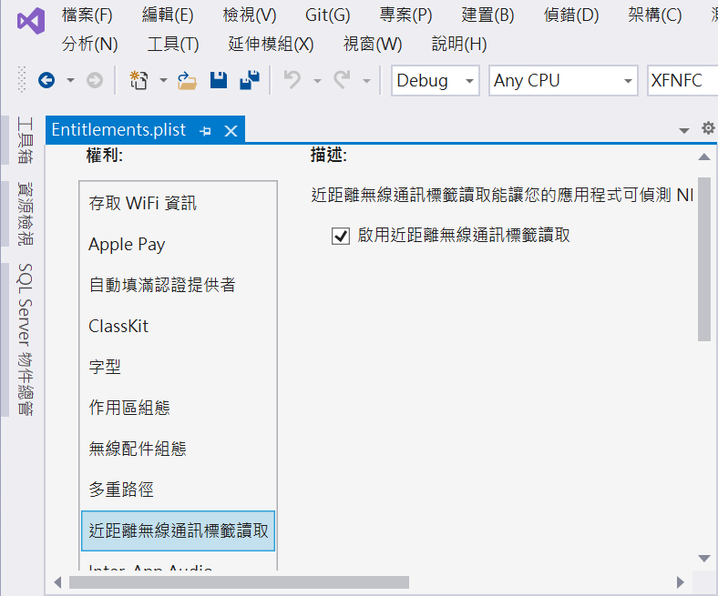

# 透過 Xamarin.Forms 來讀取 NFC 裝置 Tag

在這篇文章將會逐步說明，如何使用 [Plugin.NFC 套件](https://github.com/franckbour/Plugin.NFC)，進行讀取 NFC 標籤 Tag 內碼資訊功能。

這篇專案的原始碼可以在 [Github XFNFC](https://github.com/vulcanlee/CSharp2020/tree/master/XFNFC) 找到

## 建立專案

* 開啟 Visual Studio 2019
* 在 [Visual Studio 2019] 對話窗中，選擇 [建立新的專案]
* 在 [建立新專案] 對話窗，選擇 [Prism Blank App (Xamarin.Forms)]
* 點選 [下一步] 按鈕
* 在 [設定新的專案] 對話窗， [專案名稱] 欄位輸入 XFNFC
* 點選 [建立] 按鈕
* 在 [RPISM PROJECT WIZARD] 對話窗內，勾選 [ANDROID] & [iOS]
* 點選 [CREATE PROJECT] 按鈕

## 加入新套件

### 安裝 PropertyChanged.Fody

* 在 [XFNFC] 專案內
* 滑鼠右擊 [相依性節點]，點選 [管理 NuGet 套件]
* 當 [NuGet: XFNFC] 視窗出現後，點選 [瀏覽] 標籤頁次
* 在文字輸入盒內輸入 PropertyChanged.Fody ，搜尋出這個套件
* 點選 [PropertyChanged.Fody] 這個套件，安裝到 Xamarin.Forms 專案內

### 安裝 PropertyChanged.Fody

* 在 [XFNFC] 專案內
* 滑鼠右擊 [相依性節點]，點選 [管理 NuGet 套件]
* 當 [NuGet: XFNFC] 視窗出現後，點選 [瀏覽] 標籤頁次
* 在文字輸入盒內輸入 Plugin.NFC ，搜尋出這個套件
* 點選 [Plugin.NFC] 這個套件，安裝到 Xamarin.Forms 專案內

### 更新所有的套件(選擇性)

* 滑鼠右擊 [方案總管] 最上方的節點 [解決方案 xfMediaPicker]
* 點選 [管理方案的 NuGet 套件]
* 當 [NuGet: 解決方案] 視窗出現後，點選 [更新] 標籤頁次
* 點選 [選取所有封裝] ，接著點選 [更新按鈕]
* 將選取套件更新到最新版本

## Android 原生專案的設定

* 在 [XFNFC.Android] 專案內的 [Properties] 節點內
* 打開 [AssemblyInfo.cs] 檔案
* 加入底下的敘述在該檔案的最後面

```csharp
[assembly: UsesPermission(Android.Manifest.Permission.Nfc)]
[assembly: UsesFeature("android.hardware.nfc", Required = false)]
```

* 打開 [MainActivity.cs] 檔案
* 找到 [OnCreate] 方法
* 在 [base.OnCreate] 方法呼叫之後，加入 `CrossNFC.Init(this);` 敘述
* 完成後的結果如下

```csharp
protected override void OnCreate(Bundle savedInstanceState)
{
    TabLayoutResource = Resource.Layout.Tabbar;
    ToolbarResource = Resource.Layout.Toolbar;
 
    base.OnCreate(savedInstanceState);
 
    // https://github.com/franckbour/Plugin.NFC
    // Plugin NFC: Initialization
    CrossNFC.Init(this);
 
    Xamarin.Essentials.Platform.Init(this, savedInstanceState);
    global::Xamarin.Forms.Forms.Init(this, savedInstanceState);
    LoadApplication(new App(new AndroidInitializer()));
}
```

* 在 [MainActivity] 類別內
* 加入底下的方法宣告

```csharp
protected override void OnNewIntent(Intent intent)
{
    base.OnNewIntent(intent);
    CrossNFC.OnNewIntent(intent);
}
 
protected override void OnResume()
{
    base.OnResume();
 
    // Plugin NFC: Restart NFC listening on resume (needed for Android 10+) 
    CrossNFC.OnResume();
}
```

* 在 [MainActivity] 類別外
* 加入底下的 Attribute 屬性宣告

> 請注意，這裡的 [DataMimeType] 宣告為 `com.companyname.MyNFC` ，若要套用此套件功能到開發中的專案，在此，請修改為該 Android 專案用的套件名稱

```csharp
    [IntentFilter(new[] { NfcAdapter.ActionNdefDiscovered }, 
        Categories = new[] { Intent.CategoryDefault }, 
        DataMimeType = "application/com.companyname.MyNFC")]
```

## iOS 原生專案設定

* 在 iOS 專案 [XFNFC.iOS]
* 使用滑鼠右擊 [Entitlements.plist] 檔案
* 選擇 [開啟方式] 選項
* 從 [開啟方式 - Entitlements.plist] 對話窗內
* 選擇 [XML (文字) 編輯器]
* 點選 [確定] 按鈕
* 在  [Entitlements.plist] 視窗內的 `<dict>` 與 `</dict>` 標籤區域內
* 加入底下宣告

```
	<key>com.apple.developer.nfc.readersession.formats</key>
	<array>
		<string>NDEF</string>
		<string>TAG</string>
	</array>
```

> 上面的操作可以使用底下的做法來取代，會得到同樣的效果
>
> 滑鼠雙擊 [Entitlements.plist] 檔案
>
> 在 [Entitlements.plist] 視窗內
>
> 找到與點選 [近距離無線通訊標籤讀取] 項目
>
> 勾選 [啟用近距離無線通訊標籤讀取] 項目
>
>
>

* 在 iOS 專案 [XFNFC.iOS]
* 滑鼠右擊 [Info.plist] 檔案，選擇 [開啟方式]
* 在 [開啟方式 - Info.plist] 對話窗出現後，選擇 [XML (文字) 編輯器]
* 將底下內容輸入到 `</dict>` 文字前面

```XML
<key>NFCReaderUsageDescription</key>
<string>NFC tag to read NDEF messages into the application</string>
<key>com.apple.developer.nfc.readersession.iso7816.select-identifiers</key>
<string>com.apple.developer.nfc.readersession.iso7816.select-identifiers</string>
```
## 讀取 NFC 的操作摘要

### Read a tag
* Start listening with CrossNFC.Current.StartListening().
* When a NDEF message is received, the event OnMessageReceived is raised.
### Write a tag
* To write a tag, call CrossNFC.Current.StartPublishing()
* Then CrossNFC.Current.PublishMessage(ITagInfo) when OnTagDiscovered event is raised.
* Do not forget to call CrossNFC.Current.StopPublishing() once the tag has been written.
### Clear a tag
* To clear a tag, call CrossNFC.Current.StartPublishing(clearMessage: true)
* Then CrossNFC.Current.PublishMessage(ITagInfo) when OnTagDiscovered event is raised.
* Do not forget to call CrossNFC.Current.StopPublishing() once the tag has been cleared.

## Xamarin.Forms 專案修正 首頁頁面

* 在 Xamarin.Forms 專案 [XFNFC] 內
* 打開 MainPage.xaml 檔案
* 將這個檔案內容替換為底下內容

```xml
<?xml version="1.0" encoding="utf-8" ?>
<ContentPage xmlns="http://xamarin.com/schemas/2014/forms"
             xmlns:x="http://schemas.microsoft.com/winfx/2009/xaml"
             x:Class="XFNFC.Views.MainPage"
             Title="NFC 標籤讀取}">

    <StackLayout HorizontalOptions="CenterAndExpand" VerticalOptions="CenterAndExpand">
        <Label Text="Welcome to Xamarin Forms and Prism!" />
        <Label Text="{Binding Tag}"
               FontSize="30" TextColor="Red"/>
        <Button Text="感應 NFC" Command="{Binding ReadNFCCommand}"/>
        <Button Text="停止感應 NFC" Command="{Binding StopReadNFCCommand}"/>
    </StackLayout>

</ContentPage>
```

## 修正首頁 ViewModel

* 打開 MainPageViewModel.cs 檔案
* 將這個檔案內容替換為底下內容

```csharp
using Prism.Commands;
using Prism.Mvvm;
using Prism.Navigation;
using System;
using System.Collections.Generic;
using System.Linq;
using System.Text;

namespace XFNFC.ViewModels
{
    using System.ComponentModel;
    using System.Threading.Tasks;
    using Plugin.NFC;
    using Prism.Events;
    using Prism.Navigation;
    using Prism.Services;
    using Xamarin.Forms;

    public class MainPageViewModel : INotifyPropertyChanged, INavigationAware
    {
        public event PropertyChangedEventHandler PropertyChanged;

        private readonly INavigationService navigationService;
        public string Tag { get; set; }
        public DelegateCommand ReadNFCCommand { get; set; }
        public DelegateCommand StopReadNFCCommand { get; set; }
        public MainPageViewModel(INavigationService navigationService)
        {
            this.navigationService = navigationService;
            ReadNFCCommand = new DelegateCommand(async () =>
            {
                if (CrossNFC.Current.IsAvailable == false)
                {
                    Tag = "你的裝置沒有 NFC 感應功能";
                    return;
                }
                if (CrossNFC.Current.IsEnabled == false)
                {
                    Tag = "裝置上 NFC 感應功能沒有啟用";
                    return;
                }

                SubscribeEvents();
                StartListen();
            });
            StopReadNFCCommand = new DelegateCommand(() =>
            {
                Tag = "";
                UnsubscribeEvents();
                CrossNFC.Current.StopListening();
            });
        }
        void SubscribeEvents()
        {
            CrossNFC.Current.OnTagDiscovered += OnTagDiscovered;
            CrossNFC.Current.OnMessageReceived += OnMessageReceived;
            CrossNFC.Current.OnMessagePublished += OnMessagePublished;
        }
        void UnsubscribeEvents()
        {
            CrossNFC.Current.OnTagDiscovered -= OnTagDiscovered;
            CrossNFC.Current.OnMessageReceived -= OnMessageReceived;
            CrossNFC.Current.OnMessagePublished -= OnMessagePublished;
        }
        void StartListen()
        {
            try
            {
                CrossNFC.Current.StartListening();
            }
            catch (Exception ex)
            {
                UnsubscribeEvents();
                Console.WriteLine(ex.Message);
            }
        }
        private void OnMessagePublished(ITagInfo tagInfo)
        {
            Tag = tagInfo.SerialNumber;
        }

        private void OnMessageReceived(ITagInfo tagInfo)
        {
            Tag = tagInfo.SerialNumber;
        }

        private void OnTagDiscovered(ITagInfo tagInfo, bool format)
        {
            Tag = tagInfo.SerialNumber;
        }

        public void OnNavigatedFrom(INavigationParameters parameters)
        {
        }

        public void OnNavigatedTo(INavigationParameters parameters)
        {
        }
    }
}
```

